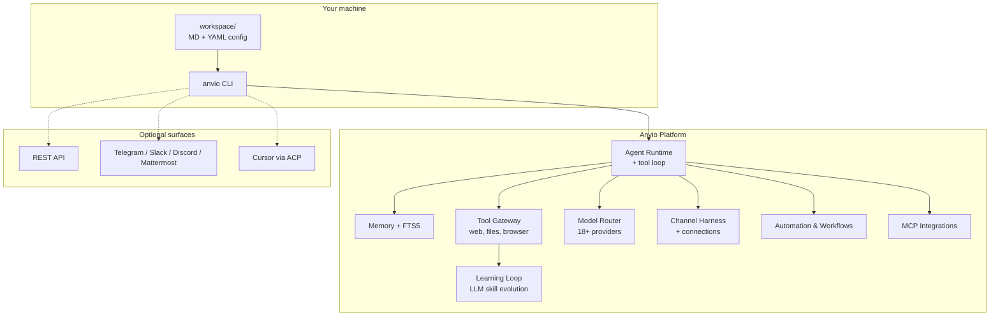
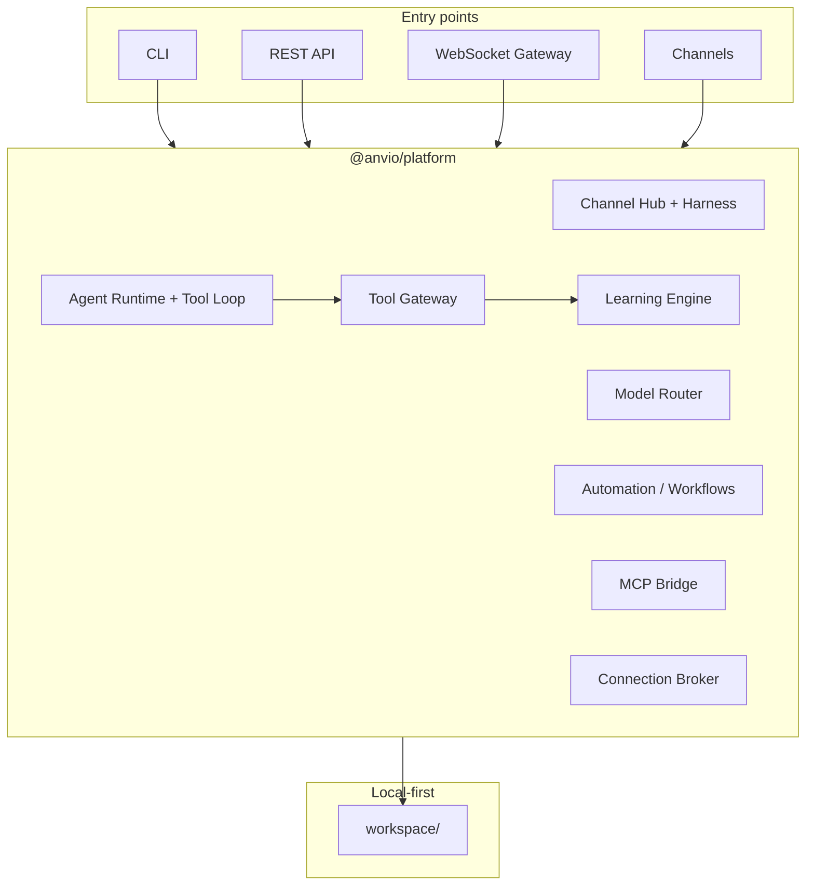
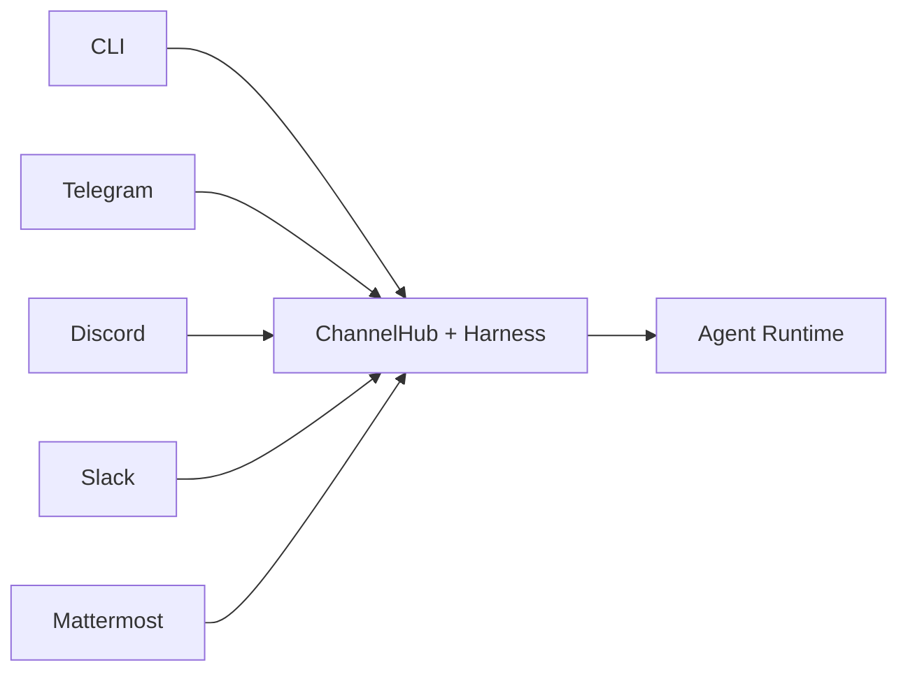

# Anvio

**Local-First AI Agent Operating System**

[](https://github.com/viantonugroho11/Anvio/releases/tag/v1.15.0)
[](https://nodejs.org/)
[](LICENSE)

Configure agents in **Markdown** (Hermes-style) with YAML for infra only. Run from the **CLI**. No database, no login, no Docker required to start.

Everything lives in a portable `workspace/` folder — back it up, commit it to git, or copy it to another machine.

> **Priority:** CLI → API → Web UI. The full platform works from your terminal alone.

**Latest (v1.15.0):** `anvio usage stats`, IMAP email polling, MCP health, Prometheus `/api/metrics`. See [Phase P10 docs](docs/63-phase-p10-priorities.md). Prior: [P9](docs/62-phase-p9-priorities.md).

---

## Table of Contents

- [What You Get](#what-you-get)
- [5-Minute Quick Start](#5-minute-quick-start)
- [Usage Guide](#usage-guide)
- [Built-in Tools & Learning Loop](#built-in-tools--learning-loop)
- [Model Providers](#model-providers)
- [Workspace Layout](#workspace-layout)
- [Architecture](#architecture)
- [Install](#install)
- [CLI Reference](#cli-reference)
- [Channels & Harness](#channels--harness)
- [Hermes Parity](#hermes-parity)
- [Progressive Enhancement](#progressive-enhancement)
- [Development](#development)
- [Documentation](#documentation)
- [Release History](#release-history)
- [License](#license)

---

## What You Get



| Layer | What it does |
|-------|----------------|
| **Agents** | Persona + skills + model + soul — `agents/*.md`, `skills/*.md`, `souls/*/SOUL.md` |
| **Tool gateway** | Built-in tools (`web_fetch`, `file_read`, `browser`, …) with multi-turn agent loop |
| **Learning loop** | Memory nudge, LLM session summary, skill drafts + **runtime self-improve** on tool use |
| **Advanced Agent OS** | Souls, goals, kanban, batch jobs, subagent delegation |
| **Automation** | Cron schedules, blueprints, workflow DAGs, event hooks |
| **Harness** | Channel formatting, engagement, contextual connections (OAuth broker) |
| **Platform** | Credential pools, provider routing, skills catalog, MCP bridge, ACP/Cursor |
| **Models** | Anthropic, OpenAI, DeepSeek, Groq, Gemini, OpenRouter, Ollama, and more |
| **Channels** | CLI, REST, Web Chat, Telegram, Discord, Slack, WhatsApp, Mattermost, … |

### Design principles

| Principle | In practice |
|-----------|-------------|
| **Local-first** | Runs on your machine; configs work offline |
| **File-first** | Agents, skills, souls = Markdown; infra = YAML/JSON |
| **CLI-first** | Primary interface; API and gateway are optional |
| **Self-improving** | Skills evolve from sessions and tool use (Hermes-style, soul-gated) |
| **Progressive** | Start with files only; add PostgreSQL/NATS/K8s when you need scale |
| **Portable** | Copy `workspace/` — no migration scripts at Level 1 |

### Anvio vs typical agent stacks

```
┌──────────────────────────────────────────────────────────────────┐
│  Typical stack                         Anvio (Level 1)           │
├──────────────────────────────────────────────────────────────────┤
│  PostgreSQL from day one        →      JSON/YAML in workspace/    │
│  Auth / JWT required            →      Auth disabled by default  │
│  Docker Compose to start        →      pnpm build && anvio chat  │
│  Web UI is the product          →      CLI > API > Web UI        │
│  Static skills only             →      Learning loop + drafts    │
└──────────────────────────────────────────────────────────────────┘
```

---

## 5-Minute Quick Start

### Step 1 — Install

**Option A — one-liner (recommended)**

```bash
curl -fsSL https://raw.githubusercontent.com/viantonugroho11/Anvio/main/scripts/install.sh | bash
source ~/.anvio/env
```

**Option B — from a clone (contributors)**

```bash
git clone https://github.com/viantonugroho11/Anvio.git
cd Anvio
pnpm install && pnpm build
pnpm anvio --help
```

### Step 2 — Set your workspace

```bash
anvio init ~/my-agents
export ANVIO_WORKSPACE=~/my-agents   # or ./workspace when developing in-repo
anvio workspace validate
```

### Step 3 — Add a model API key

Without a key, Anvio runs in **mock mode** (echoes your message). With a key, you get real completions **and** LLM-powered learning (skill evolution + session summaries).

```bash
export ANTHROPIC_API_KEY=sk-ant-...   # Claude (recommended for learning)
# or
export DEEPSEEK_API_KEY=sk-...        # DeepSeek
# or
export OPENROUTER_API_KEY=sk-or-...   # 100+ models via one key
```

Copy `.env.example` to `.env` for the full list of supported providers.

### Step 4 — Chat with an agent

```bash
anvio agents list
anvio chat --agent architect
```

### Step 5 — Run a one-shot task

```bash
anvio run architect "List trade-offs of event-driven vs request-response architecture"
```

**You are done.** Everything else below is optional power-user features.

---

## Usage Guide

### Interactive chat

```bash
anvio chat --agent architect
```

When built-in tools are enabled in `workspace/tools/gateway.yaml`, the agent can call tools in a multi-turn loop (see [Built-in Tools & Learning Loop](#built-in-tools--learning-loop)).

### Background / detached runs

```bash
anvio run architect "Refactor the auth module" --detach
anvio sessions list
anvio logs <sessionId>
anvio stop <sessionId>
```

Start the worker for detached jobs:

```bash
ANVIO_WORKSPACE=./workspace pnpm --filter @anvio/worker dev
```

### Manage sessions & approvals

| Task | Command |
|------|---------|
| List sessions | `anvio sessions list` |
| Session status | `anvio status [sessionId]` |
| Message log | `anvio logs <sessionId>` |
| Approve a tool call | `anvio approve <session> <requestId>` |
| Inject mid-run instruction | `anvio inbox <sessionId> "Focus on error handling"` |

### Define a custom agent (Markdown)

Create `workspace/agents/reviewer.md`:

```markdown
---
persona: architect
skills:
  - code-review
  - architecture
model:
  provider: deepseek
  model: deepseek-chat
  maxTokens: 8192
description: Code reviewer focused on security and clarity
soul: architect-soul
---

# Reviewer

Security-focused code reviewer.
```

Legacy YAML agents still load — `.md` is preferred. See [workspace artifacts](docs/49-workspace-artifacts.md).

### Souls (long-lived identity + evolution)

```bash
anvio soul list
anvio soul show architect-soul --context
anvio soul create --slug my-soul --name "My Soul" --from-persona architect
```

Enable self-improvement in `souls/*/SOUL.md` frontmatter:

```yaml
spec:
  evolution:
    allowAutoUpdate: true
    requireApproval: false   # false = auto-promote learned skills
```

### Goals, blueprints, automation

```bash
anvio goal create --slug ship-v2 --title "Ship v2 release"
anvio goal progress ship-v2 --percent 40

anvio blueprint catalog
anvio blueprint run daily-summary

anvio automation list
anvio cron next-runs "0 9 * * *"
```

### Kanban, batch, workflows

```bash
anvio kanban create --board dev --title "Implement auth"
anvio batch run my-batch-job.yaml
anvio workflow list
```

### Knowledge base (raw → wiki)

```bash
anvio kb list
anvio kb ingest playbook
```

### Provider routing & credentials

```bash
anvio routing catalog
anvio routing test coding --input "implement JWT middleware"
anvio credentials list
anvio credentials add --pool anthropic --value sk-ant-...
```

### MCP integrations

```bash
anvio mcp list
anvio mcp test github
```

Edit `workspace/mcp/servers.yaml` to register servers.

### Sandboxed code execution

```bash
anvio exec run --lang python --code 'print("hello")'
anvio exec audit
```

### Contextual connections (OAuth broker)

```bash
anvio connect list
anvio connect put slack --user local-user --data '{"token":"..."}'
anvio connect login-host --provider github
```

Requires `ANVIO_CONNECTION_ENCRYPTION_KEY`. See [Phase P1 docs](docs/53-phase-p1-priorities.md).

### Git worktree isolation

```bash
anvio worktree create --agent architect --branch feat/auth
```

---

## Built-in Tools & Learning Loop

### Tool gateway

Configure `workspace/tools/gateway.yaml`:

```yaml
apiVersion: anvio.io/v1
kind: ToolGateway
spec:
  enabled: true
  tools:
    web_fetch:
      enabled: true
    file_read:
      enabled: true
    file_write:
      enabled: false
    browser:
      enabled: false
    web_search:
      enabled: false   # needs WEB_SEARCH_API_KEY
```

```bash
anvio tools list
anvio tools test anvio_tools__web_fetch https://example.com
```

Agents call tools via fenced blocks (up to 5 model round-trips):

````markdown
```anvio_tool
{"name": "anvio_tools__web_fetch", "arguments": {"url": "https://example.com"}}
```
````

### Learning loop (Hermes-style)

| Trigger | What happens |
|---------|----------------|
| Session end | Memory nudge, LLM session summary, skill draft |
| Tool success | LLM analyzes pattern → skill draft → auto-promote if allowed |

```bash
anvio learning drafts
anvio learning promote <draft-slug>
```

Drafts live in `workspace/skills/_drafts/`; promoted skills in `workspace/skills/`.

**Requires:** model API key for LLM summarizer (falls back to rules without one). Gated by soul `evolution.allowAutoUpdate`.

Full guide: [docs/43-learning-loop.md](docs/43-learning-loop.md) · [docs/55-phase-l6-learning-priorities.md](docs/55-phase-l6-learning-priorities.md)

---

## Model Providers

Anvio supports **18+ built-in providers**. Set the matching env var, then reference `provider` in your agent config.

```bash
anvio routing catalog
```

| Provider | Environment variable | Example model |
|----------|---------------------|---------------|
| Anthropic | `ANTHROPIC_API_KEY` | `claude-sonnet-4-20250514` |
| OpenAI | `OPENAI_API_KEY` | `gpt-4o` |
| Gemini | `GEMINI_API_KEY` / `GOOGLE_API_KEY` | `gemini-2.0-flash` |
| DeepSeek | `DEEPSEEK_API_KEY` | `deepseek-chat` |
| Groq | `GROQ_API_KEY` | `llama-3.3-70b-versatile` |
| OpenRouter | `OPENROUTER_API_KEY` | `anthropic/claude-3.5-sonnet` |
| Ollama (local) | `OLLAMA_BASE_URL` + `OLLAMA_ENABLED=true` | `llama3.2` |

**Routing & fallback** — edit `workspace/providers/routing.yaml`:

```yaml
apiVersion: anvio.io/v1
kind: ProviderRouting
spec:
  routes:
    coding:
      primary:
        provider: anthropic
        model: claude-sonnet-4-20250514
      fallback:
        - provider: deepseek
          model: deepseek-chat
```

---

## Workspace Layout

```
workspace/
├── anvio.yaml                 # Platform config (required)
├── agents/                    # Agent definitions (*.md preferred)
├── personas/                  # Persona templates (*.md)
├── skills/                    # Installed skills + _drafts/ from learning
├── souls/                     # SOUL.md identities
├── goals/                     # Persistent goals
├── workflows/                 # DAG workflows (*.md)
├── tools/gateway.yaml         # Built-in tool gateway
├── harness/                   # Channel harness profiles
├── providers/routing.yaml     # Model routing & fallback
├── mcp/servers.yaml           # MCP server registry
├── hooks/hooks.yaml           # Event hook registry
├── automations/               # Cron & event automations
├── blueprints/                # Workflow templates
├── kanban/                    # Task boards
├── credentials/               # Encrypted credential pools
├── knowledge/                 # Raw → wiki knowledge bases
│
├── sessions/                  # Runtime session store (gitignore)
├── memory/                    # Long-term memory (gitignore)
├── inbox/                     # Agent inbox (gitignore)
├── artifacts/                 # Agent output files
└── worktrees/                 # Git worktree isolation
```

```bash
anvio workspace validate
```

---

## Architecture

### System map



### Monorepo layout

```
Anvio/
├── apps/
│   ├── cli/           Primary interface
│   ├── api/           Optional REST (NestJS)
│   ├── worker/        Background job consumer
│   └── gateway/       WebSocket gateway
├── packages/
│   ├── core/          Schemas & ports
│   ├── platform/      Composition factory
│   ├── workspace/     Loader & session store
│   ├── agents/        Runtime & orchestration
│   ├── learning/      Skill evolution & memory nudge
│   ├── tools/           Built-in tool gateway
│   ├── harness/         Channel harness & connections
│   ├── models/          Providers & routing
│   ├── memory/          FTS5, Honcho delegate
│   ├── channels/        Multi-platform adapters
│   ├── voice/           STT/TTS pipeline
│   ├── knowledge/       Raw → wiki ingest
│   ├── acp/             Cursor / editor integration
│   └── …
├── configs/           Bundled skills & blueprints
├── workspace/         Default workspace (your copy)
└── docs/              Architecture & guides
```

**Dependency rule:** `apps → platform → packages → core`

---

## Install

### Global install (end users)

```bash
curl -fsSL https://raw.githubusercontent.com/viantonugroho11/Anvio/main/scripts/install.sh | bash
source ~/.anvio/env
```

| Path | Purpose |
|------|---------|
| `~/.anvio/app` | Anvio source clone |
| `~/.anvio/workspace` | Default workspace |
| `~/.local/bin/anvio` | CLI binary |
| `~/.anvio/env` | Env hints |

### Developer install

```bash
git clone https://github.com/viantonugroho11/Anvio.git
cd Anvio
pnpm install && pnpm build && pnpm test
export ANVIO_WORKSPACE=./workspace
pnpm anvio chat
```

**Requirements:** Node 20+, pnpm 9+

---

## CLI Reference

Run `anvio help` for the full grouped list.

### Core

| Command | Description |
|---------|-------------|
| `anvio init [path]` | Scaffold workspace |
| `anvio workspace validate` | Check structure |
| `anvio agents list` | List agents |
| `anvio chat [--agent NAME]` | Interactive chat |
| `anvio run <agent> [msg] [--detach]` | One-shot or background task |
| `anvio sessions list` | List sessions |
| `anvio status` / `anvio logs` | Monitor runs |

### Tools & learning

| Command | Description |
|---------|-------------|
| `anvio tools list` | Built-in tools from gateway |
| `anvio tools test <tool> [args]` | Test a tool |
| `anvio learning drafts` | List skill drafts |
| `anvio learning promote <slug>` | Promote draft to skill |

### Advanced Agent OS

| Command | Description |
|---------|-------------|
| `anvio soul …` | Persistent identities |
| `anvio goal …` | Goal tracking |
| `anvio blueprint …` | Workflow templates |
| `anvio automation …` / `anvio cron …` | Schedules |
| `anvio kanban …` / `anvio batch …` | Tasks & parallel jobs |
| `anvio workflow …` | DAG workflows |
| `anvio kb …` | Knowledge base ingest |

### Platform

| Command | Description |
|---------|-------------|
| `anvio routing …` | Model routing |
| `anvio credentials …` | Encrypted API key pools |
| `anvio skill …` | Skills catalog |
| `anvio mcp …` | MCP servers |
| `anvio exec …` | Sandboxed execution |
| `anvio connect …` | Contextual connections |
| `anvio harness …` | Harness simulate / status |
| `anvio channels status` | Channel health |
| `anvio acp serve` | Editor integration (ACP) |
| `anvio runtime …` | Runtime providers (local, cursor, docker, …) |
| `anvio voice …` | CLI STT/TTS |

### Key environment variables

| Variable | Purpose |
|----------|---------|
| `ANVIO_WORKSPACE` | Workspace path |
| `ANTHROPIC_API_KEY` | Claude + learning LLM |
| `OPENAI_API_KEY` | GPT + Whisper (voice) |
| `ANVIO_CONNECTION_ENCRYPTION_KEY` | Connection broker |
| `ANVIO_CHANNEL_VOICE` | Enable voice on channels |
| `WEB_SEARCH_API_KEY` | Brave web search tool |
| `MATTERMOST_SERVER_URL` / `MATTERMOST_BOT_TOKEN` | Mattermost |

See [`.env.example`](.env.example) for the complete list.

---

## Channels & Harness

One agent runtime, many surfaces:



Enable in `anvio.yaml`:

```yaml
spec:
  harness:
    enabled: true
  channels:
    voice:
      enabled: true
    telegram:
      enabled: true
      botToken: ${TELEGRAM_BOT_TOKEN}
    mattermost:
      enabled: true
      serverUrl: https://mattermost.example.com
      botToken: ${MATTERMOST_BOT_TOKEN}
```

```bash
anvio channels status
anvio harness simulate telegram greeting
```

Voice notes (Telegram) and audio attachments (Discord) transcribe via Whisper when `OPENAI_API_KEY` is set.

Optional stack:

```bash
ANVIO_WORKSPACE=./workspace pnpm --filter @anvio/worker dev
ANVIO_WORKSPACE=./workspace pnpm --filter @anvio/api dev
ANVIO_WORKSPACE=./workspace pnpm --filter @anvio/gateway dev
```

---

## Hermes Parity

Anvio targets parity with [Hermes Agent](https://hermes-agent.nousresearch.com/docs) and [slaude](https://github.com/barockok/slaude)-style harness (generalized multi-channel):

| Reference | Parity (v1.16.0) | Strengths in Anvio |
|-----------|------------------|---------------------|
| Hermes | ~88% | Local-first, 18+ models, Agent OS, MCP runtime, native tool_use |
| slaude | ~92% | SOUL gate, connections, multi-channel harness, manifest import |

**Done (P4–P11d):** Native tool_use (Anthropic/OpenAI/Gemini), MCP stdio + agent runtime, Teams/Matrix/Email E2E, LLM SoulPolicy, token audit + metrics, **71 built-in tools** (~Hermes breadth), OTel spans, planner CLI.

**Gap vs Hermes:** Sub-tool variants (Spotify/Feishu/Yuanbao/RL individual keys) via MCP presets — [docs/65-hermes-tools-catalog.md](docs/65-hermes-tools-catalog.md).

**Gap vs slaude:** Slack Agents API, strict MCP-only mode, `/1on1` flow, full CDP grant.

Detail: [docs/50-hermes-slaude-parity.md](docs/50-hermes-slaude-parity.md) · [docs/51-gap-hermes-slaude.md](docs/51-gap-hermes-slaude.md) · [docs/65-hermes-tools-catalog.md](docs/65-hermes-tools-catalog.md)

---

## Progressive Enhancement

| Level | Storage | Auth | Events | Best for |
|:-----:|---------|------|--------|----------|
| **1** | Filesystem | Off | In-process | Solo dev, local CLI |
| **2** | SQLite | Optional OAuth | Local / NATS | Small team + API |
| **3** | PostgreSQL + Qdrant | JWT / OAuth | NATS JetStream | Multi-user production |
| **4** | K8s + managed DB | Full RBAC | Distributed | Organization scale |

---

## Development

```bash
pnpm install
pnpm build
pnpm test              # 148+ tests
pnpm typecheck
pnpm anvio chat
```

Contributing: [docs/21-development-guide.md](docs/21-development-guide.md) · [docs/22-contributing.md](docs/22-contributing.md)

---

## Documentation

| Document | Description |
|----------|-------------|
| [Advanced Agent OS](docs/24-advanced-agent-os-overview.md) | Feature map & CLI surface |
| [Learning loop](docs/43-learning-loop.md) | Self-improve & skill evolution |
| [Phase L6 priorities](docs/55-phase-l6-learning-priorities.md) | Runtime learning (v1.7) |
| [Tool gateway](docs/44-tool-gateway.md) | Built-in tools (21) |
| [Hermes tools catalog](docs/65-hermes-tools-catalog.md) | ~71 Hermes tools + Anvio mapping |
| [Channel harness](docs/41-channel-harness.md) | Formatting & engagement |
| [Workspace artifacts](docs/49-workspace-artifacts.md) | MD-first conventions |
| [Hermes parity](docs/50-hermes-slaude-parity.md) | Gap audit |
| [Gap register](docs/51-gap-hermes-slaude.md) | Full gap list |
| [Architecture](docs/02-architecture.md) | Package boundaries |
| [Provider routing](docs/36-provider-routing.md) | Model fallback |
| [Runtime providers](docs/30-runtime-providers.md) | Local, Cursor, Docker, … |
| [Voice mode](docs/48-voice-mode.md) | STT/TTS |
| [Development guide](docs/21-development-guide.md) | Contributor setup |

Phase docs: [K](docs/52-phase-k-priorities.md) · [P1](docs/53-phase-p1-priorities.md) · [P2](docs/54-phase-p2-priorities.md) · [L6](docs/55-phase-l6-learning-priorities.md)

---

## Release History

| Version | Highlights |
|---------|------------|
| **[v1.7.0](https://github.com/viantonugroho11/Anvio/releases/tag/v1.7.0)** | Runtime learning, tool loop, LLM skill evolution |
| [v1.6.0](https://github.com/viantonugroho11/Anvio/releases/tag/v1.6.0) | Mattermost, voice on Telegram/Discord |
| [v1.5.0](https://github.com/viantonugroho11/Anvio/releases/tag/v1.5.0) | Harness depth, connection broker |
| [v1.4.0](https://github.com/viantonugroho11/Anvio/releases/tag/v1.4.0) | FTS5, browser sandbox, ACP/Cursor |
| [v1.2.0](https://github.com/viantonugroho11/Anvio/releases/tag/v1.2.0) | MD-first Phase J, Advanced Agent OS |

Full changelog: [CHANGELOG.md](CHANGELOG.md)

---

## License

MIT — see [LICENSE](LICENSE).
