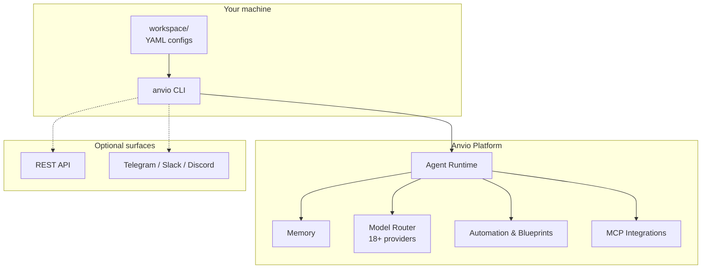
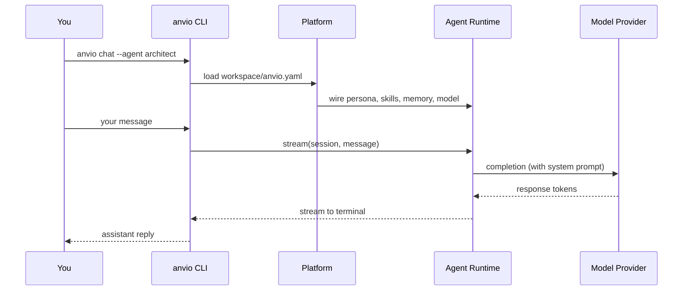
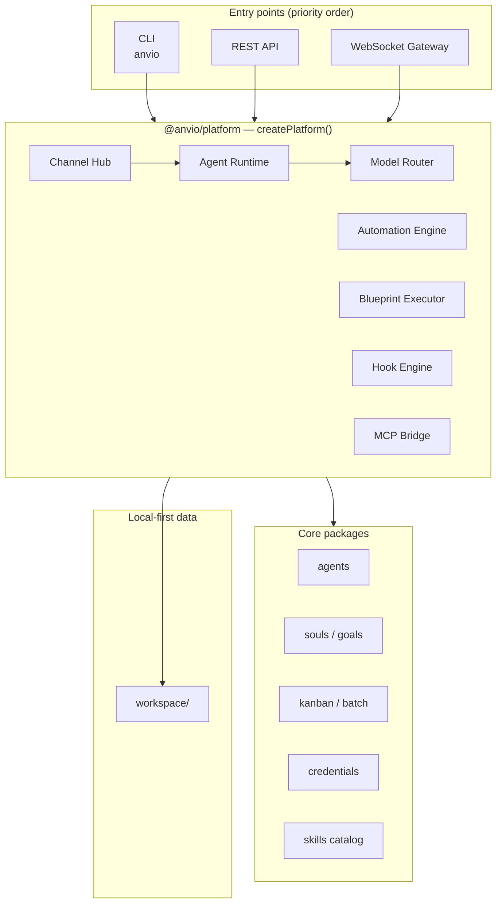
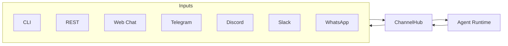
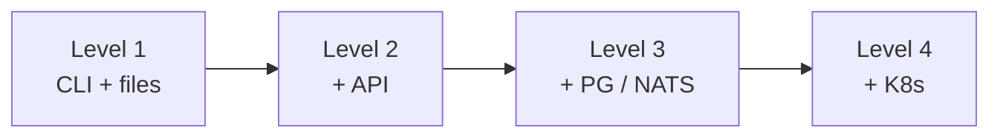

# Anvio

**Local-First AI Agent Operating System**

[](https://github.com/viantonugroho11/Anvio/releases/tag/v1.2.0)
[](https://nodejs.org/)
[](LICENSE)

Configure agents in **YAML**. Run them from the **CLI**. No database, no login, no Docker required to start.

Everything lives in a portable `workspace/` folder — back it up, commit it to git, or copy it to another machine.

> **Priority:** CLI → API → Web UI. The full platform works from your terminal alone.

---

## Table of Contents

- [What You Get](#what-you-get)
- [5-Minute Quick Start](#5-minute-quick-start)
- [Usage Guide](#usage-guide)
- [Model Providers](#model-providers)
- [Workspace Layout](#workspace-layout)
- [Architecture](#architecture)
- [Install](#install)
- [CLI Reference](#cli-reference)
- [Channels](#channels)
- [Progressive Enhancement](#progressive-enhancement)
- [Development](#development)
- [Documentation](#documentation)
- [License](#license)

---

## What You Get



| Layer | What it does |
|-------|----------------|
| **Agents** | Persona + skills + model + memory — defined in YAML |
| **Advanced Agent OS** | Souls, goals, kanban, batch jobs, subagent delegation |
| **Automation** | Cron schedules, blueprints (workflows), event hooks |
| **Platform** | Credential pools, provider routing, skills catalog, MCP bridge |
| **Models** | Anthropic, OpenAI, DeepSeek, Groq, Gemini, OpenRouter, Ollama, and more |
| **Channels** | Same runtime on CLI, REST, Web Chat, Telegram, Discord, Slack, WhatsApp |

### Design principles

| Principle | In practice |
|-----------|-------------|
| **Local-first** | Runs on your machine; configs work offline |
| **File-first** | Agents, skills, goals = human-readable YAML/JSON |
| **CLI-first** | Primary interface; API and gateway are optional |
| **Progressive** | Start with files only; add PostgreSQL/NATS/K8s when you need scale |
| **Portable** | Copy `workspace/` — no migration scripts at Level 1 |

### Anvio vs typical agent stacks

```
┌──────────────────────────────────────────────────────────────────┐
│  Typical stack                         Anvio (Level 1)           │
├──────────────────────────────────────────────────────────────────┤
│  PostgreSQL from day one        →      JSON/YAML in workspace/   │
│  Auth / JWT required            →      Auth disabled by default  │
│  Docker Compose to start        →      pnpm build && anvio chat  │
│  Web UI is the product          →      CLI > API > Web UI        │
└──────────────────────────────────────────────────────────────────┘
```

---

## 5-Minute Quick Start

### Step 1 — Install

**Option A — one-liner (recommended)**

```bash
curl -fsSL https://raw.githubusercontent.com/viantonugroho11/Anvio/main/scripts/install.sh | bash
source ~/.anvio/env
```

**Option B — from a clone (contributors)**

```bash
git clone https://github.com/viantonugroho11/Anvio.git
cd Anvio
pnpm install && pnpm build
pnpm anvio --help
```

### Step 2 — Set your workspace

```bash
# Use the bundled workspace in the repo, or create a fresh one:
anvio init ~/my-agents
export ANVIO_WORKSPACE=~/my-agents   # or ./workspace when developing in-repo
anvio workspace validate
```

### Step 3 — Add a model API key (optional)

Without a key, Anvio runs in **mock mode** (echoes your message back).

```bash
export ANTHROPIC_API_KEY=sk-ant-...   # Claude
# or
export DEEPSEEK_API_KEY=sk-...        # DeepSeek
# or
export OPENROUTER_API_KEY=sk-or-...   # 100+ models via one key
```

Copy `.env.example` to `.env` for a full list of supported providers.

### Step 4 — Chat with an agent

```bash
anvio agents list
anvio chat --agent architect
```

```
You: Review this API design for a payment service
Assistant: ...
```

### Step 5 — Run a one-shot task

```bash
anvio run architect "List the trade-offs of event-driven vs request-response architecture"
```

**You are done.** Everything else below is optional power-user features.

---

## Usage Guide

### Interactive chat

```bash
anvio chat --agent architect
```

Flow:



### Background / detached runs

```bash
anvio run architect "Refactor the auth module" --detach
anvio sessions list
anvio logs <sessionId>
anvio stop <sessionId>
```

### Manage sessions & approvals

| Task | Command |
|------|---------|
| List sessions | `anvio sessions list` |
| Session status | `anvio status [sessionId]` |
| Message log | `anvio logs <sessionId>` |
| Approve a tool call | `anvio approve <session> <requestId>` |
| Inject mid-run instruction | `anvio inbox <sessionId> "Focus on error handling"` |

### Define a custom agent

Create `workspace/agents/reviewer.yaml`:

```yaml
apiVersion: anvio.io/v1
kind: Agent
metadata:
  name: reviewer
  version: "1.0.0"
spec:
  description: Code reviewer focused on security and clarity
  persona: architect
  skills:
    - code-review
    - architecture
  tools: []
  model:
    provider: deepseek          # see Model Providers
    model: deepseek-chat
    maxTokens: 8192
  memory:
    shortTerm: { enabled: true, ttlSeconds: 3600 }
    longTerm: { enabled: true }
    semantic: { enabled: false }
  orchestration:
    pattern: single
    delegates: []
  approvals:
    requiredFor: [destructive]
```

Then:

```bash
anvio chat --agent reviewer
```

### Goals (persistent objectives)

```bash
anvio goal create --slug ship-v2 --title "Ship v2 release"
anvio goal progress ship-v2 --percent 40
anvio goal list
anvio goal complete ship-v2
```

### Souls (long-lived identity)

```bash
anvio soul create --slug architect-soul --name "Architect Soul" --from-persona architect
anvio soul show architect-soul --context
```

Bind a soul in an agent YAML with `spec.soul: architect-soul`.

### Blueprints (workflow templates)

```bash
anvio blueprint catalog
anvio blueprint run daily-summary --dry-run
anvio blueprint run github-triage
```

Bundled blueprints live in `configs/blueprints/` (daily-summary, security-audit, release-preparation, …).

### Automation & cron

```bash
anvio automation list
anvio automation run daily-summary
anvio cron list
anvio cron next-runs "0 9 * * *"
```

### Kanban & batch jobs

```bash
anvio kanban list
anvio kanban create --board dev --title "Implement auth"
anvio batch run my-batch-job.yaml
anvio batch status <jobId>
```

### Provider routing & credentials

```bash
anvio routing catalog      # all supported providers + env vars
anvio routing providers    # currently configured (keys set)
anvio routing show         # your routing.yaml
anvio routing test coding --input "implement JWT middleware"

anvio credentials list
anvio credentials add --pool anthropic --value sk-ant-...
```

### MCP integrations

Edit `workspace/mcp/servers.yaml`, then:

```bash
anvio mcp list
anvio mcp test github
```

### Sandboxed code execution

```bash
anvio exec run --lang python --code 'print("hello")'
anvio exec audit
```

### Git worktree isolation (per-agent)

```bash
anvio worktree list
anvio worktree create --agent architect --branch feat/auth
```

Enable in agent YAML: `spec.workspace.isolatedWorktree: true`.

---

## Model Providers

Anvio supports **18 built-in providers**. Set the matching env var, then reference `provider` in your agent YAML.

```bash
anvio routing catalog
```

| Provider | Environment variable | Example model |
|----------|---------------------|---------------|
| Anthropic | `ANTHROPIC_API_KEY` | `claude-sonnet-4-20250514` |
| OpenAI | `OPENAI_API_KEY` | `gpt-4o` |
| Gemini | `GEMINI_API_KEY` / `GOOGLE_API_KEY` | `gemini-2.0-flash` |
| DeepSeek | `DEEPSEEK_API_KEY` | `deepseek-chat`, `deepseek-reasoner` |
| Groq | `GROQ_API_KEY` | `llama-3.3-70b-versatile` |
| Mistral | `MISTRAL_API_KEY` | `mistral-large-latest` |
| OpenRouter | `OPENROUTER_API_KEY` | `anthropic/claude-3.5-sonnet` |
| Ollama (local) | `OLLAMA_BASE_URL` + `OLLAMA_ENABLED=true` | `llama3.2` |
| Together, xAI, Fireworks, Moonshot, … | See `anvio routing catalog` | — |

**OpenRouter** is the fastest way to access many models with a single API key.

**Custom endpoint** (any OpenAI-compatible API):

```yaml
spec:
  model:
    provider: custom
    baseUrl: https://api.example.com/v1
    apiKeyEnv: MY_API_KEY
    model: my-model-id
```

**Routing & fallback** — edit `workspace/providers/routing.yaml` to route by task type (coding, chat, research) with automatic failover:

```yaml
apiVersion: anvio.io/v1
kind: ProviderRouting
spec:
  defaultStrategy: highest_quality
  routes:
    coding:
      primary:
        provider: anthropic
        model: claude-sonnet-4-20250514
      fallback:
        - provider: deepseek
          model: deepseek-chat
```

Test routing:

```bash
anvio routing test coding --input "implement auth middleware"
```

---

## Workspace Layout

`anvio init` creates this structure and starter configs:

```
workspace/
├── anvio.yaml                 # Platform config (required)
├── agents/                    # Agent definitions (*.yaml)
├── personas/                  # Persona templates
├── skills/                    # Installed / overridden skills
├── souls/                     # Persistent agent identities
├── goals/                     # Persistent goals
├── providers/routing.yaml     # Model routing & fallback
├── mcp/servers.yaml           # MCP server registry
├── hooks/hooks.yaml           # Event hook registry
├── automations/               # Cron & event automations
├── blueprints/                # User workflow templates
├── kanban/                    # Task boards
├── credentials/               # Encrypted credential pools
├── batch/                     # Batch job state
├── audit/                     # Execution audit logs
│
├── sessions/                  # Runtime session store (gitignore)
├── memory/                    # Long-term memory (gitignore)
├── inbox/                     # Agent inbox (gitignore)
├── artifacts/                 # Agent output files
└── worktrees/                 # Git worktree isolation
```

**Validate anytime:**

```bash
anvio workspace validate
```

**Minimal `anvio.yaml`:**

```yaml
apiVersion: anvio.io/v1
kind: Workspace
metadata:
  name: default
spec:
  auth:
    enabled: false
  storage:
    provider: filesystem
    basePath: .
  memory:
    provider: filesystem
    basePath: memory
  events:
    provider: local
  defaultAgent: architect
  defaultUserId: local-user
```

> **Tip:** Run `git init` inside `workspace/` to version agents separately from the Anvio codebase.

---

## Architecture

### System map



### Monorepo layout

```
Anvio/
├── apps/
│   ├── cli/           Primary interface
│   ├── api/           Optional REST (NestJS)
│   ├── worker/        Background job consumer
│   └── gateway/       WebSocket gateway
├── packages/
│   ├── core/          Schemas & ports
│   ├── platform/      Composition factory
│   ├── workspace/     Loader & session store
│   ├── agents/        Runtime & orchestration
│   ├── models/        Providers & routing
│   ├── souls/ goals/  Advanced Agent OS
│   ├── automation/    Cron & blueprints
│   ├── credentials/   Encrypted pools
│   ├── integrations/  MCP registry
│   └── …
├── configs/           Bundled skills & blueprints
├── workspace/         Default workspace (your copy)
└── docs/              Architecture & guides
```

**Dependency rule:** `apps → platform → packages → core`

---

## Install

### Global install (end users)

```bash
curl -fsSL https://raw.githubusercontent.com/viantonugroho11/Anvio/main/scripts/install.sh | bash
```

| Path | Purpose |
|------|---------|
| `~/.anvio/app` | Anvio source clone |
| `~/.anvio/workspace` | Default workspace |
| `~/.local/bin/anvio` | CLI binary |
| `~/.anvio/env` | Env hints — `source ~/.anvio/env` |

**Options:**

```bash
./scripts/install.sh --workspace ~/my-agents
./scripts/install.sh --bin-dir /usr/local/bin
```

### Developer install

```bash
git clone https://github.com/viantonugroho11/Anvio.git
cd Anvio
pnpm install
pnpm build
pnpm test
export ANVIO_WORKSPACE=./workspace
pnpm anvio chat
```

**Requirements:** Node 20+, pnpm 9+

---

## CLI Reference

Run `anvio help` for the full grouped list.

### Core commands

| Command | Description |
|---------|-------------|
| `anvio init [path]` | Scaffold a new workspace |
| `anvio workspace validate` | Check workspace structure |
| `anvio agents list` | List agents |
| `anvio chat [--agent NAME]` | Interactive chat |
| `anvio run <agent> [msg]` | One-shot task (`--detach` for background) |
| `anvio sessions list` | List sessions |
| `anvio status [sessionId]` | Platform or session status |
| `anvio logs <sessionId>` | Session message log |
| `anvio channels status [--json]` | Channel health check |

### Advanced Agent OS

| Command | Description |
|---------|-------------|
| `anvio soul list\|show\|create` | Persistent identities |
| `anvio goal list\|create\|progress\|complete` | Goal tracking |
| `anvio blueprint catalog\|run` | Workflow templates |
| `anvio automation list\|run\|enable` | Scheduled automations |
| `anvio kanban list\|create\|move` | Task boards |
| `anvio batch run\|status\|resume` | Parallel batch jobs |
| `anvio routing catalog\|providers\|test` | Model routing |
| `anvio credentials list\|add\|test` | Encrypted API key pools |
| `anvio skill catalog\|install\|validate` | Skills catalog |
| `anvio mcp list\|test` | MCP servers |
| `anvio exec run\|audit` | Sandboxed code execution |
| `anvio acp serve\|status` | Editor integration (ACP) |
| `anvio runtime list\|test` | Runtime providers |

### Key environment variables

| Variable | Purpose |
|----------|---------|
| `ANVIO_WORKSPACE` | Workspace path (default: `./workspace`) |
| `ANTHROPIC_API_KEY` | Claude models |
| `OPENAI_API_KEY` | GPT models |
| `DEEPSEEK_API_KEY` | DeepSeek models |
| `OPENROUTER_API_KEY` | OpenRouter gateway |
| `GEMINI_API_KEY` | Google Gemini |
| `OLLAMA_BASE_URL` / `OLLAMA_ENABLED` | Local Ollama |
| `ANVIO_CREDENTIALS_PASSPHRASE` | Credential pool encryption |
| `GITHUB_TOKEN` | GitHub MCP server |

See [`.env.example`](.env.example) for the complete list.

---

## Channels

One agent runtime, many surfaces:



Enable in `anvio.yaml`:

```yaml
spec:
  channels:
    telegram:
      enabled: true
      botToken: ${TELEGRAM_BOT_TOKEN}
      defaultAgent: architect
    slack:
      enabled: true
      botToken: ${SLACK_BOT_TOKEN}
      appToken: ${SLACK_APP_TOKEN}
```

```bash
anvio channels status
anvio channels status --json
```

Optional stack (Level 2+):

```bash
ANVIO_WORKSPACE=./workspace pnpm --filter @anvio/api dev
ANVIO_WORKSPACE=./workspace pnpm --filter @anvio/worker dev
ANVIO_WORKSPACE=./workspace pnpm --filter @anvio/gateway dev
```

---

## Progressive Enhancement

Start at Level 1. Add infrastructure only when you outgrow files.

| Level | Storage | Auth | Events | Best for |
|:-----:|---------|------|--------|----------|
| **1** | Filesystem | Off | In-process | Solo dev, local CLI |
| **2** | SQLite | Optional OAuth | Local / NATS | Small team + API |
| **3** | PostgreSQL + Qdrant | JWT / OAuth | NATS JetStream | Multi-user production |
| **4** | K8s + managed DB | Full RBAC | Distributed | Organization scale |



---

## Development

```bash
pnpm install
pnpm build
pnpm test              # 80+ integration tests
pnpm typecheck
pnpm anvio chat        # CLI from source
```

Contributing: see [`docs/21-development-guide.md`](docs/21-development-guide.md).

---

## Documentation

| Document | Description |
|----------|-------------|
| [Advanced Agent OS overview](docs/24-advanced-agent-os-overview.md) | Feature map & CLI surface |
| [Architecture](docs/02-architecture.md) | Package boundaries |
| [Roadmap](docs/23-roadmap.md) | Phases A–F status & doc index |
| [Channels](docs/10-channels.md) | Channel hub & adapters |
| [Provider routing](docs/36-provider-routing.md) | Routing strategies & fallback |
| [Credential pools](docs/33-credential-pools.md) | Encrypted key management |
| [Development guide](docs/21-development-guide.md) | Contributor setup |

Full doc index: [`docs/24-advanced-agent-os-overview.md`](docs/24-advanced-agent-os-overview.md) (links to docs 25–40).

Changelog: [`CHANGELOG.md`](CHANGELOG.md) · Latest release: [v1.2.0](https://github.com/viantonugroho11/Anvio/releases/tag/v1.2.0)

---

## License

MIT — see [LICENSE](LICENSE).
