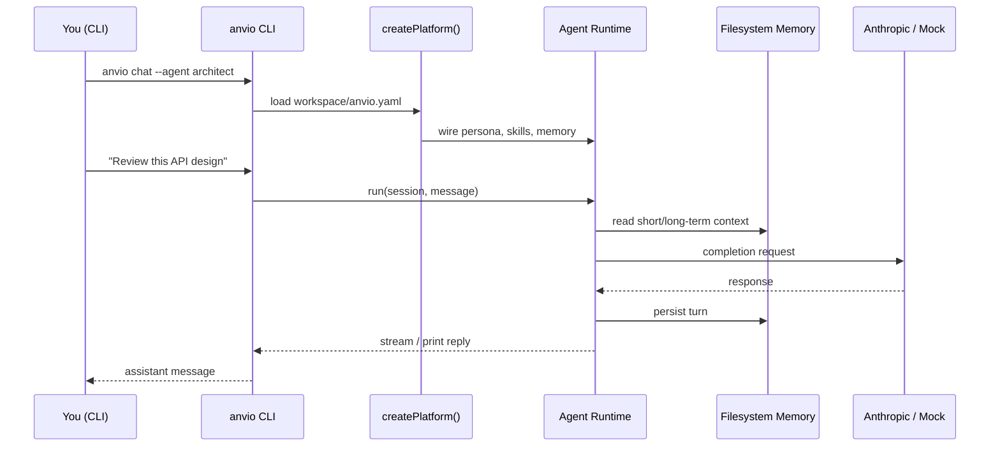
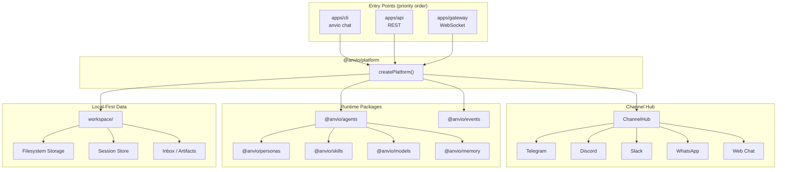
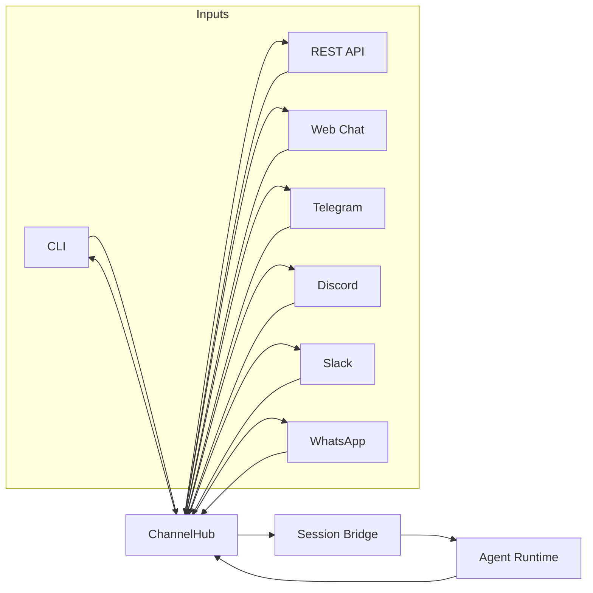
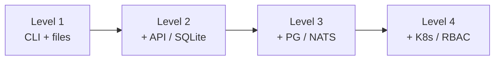

# Anvio

**Local-First AI Agent Operating System**

[](https://github.com/viantonugroho11/Anvio/releases/tag/v1.0.0)
[](https://nodejs.org/)
[](LICENSE)

Anvio lets you create, configure, and run AI agents from **YAML files** — no database, no login, no Docker required to get started. Everything lives in a portable `workspace/` folder you can back up, version with git, or move between machines.

> **CLI first.** Run agents from your terminal in seconds. Add API, workers, and chat channels only when you need them.

---

## Table of Contents

- [Release v1.0.0](#release-v100)
- [Why Anvio](#why-anvio)
- [How It Works](#how-it-works)
- [Architecture](#architecture)
- [Install](#install)
- [Quick Start](#quick-start)
- [Workspace](#workspace)
- [CLI Reference](#cli-reference)
- [Channels](#channels)
- [Progressive Enhancement](#progressive-enhancement)
- [Development](#development)
- [Documentation](#documentation)
- [License](#license)

---

## Release v1.0.0

**Anvio v1.0.0** is the first stable release of the local-first agent platform.

| Area | What's included |
|------|-----------------|
| **Runtime** | Agent engine, personas, skills, filesystem memory & sessions |
| **CLI** | Full command set — chat, run, sessions, approve, inbox, worktrees |
| **Channels** | CLI, REST, Web Chat, Telegram, Discord, Slack, WhatsApp |
| **Platform** | `createPlatform()` factory wired from `anvio.yaml` |
| **Storage** | Filesystem-first workspace (no DB required) |
| **Auth** | Disabled by default — optional JWT/OAuth plugin |
| **Install** | One-command `install.sh` for global `anvio` CLI |
| **Isolation** | Optional per-agent git worktree support |

```bash
# Tag this release locally
git checkout main && git pull
git tag -a v1.0.0 -m "Anvio v1.0.0 — local-first AI Agent OS"
git push origin v1.0.0
```

---

## Why Anvio

Most agent frameworks assume cloud services, user accounts, and a database from day one. Anvio flips that:

```
┌─────────────────────────────────────────────────────────────┐
│  Traditional agent stack          Anvio (Level 1)            │
├─────────────────────────────────────────────────────────────┤
│  PostgreSQL required      →       JSON files in workspace/  │
│  Login / JWT required     →       Auth off by default       │
│  Docker compose first     →       pnpm build → anvio chat   │
│  Web UI is the product    →       CLI > API > Web UI        │
└─────────────────────────────────────────────────────────────┘
```

| Principle | Default |
|-----------|---------|
| **Local-first** | Runs on your machine, offline-capable configs |
| **File-first** | Agents, personas, skills = human-readable YAML |
| **CLI-first** | Primary interface; API & gateway are optional |
| **Progressive** | Start at Level 1, grow to PostgreSQL/NATS/K8s later |
| **Portable** | Copy `workspace/` — no migration scripts |

---

## How It Works

A typical chat session flows like this:



**In plain terms:**

1. You point Anvio at a **workspace** (folder with `anvio.yaml` + agent configs).
2. The **platform** reads config and wires storage, memory, channels, and the model provider.
3. The **agent runtime** loads persona + skills, calls the model, and optionally uses tools.
4. **Sessions** and **memory** are saved as JSON under `workspace/` — inspectable anytime.

---

## Architecture

### High-level system map



### Monorepo layout

```
Anvio/
├── apps/
│   ├── cli/          ← Primary interface (anvio command)
│   ├── api/          ← Optional NestJS REST API
│   ├── worker/       ← Background agent run consumer
│   └── gateway/      ← Optional WebSocket gateway
│
├── packages/
│   ├── core/         ← Schemas, ports, shared types
│   ├── platform/     ← Composition root (wires from anvio.yaml)
│   ├── workspace/    ← Workspace loader, sessions, worktrees
│   ├── agents/       ← Agent runtime & orchestrator
│   ├── channels/     ← Channel hub + adapters
│   ├── memory/       ← Pluggable memory (filesystem default)
│   ├── storage/      ← Pluggable storage (filesystem default)
│   ├── auth/         ← Optional auth plugin
│   ├── events/       ← Local bus + NATS (optional)
│   └── …             ← models, personas, skills, tools, db
│
├── workspace/        ← Your agents & config (portable)
├── docs/             ← Architecture & ADRs
└── scripts/
    └── install.sh    ← One-command installer
```

### Dependency rule

```
apps  →  platform  →  packages  →  core
```

Domain logic lives in packages — never in NestJS controllers.

---

## Install

### One command (recommended)

```bash
curl -fsSL https://raw.githubusercontent.com/viantonugroho11/Anvio/main/scripts/install.sh | bash
```

This will:

- Check Node 20+
- Install pnpm if needed
- Clone Anvio to `~/.anvio/app` and build
- Seed `~/.anvio/workspace` with default agents
- Install the `anvio` binary to `~/.local/bin`

### From a cloned repo

```bash
git clone https://github.com/viantonugroho11/Anvio.git
cd Anvio
./scripts/install.sh
```

### Install options

```bash
./scripts/install.sh --workspace ~/my-agents
./scripts/install.sh --bin-dir /usr/local/bin
```

| Path | Purpose |
|------|---------|
| `~/.anvio/app` | Anvio source (git clone) |
| `~/.anvio/workspace` | Your agents, personas, skills |
| `~/.local/bin/anvio` | Global CLI command |
| `~/.anvio/env` | Environment hints (`source` this) |

### First run

```bash
# New terminal, or:
source ~/.anvio/env

export ANTHROPIC_API_KEY=sk-ant-...   # optional — mock mode works without it
anvio chat --agent architect
```

---

## Quick Start

### Developers (from repo)

```bash
pnpm install
pnpm build
pnpm anvio chat
```

### Create a new workspace

```bash
anvio init ~/my-workspace
export ANVIO_WORKSPACE=~/my-workspace
anvio agents list
anvio chat --agent architect
```

### Run a one-shot task

```bash
anvio run architect "Summarize the trade-offs of event-driven architecture"
anvio run architect "Fix the bug" --detach   # background via worker events
```

### Optional: API + Worker + Gateway

```bash
ANVIO_WORKSPACE=./workspace pnpm --filter @anvio/api dev
ANVIO_WORKSPACE=./workspace pnpm --filter @anvio/worker dev
ANVIO_WORKSPACE=./workspace pnpm --filter @anvio/gateway dev
```

No auth required by default — agents run immediately.

---

## Workspace

Your entire agent configuration is a folder:

```
workspace/
├── anvio.yaml           # Platform config (storage, memory, channels, auth)
├── agents/              # Agent definitions
│   └── architect.yaml
├── personas/            # Persona profiles
│   └── architect.yaml
├── skills/              # Reusable skill modules
│   ├── architecture.yaml
│   └── code-review.yaml
├── sessions/            # Session state (runtime, gitignored)
├── memory/              # Long-term memory (runtime, gitignored)
├── inbox/               # Agent inbox messages (runtime)
├── artifacts/           # Agent output files
├── worktrees/           # Git worktree isolation (optional)
├── mcp/                 # MCP server bindings (Phase 2)
└── workflows/           # Workflow definitions (Phase 3)
```

**Example `anvio.yaml`:**

```yaml
apiVersion: anvio.io/v1
kind: Workspace
metadata:
  name: default
spec:
  auth:
    enabled: false
  storage:
    provider: filesystem
  memory:
    provider: filesystem
    basePath: memory
  events:
    provider: local
  defaultAgent: architect
  channels:
    telegram:
      enabled: false
      botToken: ${TELEGRAM_BOT_TOKEN}
```

**Example agent (`agents/architect.yaml`):**

```yaml
apiVersion: anvio.io/v1
kind: Agent
metadata:
  name: architect
spec:
  description: Senior Software Architect
  persona: architect
  skills: [architecture, code-review]
  model:
    provider: anthropic
    model: claude-sonnet-4-20250514
  workspace:
    isolatedWorktree: false   # set true for git worktree per session
```

> Tip: `git init` inside `workspace/` to version your agents separately from the Anvio codebase.

---

## CLI Reference

| Command | Description |
|---------|-------------|
| `anvio init [path]` | Create a new workspace |
| `anvio agents list` | List configured agents |
| `anvio chat [--agent NAME]` | Interactive chat session |
| `anvio run <agent> [msg]` | Run a task (`--detach` for background) |
| `anvio sessions list` | List agent sessions |
| `anvio status [sessionId]` | Platform or session status |
| `anvio logs <sessionId>` | Show session message log |
| `anvio approve <session> <id>` | Approve a pending tool request |
| `anvio stop <sessionId>` | Stop a running session |
| `anvio inbox <sessionId> <msg>` | Inject instruction into running agent |
| `anvio worktree list\|create\|remove` | Manage git worktree isolation |
| `anvio channels status [--json]` | Health check all channel adapters |

**Environment variables:**

| Variable | Purpose |
|----------|---------|
| `ANVIO_WORKSPACE` | Path to workspace (default: `./workspace`) |
| `ANTHROPIC_API_KEY` | Anthropic API key for real model responses |
| `TELEGRAM_BOT_TOKEN` | Telegram bot token |
| `DISCORD_BOT_TOKEN` | Discord bot token |
| `SLACK_BOT_TOKEN` | Slack bot token |
| `SLACK_APP_TOKEN` | Slack Socket Mode app token |

---

## Channels

Anvio routes messages through a **Channel Hub** — one runtime, many surfaces:



Enable channels in `anvio.yaml`:

```yaml
spec:
  channels:
    telegram:
      enabled: true
      botToken: ${TELEGRAM_BOT_TOKEN}
      defaultAgent: architect
    slack:
      enabled: true
      botToken: ${SLACK_BOT_TOKEN}
      appToken: ${SLACK_APP_TOKEN}
```

Check channel health:

```bash
anvio channels status
anvio channels status --json
```

WhatsApp webhooks are served by the API at `POST /api/channels/whatsapp/webhook`.

---

## Progressive Enhancement

Start simple. Add infrastructure only when you outgrow files:

| Level | Storage | Auth | Events | Channels | Use case |
|:-----:|---------|------|--------|----------|----------|
| **1** | Filesystem | None | In-process | CLI + optional bots | Solo dev, local CLI |
| **2** | SQLite | Optional OAuth | Local / NATS | + REST, Web Chat | Small team |
| **3** | PostgreSQL + Qdrant | JWT / OAuth | NATS JetStream | All adapters | Multi-user production |
| **4** | K8s + managed DB | Full RBAC | Distributed | Enterprise integrations | Org scale |



Enable auth only when needed (e.g. external MCP providers):

```yaml
spec:
  auth:
    enabled: true
    provider: oauth2
```

---

## Development

```bash
pnpm install          # install dependencies
pnpm build            # build all packages
pnpm test             # run tests
pnpm typecheck        # TypeScript check
pnpm anvio chat       # run CLI from source
```

**Requirements:** Node 20+, pnpm 9+

Docker and PostgreSQL are optional — only needed for Level 3+ workflows.

---

## Documentation

| Doc | Topic |
|-----|-------|
| [`docs/02-architecture.md`](docs/02-architecture.md) | System architecture |
| [`docs/10-channels.md`](docs/10-channels.md) | Channel hub & adapters |
| [`docs/21-development-guide.md`](docs/21-development-guide.md) | Contributor setup |
| [`docs/adr/0007-local-first-architecture.md`](docs/adr/0007-local-first-architecture.md) | Local-first ADR |
| [`docs/adr/0008-channel-hub-architecture.md`](docs/adr/0008-channel-hub-architecture.md) | Channel hub ADR |

Full index: [`docs/`](docs/)

See also: [`CHANGELOG.md`](CHANGELOG.md)

---

## License

MIT — see [LICENSE](LICENSE).
