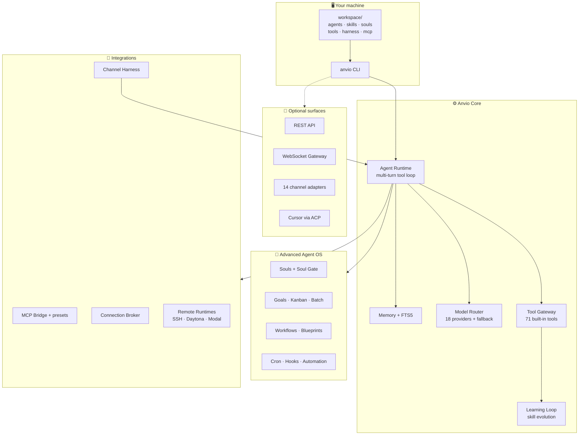
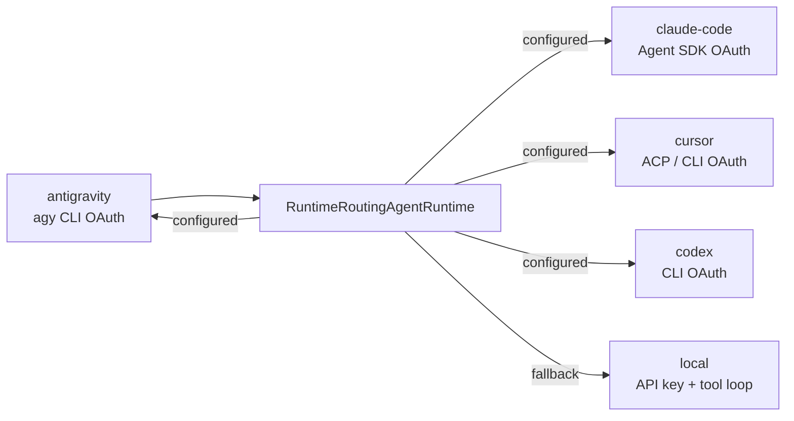
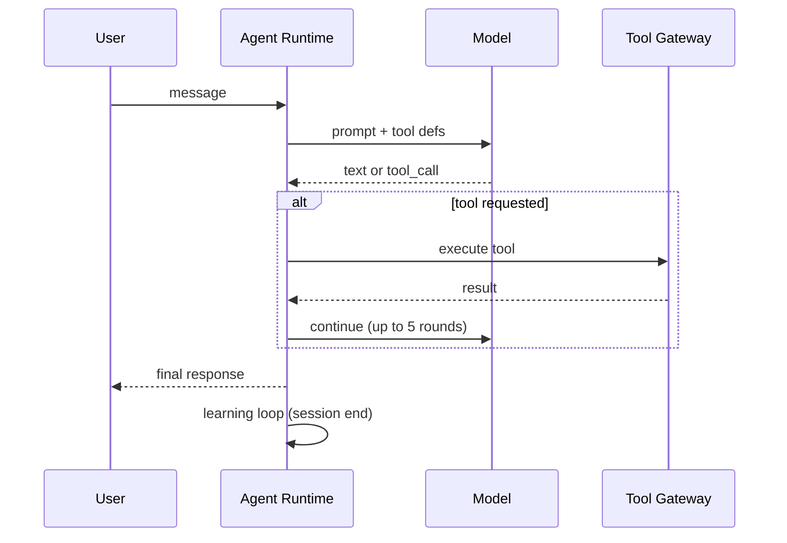
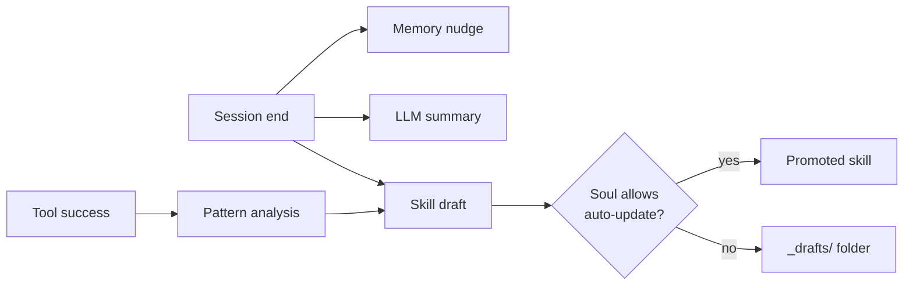
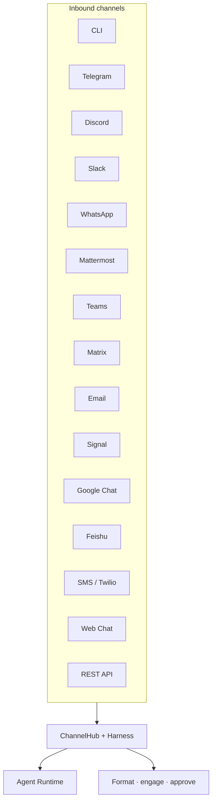
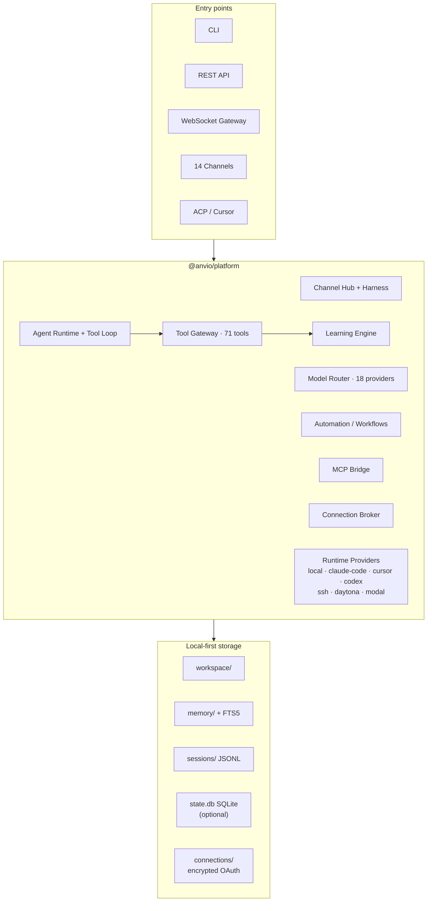
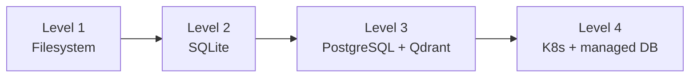

<div align="center">

# Anvio

**Local-First AI Agent Operating System**

Configure agents in **Markdown** (Hermes-style) · YAML for infra only · Run from the **CLI**

[](https://github.com/viantonugroho11/Anvio/releases/tag/v1.21.0)
[](https://nodejs.org/)
[](https://pnpm.io/)
[](LICENSE)
[](#development)

File-first by default · SQLite when you need it · Vendor OAuth optional · No Docker required

[Quick Start](#5-minute-quick-start) · [Storage & Auth](#storage--authentication) · [Runtime OAuth](#runtime-providers--oauth) · [Unified Gateway](#unified-gateway-hermes-style) · [CLI Reference](#cli-reference) · [Docs](#documentation) · [Changelog](CHANGELOG.md)

</div>

---

> **Philosophy:** CLI → API → Web UI. The full platform works from your terminal alone.
>
> Everything lives in a portable `workspace/` folder — back it up, commit it to git, or copy it to another machine.
>
> **Start simple:** filesystem sessions, model API key (or mock mode), no Docker. Add SQLite, vendor OAuth, gateway, or PostgreSQL only when you need them.

### What's new in v1.21.0

| Track | Highlights |
|-------|------------|
| **Runtime OAuth** | `anvio setup-token --claude\|--cursor\|--codex` — vendor subscription login |
| **Claude Code runtime** | Agent SDK OAuth (Pro/Max), not `ANTHROPIC_API_KEY` |
| **Multi-runtime routing** | Per-agent runtime + cross-vendor fallback via connection broker |

Prior: [ADR 0009](docs/adr/0009-runtime-oauth-authentication.md) · [Runtime providers](docs/30-runtime-providers.md)

### What's new in v1.20.0

| Track | Highlights |
|-------|------------|
| **Unified gateway** | One daemon — `anvio gateway start` (channels + worker + API + WebSocket) |
| **SQLite sessions** | Hermes-style `state.db` + FTS5 search — `storage.provider: sqlite` |
| **Realtime STT** | OpenAI Realtime WebSocket — `anvio voice realtime-transcribe` |

Prior: [v1.19](docs/75-phase-p14-priorities.md) · [Unified gateway guide](docs/76-unified-gateway.md)

### What's new in v1.19.0

| Track | Highlights |
|-------|------------|
| **Remote runtimes** | SSH, Daytona, Modal — `anvio runtime exec ssh\|daytona\|modal -- <cmd>` |
| **Channels** | Feishu webhook, SMS (Twilio), Google Chat service account |
| **Voice** | Streaming STT — `anvio voice stream-transcribe` |
| **Email** | IMAP IDLE watch, Message-ID threading |
| **Research** | Session trajectory export — `anvio session export <id> [--md]` |
| **Browser** | Extended CDP grant — `ANVIO_BROWSER_CDP_GRANT=1` |

Phase docs: [P13](docs/73-phase-p13-priorities.md) · [P14](docs/75-phase-p14-priorities.md) · Prior: [P12](docs/70-phase-p12-priorities.md) · [P11 tools](docs/65-hermes-tools-catalog.md)

---

## At a Glance

```
┌─────────────────────────────────────────────────────────────────────────────┐
│  71 built-in tools   │  18 model providers  │  14 channel adapters         │
│  Learning loop       │  MCP + ACP/Cursor    │  Remote exec (SSH/Daytona)   │
│  Soul-gated evolution│  Workflow DAGs       │  Multi-runtime OAuth (v1.21+) │
└─────────────────────────────────────────────────────────────────────────────┘
```

| | Anvio | Typical agent stack |
|---|-------|---------------------|
| **Config** | Markdown + YAML in `workspace/` | PostgreSQL from day one |
| **Storage** | Filesystem default; SQLite one YAML flip | Server DB mandatory |
| **Auth** | Optional — vendor OAuth + API keys; no platform login at Level 1–2 | JWT / OAuth required upfront |
| **Start** | `pnpm build && anvio chat` — mock mode without any key | Docker Compose mandatory |
| **Interface** | CLI-first | Web UI is the product |
| **Skills** | Self-improving via learning loop | Static skill files only |

### Storage & authentication

Anvio has **local storage and auth layers** — but neither blocks a first run:

| Concern | Default (Level 1) | When you opt in | Command / config |
|---------|-------------------|-----------------|------------------|
| **Sessions** | JSONL in `workspace/sessions/` | Hermes-style `state.db` + FTS5 search | `storage.provider: sqlite` in `anvio.yaml` |
| **Model access** | `ANTHROPIC_API_KEY` (or mock mode) | 18 providers + routing fallback | `export ANTHROPIC_API_KEY=…` |
| **Vendor runtime** | `local` (built-in tool loop) | Claude Code / Cursor / Codex subscription OAuth | `anvio setup-token --claude` |
| **Channel / tool OAuth** | Off | Slack, GitHub, etc. via connection broker | `anvio connect login-host --provider github` |
| **Platform login** | Off | JWT for multi-user API (Level 3+) | `spec.auth` in `anvio.yaml` |
| **Docker** | Not required | Sandbox exec, remote runtime images | `anvio runtime exec …` only |

**Two auth layers (don't mix them up):**

1. **Model API key** — powers the `local` runtime (direct LLM + tool loop). Set `ANTHROPIC_API_KEY`, `DEEPSEEK_API_KEY`, etc.
2. **Runtime OAuth** — powers vendor CLIs (Claude Code Pro/Max, Cursor, Codex). Use `anvio setup-token`; stored encrypted in `workspace/connections/`. Do **not** set `ANTHROPIC_API_KEY` when running `claude-code` runtime (it shadows OAuth).

See [ADR 0009](docs/adr/0009-runtime-oauth-authentication.md) · [Progressive Enhancement](#progressive-enhancement)

---

## Table of Contents

- [Platform Overview](#platform-overview)
- [Storage & Authentication](#storage--authentication)
- [5-Minute Quick Start](#5-minute-quick-start)
- [Runtime Providers & OAuth](#runtime-providers--oauth)
- [Unified Gateway (Hermes-style)](#unified-gateway-hermes-style)
- [Usage Guide](#usage-guide)
- [Built-in Tools & Learning Loop](#built-in-tools--learning-loop)
- [Model Providers](#model-providers)
- [Channels & Harness](#channels--harness)
- [Workspace Layout](#workspace-layout)
- [Architecture](#architecture)
- [Install](#install)
- [CLI Reference](#cli-reference)
- [Hermes Parity](#hermes-parity)
- [Progressive Enhancement](#progressive-enhancement)
- [Development](#development)
- [Documentation](#documentation)
- [Release History](#release-history)
- [License](#license)

---

## Platform Overview



### Capability layers

| Layer | What it does | Key paths / commands |
|-------|--------------|----------------------|
| **Agents** | Persona + skills + model + soul | `agents/*.md`, `anvio chat --agent NAME` |
| **Tool gateway** | 71 built-in tools, multi-turn loop | `tools/gateway.yaml`, `anvio tools list` |
| **Learning loop** | Memory nudge, session summary, skill drafts, runtime self-improve | `anvio learning drafts` |
| **Advanced Agent OS** | Souls, goals, kanban, batch, subagent delegation | `anvio soul`, `anvio goal`, `anvio kanban` |
| **Automation** | Cron, blueprints, workflow DAGs, event hooks | `anvio automation`, `anvio workflow` |
| **Harness** | Channel formatting, engagement, OAuth connections | `harness/`, `anvio connect` |
| **Runtimes** | Local loop or vendor OAuth (Claude Code, Cursor, Codex) | `anvio setup-token`, `anvio runtime` |
| **Platform** | Credential pools, routing, MCP, ACP, remote runtimes | `anvio routing`, `anvio mcp`, `anvio runtime` |
| **Models** | Anthropic, OpenAI, DeepSeek, Groq, Gemini, OpenRouter, Ollama, … | `providers/routing.yaml` |
| **Channels** | CLI, REST, Web Chat, Telegram, Discord, Slack, … | `anvio channels status` |

### Design principles

| Principle | In practice |
|-----------|-------------|
| **Local-first** | Runs on your machine; configs work offline |
| **File-first** | Agents, skills, souls = Markdown; infra = YAML/JSON |
| **CLI-first** | Primary interface; API and gateway are optional |
| **Self-improving** | Skills evolve from sessions and tool use (Hermes-style, soul-gated) |
| **Progressive** | Start with files only; add SQLite → PostgreSQL/NATS/K8s when you need scale |
| **Portable** | Copy `workspace/` — no migration scripts at Level 1 |

---

## 5-Minute Quick Start

```
 ① Install          ② Workspace           ③ API key           ④ Chat
 curl | bash    →   anvio init       →   export KEY=...  →   anvio chat
                    validate              (or mock mode)
```

> **No Docker, no database setup, no login screen.** Step 3 is a model API key for the `local` runtime — skip it to try mock mode. For Claude Code / Cursor / Codex subscription runtimes, see [Runtime Providers & OAuth](#runtime-providers--oauth) instead.

### Step 1 — Install

**Option A — one-liner (recommended)**

```bash
curl -fsSL https://raw.githubusercontent.com/viantonugroho11/Anvio/main/scripts/install.sh | bash
source ~/.anvio/env
```

**Option B — from a clone (contributors)**

```bash
git clone https://github.com/viantonugroho11/Anvio.git
cd Anvio
pnpm install && pnpm build
pnpm anvio --help
```

### Step 2 — Set your workspace

```bash
anvio init ~/my-agents
export ANVIO_WORKSPACE=~/my-agents   # or ./workspace when developing in-repo
anvio workspace validate
```

### Step 3 — Add a model API key (local runtime)

Without a key, Anvio runs in **mock mode** (echoes your message). With a key, you get real completions **and** LLM-powered learning (skill evolution + session summaries).

This step is for the **`local` runtime** (built-in multi-turn tool loop). If you want to run agents through **Claude Code, Cursor, or Codex** with your subscription, skip to [Runtime Providers & OAuth](#runtime-providers--oauth) — that path uses vendor OAuth, not `ANTHROPIC_API_KEY`.

```bash
export ANTHROPIC_API_KEY=sk-ant-...   # Claude (recommended for learning)
# or
export DEEPSEEK_API_KEY=sk-...        # DeepSeek
# or
export OPENROUTER_API_KEY=sk-or-...   # 100+ models via one key
```

Copy [`.env.example`](.env.example) to `.env` for the full list of supported providers.

### Step 4 — Chat with an agent

```bash
anvio agents list
anvio chat --agent architect
```

### Step 5 — Run a one-shot task

```bash
anvio run architect "List trade-offs of event-driven vs request-response architecture"
```

**You are done.** Everything below is optional power-user features.

### Optional — enable SQLite sessions

Default storage is JSONL files under `workspace/sessions/`. For Hermes-style persistence and FTS5 message search, add to `workspace/anvio.yaml`:

```yaml
spec:
  storage:
    provider: sqlite
    basePath: .
```

Sessions land in `workspace/state.db`. No separate database server — embedded SQLite only.

---

## Runtime Providers & OAuth

Anvio can run agents through **multiple execution backends**. The default is `local` (model API key + built-in tool loop). External runtimes delegate to vendor CLIs authenticated via **subscription OAuth**.



### Choose your path

| Path | Auth | Best for |
|------|------|----------|
| **`local` (default)** | Model API key (`ANTHROPIC_API_KEY`, …) | Full control, 71 built-in tools, any of 18 providers |
| **`claude-code`** | OAuth via `anvio setup-token --claude` | Claude Pro/Max subscription, Agent SDK features |
| **`cursor`** | OAuth via `anvio setup-token --cursor` | Cursor subscription, editor-integrated agent |
| **`codex`** | OAuth via `anvio setup-token --codex` | OpenAI Codex CLI subscription |
| **`antigravity`** | Google Sign-In via `anvio setup-token --antigravity` | [Antigravity CLI](https://github.com/google-antigravity/antigravity-cli) (`agy`) — auto-installs if missing |

`anvio setup-token --antigravity` runs Google's official install script when `agy` is not on PATH (macOS/Linux). Skip with `--no-install` if you prefer manual setup.

### Unified vendor login

```bash
export ANVIO_CONNECTION_ENCRYPTION_KEY=your-secret   # required for broker storage

anvio setup-token --claude          # wraps `claude setup-token`
anvio setup-token --cursor          # Cursor agent login
anvio setup-token --codex           # Codex CLI login
anvio setup-token --antigravity     # Google Antigravity CLI (`agy`) Google Sign-In
anvio setup-token --list            # show supported vendors

# Per-user tokens (multi-tenant / shared server)
anvio setup-token --claude --user alice
```

Tokens are stored encrypted under `workspace/connections/`. On headless/Docker hosts, provision tokens on a bastion and mount the connections folder — see [ADR 0009 § Docker](docs/adr/0009-runtime-oauth-authentication.md).

### Bind runtime per agent

```yaml
# workspace/agents/architect.md frontmatter (or legacy YAML)
spec:
  runtime:
    provider: claude-code    # primary
    fallback: local          # if OAuth not configured
  model:
    provider: anthropic      # used only when fallback → local
    model: claude-sonnet-4-20250514
```

### Test & verify

```bash
anvio runtime test claude-code
anvio connect login claude-code     # alias for setup-token --claude
anvio run architect "Summarize this repo" --detach
```

**Important:** When `provider: claude-code`, do **not** set `ANTHROPIC_API_KEY` in the same environment — it overrides OAuth and breaks subscription auth.

Full guide: [Runtime providers](docs/30-runtime-providers.md) · [ADR 0009](docs/adr/0009-runtime-oauth-authentication.md)

---

## Unified Gateway (Hermes-style)

One process replaces separate worker + API + WebSocket — equivalent to Hermes `GatewayRunner`.

```bash
# Enable channels in workspace/anvio.yaml, then:
anvio gateway start              # background daemon
anvio gateway start --foreground # foreground (Ctrl+C)
anvio gateway status
anvio gateway stop
```

```
┌─────────────────────────────────────────────────────────────┐
│  anvio gateway start  (single daemon on port 3001)          │
├─────────────────────────────────────────────────────────────┤
│  Channel Hub     Telegram · Slack · Discord · Email · …     │
│  Agent worker    Detached runs · approvals · inbox          │
│  REST API        /api/sessions · channel webhooks           │
│  WebSocket       /ws?sessionId=<id>                       │
│  Automation      Cron scheduler + hooks                     │
└─────────────────────────────────────────────────────────────┘
```

### SQLite sessions (Hermes `state.db`)

Built-in embedded storage — enable in `workspace/anvio.yaml` (no PostgreSQL, no Docker):

```yaml
spec:
  storage:
    provider: sqlite
    basePath: .
```

Sessions persist in `workspace/state.db` with **FTS5** message search (powers `session_search` tool).

### OpenAI Realtime STT

```bash
export OPENAI_API_KEY=sk-...
anvio voice realtime-transcribe sample.wav
# or: ANVIO_VOICE_REALTIME=1 anvio voice stream-transcribe sample.wav
```

Full guide: [docs/76-unified-gateway.md](docs/76-unified-gateway.md)

---

## Usage Guide

### Interactive chat

```bash
anvio chat --agent architect
anvio session 1on1 --agent architect    # dedicated persistent session (v1.18+)
```

When built-in tools are enabled in `workspace/tools/gateway.yaml`, the agent can call tools in a multi-turn loop (see [Built-in Tools & Learning Loop](#built-in-tools--learning-loop)).

### Background / detached runs

```bash
anvio run architect "Refactor the auth module" --detach
anvio sessions list
anvio logs <sessionId>
anvio stop <sessionId>
anvio session export <sessionId> --md    # trajectory export (v1.19+)
```

Start the worker for detached jobs:

```bash
ANVIO_WORKSPACE=./workspace pnpm --filter @anvio/worker dev
```

### Manage sessions & approvals

| Task | Command |
|------|---------|
| List sessions | `anvio sessions list` |
| Session status | `anvio status [sessionId]` |
| Message log | `anvio logs <sessionId>` |
| Export trajectory | `anvio session export <id> [--md]` |
| Approve a tool call | `anvio approve <session> <requestId>` |
| Inject mid-run instruction | `anvio inbox <sessionId> "Focus on error handling"` |

### Define a custom agent (Markdown)

Create `workspace/agents/reviewer.md`:

```markdown
---
persona: architect
skills:
  - code-review
  - architecture
model:
  provider: deepseek
  model: deepseek-chat
  maxTokens: 8192
description: Code reviewer focused on security and clarity
soul: architect-soul
---

# Reviewer

Security-focused code reviewer.
```

Legacy YAML agents still load — `.md` is preferred. See [workspace artifacts](docs/49-workspace-artifacts.md).

### Souls (long-lived identity + evolution)

```bash
anvio soul list
anvio soul show architect-soul --context
anvio soul create --slug my-soul --name "My Soul" --from-persona architect
```

Enable self-improvement in `souls/*/SOUL.md` frontmatter:

```yaml
spec:
  evolution:
    allowAutoUpdate: true
    requireApproval: false   # false = auto-promote learned skills
```

### Goals, blueprints, automation

```bash
anvio goal create --slug ship-v2 --title "Ship v2 release"
anvio goal progress ship-v2 --percent 40

anvio blueprint catalog
anvio blueprint run daily-summary

anvio automation list
anvio cron next-runs "0 9 * * *"
anvio planner run my-plan                    # plan-execute-review (v1.17+)
```

### Kanban, batch, workflows

```bash
anvio kanban create --board dev --title "Implement auth"
anvio batch run my-batch-job.yaml
anvio workflow list
```

### Knowledge base (raw → wiki)

```bash
anvio kb list
anvio kb ingest playbook
```

### Provider routing & credentials

```bash
anvio routing catalog
anvio routing test coding --input "implement JWT middleware"
anvio credentials list
anvio credentials add --pool anthropic --value sk-ant-...
anvio usage --last 7                           # token audit (v1.17+)
```

### MCP integrations

```bash
anvio mcp list
anvio mcp test github
anvio mcp preset list                          # Spotify, Feishu, Tinker (v1.18+)
anvio mcp preset apply spotify
```

Edit `workspace/mcp/servers.yaml` to register servers. Guide: [docs/71-mcp-setup-guide.md](docs/71-mcp-setup-guide.md).

### Sandboxed & remote execution

```bash
anvio exec run --lang python --code 'print("hello")'
anvio exec audit

# Remote runtimes (v1.19+)
ANVIO_SSH_MOCK=1 anvio runtime exec ssh -- echo hello
ANVIO_DAYTONA_MOCK=1 anvio runtime exec daytona -- uname -a
anvio runtime exec modal -- npm test
```

### Contextual connections (OAuth broker)

For **channel integrations and third-party tools** (GitHub, Slack, …) — separate from runtime OAuth above:

```bash
anvio connect list
anvio connect put slack --user local-user --data '{"token":"..."}'
anvio connect login-host --provider github
anvio connect login claude-code    # shortcut → setup-token --claude
```

Requires `ANVIO_CONNECTION_ENCRYPTION_KEY`. See [Phase P1 docs](docs/53-phase-p1-priorities.md).

### Git worktree isolation

```bash
anvio worktree create --agent architect --branch feat/auth
```

---

## Built-in Tools & Learning Loop

### Tool loop (how agents use tools)



### Tool gateway

Configure `workspace/tools/gateway.yaml`:

```yaml
apiVersion: anvio.io/v1
kind: ToolGateway
spec:
  enabled: true
  tools:
    web_fetch:
      enabled: true
    file_read:
      enabled: true
    file_write:
      enabled: false
    browser:
      enabled: false
    web_search:
      enabled: false   # needs WEB_SEARCH_API_KEY
```

```bash
anvio tools list                              # 71 tools when fully enabled
anvio tools test anvio_tools__web_fetch https://example.com
```

**Tool categories (v1.17+):** filesystem, web, browser/CDP, terminal, kanban, delegation, Home Assistant, vision, skills management, and more. Full catalog: [docs/65-hermes-tools-catalog.md](docs/65-hermes-tools-catalog.md).

Agents call tools via fenced blocks (up to 5 model round-trips):

````markdown
```anvio_tool
{"name": "anvio_tools__web_fetch", "arguments": {"url": "https://example.com"}}
```
````

Native `tool_use` supported for Anthropic, OpenAI, and Gemini providers.

### Learning loop (Hermes-style)



| Trigger | What happens |
|---------|----------------|
| Session end | Memory nudge, LLM session summary, skill draft |
| Tool success | LLM analyzes pattern → skill draft → auto-promote if allowed |

```bash
anvio learning drafts
anvio learning promote <draft-slug>
```

Drafts live in `workspace/skills/_drafts/`; promoted skills in `workspace/skills/`.

**Requires:** model API key for LLM summarizer (falls back to rules without one). Gated by soul `evolution.allowAutoUpdate`.

Full guide: [docs/43-learning-loop.md](docs/43-learning-loop.md) · [docs/55-phase-l6-learning-priorities.md](docs/55-phase-l6-learning-priorities.md)

---

## Model Providers

Anvio ships **18 built-in model providers** (direct HTTP/SDK API access) plus a custom OpenAI-compatible endpoint. Separately, **vendor runtimes** (Claude Code, Cursor, Codex) use official SDK/CLI with **subscription OAuth** — not the API keys below.

```bash
anvio routing catalog
```

### SDK OAuth vs API key

Anvio picks auth based on how the agent runs, not on provider name alone:

| Situation | Auth | Setup |
|-----------|------|-------|
| Agent uses **vendor runtime** (`claude-code`, `cursor`, `codex`, `antigravity`) | Official SDK/CLI **OAuth** (subscription / Google Sign-In) | `anvio setup-token --claude\|--cursor\|--codex\|--antigravity` |
| Agent uses **`local` runtime** (default) or **runtime fallback** | **API key** / credential pool | `export ANTHROPIC_API_KEY=…` or `anvio credentials add` |

```yaml
# OAuth path — Claude Code Agent SDK, NOT ANTHROPIC_API_KEY
spec:
  runtime:
    provider: claude-code
    fallback: local
  model:
    provider: anthropic          # only used when fallback → local

# API key path — direct @anthropic-ai/sdk in local tool loop
spec:
  runtime:
    provider: local
  model:
    provider: anthropic
    model: claude-sonnet-4-20250514
```

| Vendor runtime | SDK / CLI | OAuth command | API key when `local` |
|----------------|-----------|---------------|----------------------|
| Claude Code | `@anthropic-ai/claude-agent-sdk` | `anvio setup-token --claude` | `ANTHROPIC_API_KEY` |
| Cursor | Cursor agent / ACP | `anvio setup-token --cursor` | — (runtime-only today) |
| Codex | OpenAI Codex CLI | `anvio setup-token --codex` | `OPENAI_API_KEY` |
| Antigravity | [Antigravity CLI](https://github.com/google-antigravity/antigravity-cli) (`agy`) | `anvio setup-token --antigravity` | — (runtime-only; not `GEMINI_API_KEY`) |
| *(model catalog)* | Direct provider SDK/HTTP | — | env var / credential pool |

> **Rule:** If a vendor ships an official runtime SDK with subscription OAuth, bind that runtime and use `setup-token`. Otherwise configure the model provider with an API key. Never set `ANTHROPIC_API_KEY` alongside `claude-code` runtime — it shadows OAuth and bills API credits instead of subscription quota.

### Model catalog (`local` runtime)

This table is for the **`local` runtime** (direct API access). The **Auth** column shows whether a separate **subscription OAuth runtime** also exists — those use `anvio setup-token`, not the env var in this table.

| Provider | Auth | Environment variable | Example model |
|----------|------|---------------------|---------------|
| Anthropic | API key **+** runtime OAuth (`claude-code`) | `ANTHROPIC_API_KEY` | `claude-sonnet-4-20250514` |
| OpenAI | API key **+** runtime OAuth (`codex`) | `OPENAI_API_KEY` | `gpt-4o` |
| Gemini | API key only | `GEMINI_API_KEY` / `GOOGLE_API_KEY` | `gemini-2.0-flash` |
| DeepSeek | API key only | `DEEPSEEK_API_KEY` | `deepseek-chat` |
| Groq | API key only | `GROQ_API_KEY` | `llama-3.3-70b-versatile` |
| OpenRouter | API key only | `OPENROUTER_API_KEY` | `anthropic/claude-3.5-sonnet` |
| Mistral | API key only | `MISTRAL_API_KEY` | `mistral-large-latest` |
| Together | API key only | `TOGETHER_API_KEY` | `meta-llama/Llama-3.3-70B-Instruct-Turbo` |
| xAI | API key only | `XAI_API_KEY` | `grok-2-latest` |
| Fireworks | API key only | `FIREWORKS_API_KEY` | `accounts/fireworks/models/llama-v3p3-70b-instruct` |
| Moonshot | API key only | `MOONSHOT_API_KEY` | `moonshot-v1-8k` |
| Cerebras | API key only | `CEREBRAS_API_KEY` | `llama-3.3-70b` |
| SambaNova | API key only | `SAMBANOVA_API_KEY` | `Meta-Llama-3.1-70B-Instruct` |
| Perplexity | API key only | `PERPLEXITY_API_KEY` | `sonar-pro` |
| Cohere | API key only | `COHERE_API_KEY` | `command-r-plus-08-2024` |
| Hugging Face | API key only | `HF_TOKEN` | `meta-llama/Llama-3.2-3B-Instruct` |
| Ollama (local) | Local inference (no cloud OAuth) | `OLLAMA_BASE_URL` + `OLLAMA_ENABLED=true` | `llama3.2` |
| Custom | API key only | `CUSTOM_API_KEY` + `baseUrl` in agent config | any OpenAI-compatible |

**Runtime-only (no model catalog row):** `cursor` and `antigravity` — subscription/agent runtimes without a matching API provider row. Use `anvio setup-token --cursor` or `--antigravity`. Antigravity uses Google Sign-In via the official `agy` binary ([docs](https://antigravity.google/docs/cli-overview)); do **not** set `GEMINI_API_KEY` when targeting Antigravity runtime.

| Auth value | Meaning |
|------------|---------|
| **API key only** | Set env var → `runtime.provider: local` |
| **API key + runtime OAuth** | Subscription path via `setup-token` **or** API key via `local` — pick one per agent, don't mix OAuth runtime with the same vendor's API key |
| **Local inference** | Self-hosted Ollama on your machine |

**Routing & fallback** — edit `workspace/providers/routing.yaml`:

```yaml
apiVersion: anvio.io/v1
kind: ProviderRouting
spec:
  routes:
    coding:
      primary:
        provider: anthropic
        model: claude-sonnet-4-20250514
      fallback:
        - provider: deepseek
          model: deepseek-chat
```

Detail: [docs/36-provider-routing.md](docs/36-provider-routing.md) · [Runtime OAuth (ADR 0009)](docs/adr/0009-runtime-oauth-authentication.md)

---

## Channels & Harness

One agent runtime, many surfaces:



| Channel | Config key | Notes |
|---------|------------|-------|
| CLI | built-in | Primary interface |
| Telegram | `channels.telegram` | Voice notes via Whisper |
| Discord | `channels.discord` | Audio attachment STT |
| Slack | `channels.slack` | Socket Mode |
| WhatsApp | `channels.whatsapp` | Meta Cloud API |
| Mattermost | `channels.mattermost` | Bot token |
| Microsoft Teams | `channels.teams` | Bot Framework + retry |
| Matrix | `channels.matrix` | Homeserver + room |
| Email | `channels.email` | IMAP/SMTP, IDLE watch (v1.19+) |
| Signal | `channels.signal` | signal-cli REST |
| Google Chat | `channels.googleChat` | Webhook or service account |
| Feishu | `channels.feishu` | Webhook (v1.19+) |
| SMS | `channels.sms` | Twilio (v1.19+) |
| Web Chat | API/gateway | Browser UI |

Enable in `anvio.yaml`:

```yaml
spec:
  harness:
    enabled: true
  channels:
    voice:
      enabled: true
    telegram:
      enabled: true
      botToken: ${TELEGRAM_BOT_TOKEN}
    feishu:
      enabled: true
      webhookUrl: ${FEISHU_WEBHOOK_URL}
    mattermost:
      enabled: true
      serverUrl: https://mattermost.example.com
      botToken: ${MATTERMOST_BOT_TOKEN}
```

```bash
anvio channels status
anvio harness simulate telegram greeting
anvio harness status
```

Voice notes (Telegram) and audio attachments (Discord) transcribe via Whisper when `OPENAI_API_KEY` is set. Use **Realtime STT** for live transcription: `anvio voice realtime-transcribe`.

**Recommended:** run everything via unified gateway:

```bash
anvio gateway start
anvio channels status
```

Legacy split stack (development only):

```bash
ANVIO_WORKSPACE=./workspace pnpm --filter @anvio/worker dev
ANVIO_WORKSPACE=./workspace pnpm --filter @anvio/api dev
```

Detail: [docs/41-channel-harness.md](docs/41-channel-harness.md) · [docs/46-expanded-channels.md](docs/46-expanded-channels.md)

---

## Workspace Layout

```
workspace/
├── anvio.yaml                 # Platform config (required)
│
├── agents/                    # Agent definitions (*.md preferred)
├── personas/                  # Persona templates (*.md)
├── skills/                    # Installed skills + _drafts/ from learning
├── souls/                     # SOUL.md identities + evolution policy
├── goals/                     # Persistent goals
│
├── workflows/                 # DAG workflows (*.md)
├── automations/               # Cron & event automations
├── blueprints/                # Workflow templates
├── kanban/                    # Task boards
├── knowledge/                 # Raw → wiki knowledge bases
│
├── tools/gateway.yaml         # Built-in tool gateway (71 tools)
├── harness/                   # Channel harness profiles
├── providers/routing.yaml     # Model routing & fallback
├── mcp/servers.yaml           # MCP server registry
├── mcp/presets/               # Spotify, Feishu, Tinker presets
├── hooks/hooks.yaml           # Event hook registry
├── credentials/               # Encrypted credential pools
├── connections/               # Encrypted OAuth tokens (runtime + channel)
│
├── sessions/                  # Runtime sessions (filesystem mode; gitignore)
├── state.db                   # SQLite sessions (when storage.provider: sqlite)
├── .gateway/                  # Gateway pid file (gitignore)
├── memory/                    # Long-term memory (gitignore)
├── inbox/                     # Agent inbox (gitignore)
├── artifacts/                 # Agent output files
└── worktrees/                 # Git worktree isolation
```

```bash
anvio workspace validate
```

Convention guide: [docs/49-workspace-artifacts.md](docs/49-workspace-artifacts.md)

---

## Architecture

### System map



### Monorepo layout

```
Anvio/
├── apps/
│   ├── cli/           Primary interface
│   ├── api/           Optional REST (NestJS)
│   ├── worker/        Background job consumer
│   ├── gateway/       WebSocket gateway
│   └── desktop/       Desktop shell scaffold (v1.19+)
├── packages/
│   ├── core/          Schemas & ports
│   ├── platform/      Composition factory
│   ├── workspace/     Loader & session store
│   ├── agents/        Runtime & orchestration
│   ├── learning/      Skill evolution & memory nudge
│   ├── tools/         Built-in tool gateway (71 tools)
│   ├── harness/       Channel harness & connections
│   ├── models/        Providers & routing
│   ├── memory/        FTS5, Honcho delegate
│   ├── channels/      Multi-platform adapters
│   ├── voice/         STT/TTS pipeline
│   ├── knowledge/     Raw → wiki ingest
│   ├── runtimes/      Local, Cursor, Docker, SSH, Daytona, Modal
│   ├── acp/           Cursor / editor integration
│   └── …
├── configs/           Bundled skills, blueprints, observability
├── workspace/         Default workspace (your copy)
└── docs/              Architecture & phase guides
```

**Dependency rule:** `apps → platform → packages → core`

Detail: [docs/02-architecture.md](docs/02-architecture.md)

---

## Install

### Global install (end users)

```bash
curl -fsSL https://raw.githubusercontent.com/viantonugroho11/Anvio/main/scripts/install.sh | bash
source ~/.anvio/env
```

| Path | Purpose |
|------|---------|
| `~/.anvio/app` | Anvio source clone |
| `~/.anvio/workspace` | Default workspace |
| `~/.local/bin/anvio` | CLI binary |
| `~/.anvio/env` | Env hints |

### Developer install

```bash
git clone https://github.com/viantonugroho11/Anvio.git
cd Anvio
pnpm install && pnpm build && pnpm test
export ANVIO_WORKSPACE=./workspace
pnpm anvio chat
```

**Requirements:** Node 20+, pnpm 9+

---

## CLI Reference

Run `anvio help` for the full grouped list.

### Gateway (Hermes-style)

| Command | Description |
|---------|-------------|
| `anvio gateway start [--foreground]` | Unified daemon (channels + worker + API + WS) |
| `anvio gateway stop` | Stop background gateway |
| `anvio gateway status` | Health check on port 3001 |

### Core

| Command | Description |
|---------|-------------|
| `anvio init [path]` | Scaffold workspace |
| `anvio workspace validate` | Check structure |
| `anvio agents list` | List agents |
| `anvio chat [--agent NAME]` | Interactive chat |
| `anvio session 1on1 [--agent NAME]` | Dedicated persistent session |
| `anvio run <agent> [msg] [--detach]` | One-shot or background task |
| `anvio sessions list` | List sessions |
| `anvio session export <id> [--md]` | Export session trajectory |
| `anvio status` / `anvio logs` | Monitor runs |

### Tools & learning

| Command | Description |
|---------|-------------|
| `anvio tools list` | Built-in tools from gateway |
| `anvio tools test <tool> [args]` | Test a tool |
| `anvio learning drafts` | List skill drafts |
| `anvio learning promote <slug>` | Promote draft to skill |

### Advanced Agent OS

| Command | Description |
|---------|-------------|
| `anvio soul …` | Persistent identities |
| `anvio goal …` | Goal tracking |
| `anvio blueprint …` | Workflow templates |
| `anvio automation …` / `anvio cron …` | Schedules |
| `anvio planner run …` | Plan-execute-review engine |
| `anvio kanban …` / `anvio batch …` | Tasks & parallel jobs |
| `anvio workflow …` | DAG workflows |
| `anvio kb …` | Knowledge base ingest |

### Platform

| Command | Description |
|---------|-------------|
| `anvio routing …` | Model routing |
| `anvio credentials …` | Encrypted API key pools |
| `anvio usage …` | Token usage audit |
| `anvio skill …` | Skills catalog |
| `anvio mcp …` / `anvio mcp preset …` | MCP servers & presets |
| `anvio exec …` | Sandboxed execution |
| `anvio setup-token [--claude\|--cursor\|--codex]` | Vendor subscription OAuth login |
| `anvio runtime test <provider>` | Verify runtime OAuth / config |
| `anvio runtime exec …` | Remote SSH/Daytona/Modal |
| `anvio connect …` | Contextual connections (channels, GitHub, …) |
| `anvio harness …` | Harness simulate / status |
| `anvio channels status` | Channel health |
| `anvio acp serve` | Editor integration (ACP) |
| `anvio voice …` | CLI STT/TTS + stream/realtime transcribe |

### Key environment variables

| Variable | Purpose |
|----------|---------|
| `ANVIO_WORKSPACE` | Workspace path |
| `ANTHROPIC_API_KEY` | Claude + learning LLM |
| `OPENAI_API_KEY` | GPT + Whisper (voice) |
| `ANVIO_CONNECTION_ENCRYPTION_KEY` | Connection broker (runtime + channel OAuth) |
| `CLAUDE_CODE_OAUTH_TOKEN` | Claude Code runtime (or use setup-token + broker) |
| `ANVIO_CHANNEL_VOICE` | Enable voice on channels |
| `ANVIO_BROWSER_CDP_GRANT=1` | Extended browser CDP methods |
| `WEB_SEARCH_API_KEY` | Brave web search tool |
| `EMAIL_IMAP_IDLE=1` | IMAP idle watch loop |
| `ANVIO_GATEWAY_PORT` | Unified gateway port (default 3001) |
| `ANVIO_VOICE_REALTIME=1` | Use OpenAI Realtime STT |
| `OPENAI_REALTIME_MODEL` | Realtime transcription model |

See [`.env.example`](.env.example) for the complete list.

---

## Hermes Parity

Anvio targets parity with [Hermes Agent](https://hermes-agent.nousresearch.com/docs) for local-first agent OS capabilities:

| Reference | Parity (v1.21.0) | Strengths in Anvio |
|-----------|------------------|---------------------|
| Hermes | ~93% | Local-first, unified gateway, SQLite sessions, runtime OAuth, SOUL gate, multi-channel harness, 18 providers, 71 gateway tools |

**Shipped (P4–P14 + v1.21):** Native tool_use, MCP stdio + agent runtime, 71 built-in tools, OTel spans, planner CLI, MCP presets, harness channel tools, remote exec, Feishu/SMS, trajectory export, Claude Code OAuth runtime, `anvio setup-token`.

**Remaining gaps:** live MCP E2E with real credentials, Nous Portal OAuth, full Cursor/Codex runtime wiring from broker — see [Post-v1.17 gap register](docs/69-post-v1.17-gap-register.md).

Detail: [Hermes tools catalog](docs/65-hermes-tools-catalog.md) · [Post-v1.17 gaps](docs/69-post-v1.17-gap-register.md)

---

## Progressive Enhancement



| Level | Storage | Auth | Events | Best for |
|:-----:|---------|------|--------|----------|
| **1** | Filesystem (`sessions/` JSONL) | Model API key or mock; no platform login | In-process | Solo dev, first run in 5 min |
| **2** | SQLite (`state.db` + FTS5) | + vendor OAuth (`setup-token`) + channel connections | Local / NATS | Small team + gateway/API |
| **3** | PostgreSQL + Qdrant | JWT + OAuth | NATS JetStream | Multi-user production |
| **4** | K8s + managed DB | Full RBAC | Distributed | Organization scale |

Start at Level 1 — no Docker, no database server. Flip `storage.provider: sqlite` for Level 2. Add OAuth only for the runtimes or channels you actually use.

---

## Development

```bash
pnpm install
pnpm build
pnpm test              # 190+ tests
pnpm test:integration  # phase integration suites
pnpm typecheck
pnpm anvio chat
```

Contributing: [docs/21-development-guide.md](docs/21-development-guide.md) · [docs/22-contributing.md](docs/22-contributing.md)

---

## Documentation

### Core guides

| Document | Description |
|----------|-------------|
| [Advanced Agent OS](docs/24-advanced-agent-os-overview.md) | Feature map & CLI surface |
| [Learning loop](docs/43-learning-loop.md) | Self-improve & skill evolution |
| [Tool gateway](docs/44-tool-gateway.md) | Built-in tools |
| [Hermes tools catalog](docs/65-hermes-tools-catalog.md) | 71 Hermes tools + Anvio mapping |
| [Channel harness](docs/41-channel-harness.md) | Formatting & engagement |
| [Workspace artifacts](docs/49-workspace-artifacts.md) | MD-first conventions |
| [MCP setup](docs/71-mcp-setup-guide.md) | MCP servers & presets |
| [Provider routing](docs/36-provider-routing.md) | Model fallback |
| [Runtime providers](docs/30-runtime-providers.md) | Local, Claude Code OAuth, Cursor, Codex, SSH, … |
| [ADR 0009 — Runtime OAuth](docs/adr/0009-runtime-oauth-authentication.md) | Two-layer auth, Docker/headless, multi-user |
| [Unified gateway](docs/76-unified-gateway.md) | Hermes-style single daemon |
| [Voice mode](docs/48-voice-mode.md) | STT/TTS + Realtime WebSocket |
| [Observability](docs/72-observability-langfuse.md) | Langfuse dashboard template |

### Parity & gaps

| Document | Description |
|----------|-------------|
| [Post-v1.17 gaps](docs/69-post-v1.17-gap-register.md) | Current gap register & roadmap |
| [Hermes tools catalog](docs/65-hermes-tools-catalog.md) | 71 tools + Anvio mapping |

### Phase roadmap

| Phase | Doc | Version |
|-------|-----|---------|
| K — MD-first | [52](docs/52-phase-k-priorities.md) | v1.2 |
| P1 — Connections | [53](docs/53-phase-p1-priorities.md) | v1.5 |
| L6 — Runtime learning | [55](docs/55-phase-l6-learning-priorities.md) | v1.7 |
| P11 — 71 tools | [65](docs/65-hermes-tools-catalog.md) | v1.17 |
| P12 — Harness UX | [70](docs/70-phase-p12-priorities.md) | v1.18 |
| P13 — Remote runtimes | [73](docs/73-phase-p13-priorities.md) | v1.19 |
| P14 — Research polish | [75](docs/75-phase-p14-priorities.md) | v1.19 |
| Unified gateway | [76](docs/76-unified-gateway.md) | v1.20 |

Architecture: [docs/02-architecture.md](docs/02-architecture.md) · Development: [docs/21-development-guide.md](docs/21-development-guide.md)

---

## Release History

| Version | Highlights |
|---------|------------|
| **[v1.21.0](https://github.com/viantonugroho11/Anvio/releases/tag/v1.21.0)** | Runtime OAuth (`setup-token`), Claude Code Agent SDK, multi-runtime routing |
| [v1.20.0](https://github.com/viantonugroho11/Anvio/releases/tag/v1.20.0) | Unified gateway daemon, SQLite sessions + FTS5, OpenAI Realtime STT |
| [v1.19.0](https://github.com/viantonugroho11/Anvio/releases/tag/v1.19.0) | Remote exec, Feishu/SMS channels, streaming STT, trajectory export |
| [v1.18.0](https://github.com/viantonugroho11/Anvio/releases/tag/v1.18.0) | MCP presets, `/1on1` session, harness channel tools, Signal outbound |
| [v1.17.0](https://github.com/viantonugroho11/Anvio/releases/tag/v1.17.0) | 71 built-in tools (~Hermes parity), OTel spans, planner CLI |
| [v1.7.0](https://github.com/viantonugroho11/Anvio/releases/tag/v1.7.0) | Runtime learning, tool loop, LLM skill evolution |
| [v1.6.0](https://github.com/viantonugroho11/Anvio/releases/tag/v1.6.0) | Mattermost, voice on Telegram/Discord |
| [v1.5.0](https://github.com/viantonugroho11/Anvio/releases/tag/v1.5.0) | Harness depth, connection broker |
| [v1.4.0](https://github.com/viantonugroho11/Anvio/releases/tag/v1.4.0) | FTS5, browser sandbox, ACP/Cursor |
| [v1.2.0](https://github.com/viantonugroho11/Anvio/releases/tag/v1.2.0) | MD-first Phase K, Advanced Agent OS |

Full changelog: [CHANGELOG.md](CHANGELOG.md)

---

## License

MIT — see [LICENSE](LICENSE).
