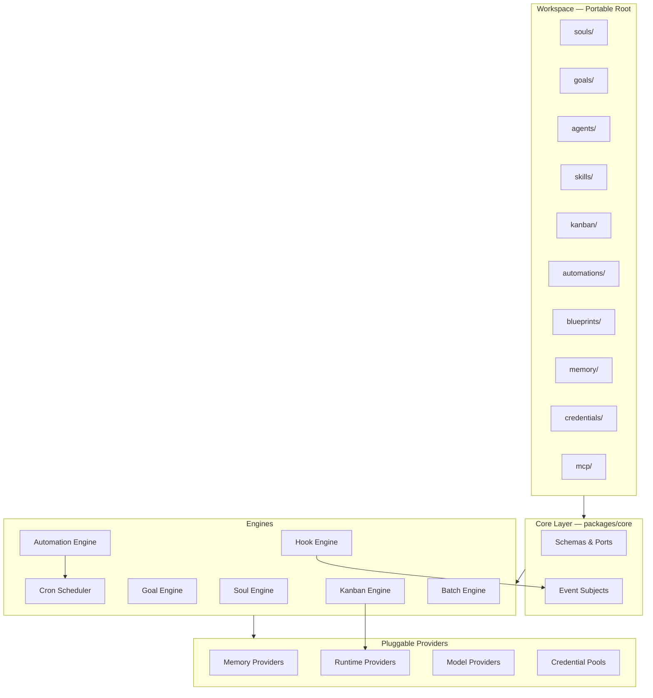
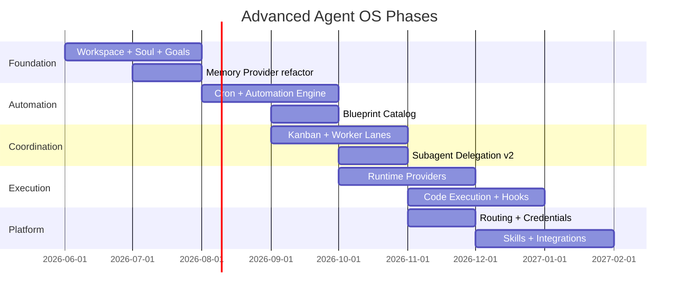

# Advanced Agent OS — Overview

Anvio Advanced Agent OS extends the Level 1 foundation into a full **local-first, file-first, configuration-driven** platform for long-lived agents, persistent goals, automation, multi-agent coordination, and vendor-agnostic execution.

## Design Principles (Mandatory)

| Principle | Meaning |
|-----------|---------|
| **Local First** | Works offline; no mandatory cloud |
| **File First** | Filesystem is the default store for all state |
| **Configuration Driven** | YAML/JSON/Markdown; no core code changes for behavior |
| **Plugin Based** | Memory, runtime, storage, integrations are swappable |
| **Vendor Agnostic** | No coupling to a single LLM or editor |
| **Progressive Enhancement** | Level 1 works alone; databases and sandboxes are optional |

**Default mode:** filesystem-only. Databases (SQLite, PostgreSQL, Qdrant) are opt-in via `workspace/anvio.yaml`.

## System Map



## Feature Index

| Feature | Doc | Package |
|---------|-----|---------|
| Soul System | [25-soul-system.md](./25-soul-system.md) | `@anvio/souls` |
| Goal System | [26-goal-system.md](./26-goal-system.md) | `@anvio/goals` |
| Memory Providers | [29-memory-providers.md](./29-memory-providers.md) | `@anvio/memory` |
| Automation Engine | [27-automation-engine.md](./27-automation-engine.md) | `@anvio/automation` |
| Cron Scheduler | [27-automation-engine.md](./27-automation-engine.md#cron-scheduler) | `@anvio/automation` |
| Blueprint Catalog | [34-blueprint-catalog.md](./34-blueprint-catalog.md) | `@anvio/blueprints` |
| Subagent Delegation | [40-subagent-delegation.md](./40-subagent-delegation.md) | `@anvio/agents` |
| Kanban System | [28-kanban-system.md](./28-kanban-system.md) | `@anvio/kanban` |
| Worker Lanes | [28-kanban-system.md](./28-kanban-system.md#worker-lanes) | `@anvio/kanban` |
| Runtime Providers | [30-runtime-providers.md](./30-runtime-providers.md) | `@anvio/runtimes` |
| Code Execution | [30-runtime-providers.md](./30-runtime-providers.md#code-execution-engine) | `@anvio/execution` |
| Event Hooks | [31-event-hooks.md](./31-event-hooks.md) | `@anvio/hooks` |
| Batch Processing | [32-batch-processing.md](./32-batch-processing.md) | `@anvio/batch` |
| Credential Pools | [33-credential-pools.md](./33-credential-pools.md) | `@anvio/credentials` |
| Provider Routing | [36-provider-routing.md](./36-provider-routing.md) | `@anvio/models` |
| Skills Catalog | [37-skills-catalog.md](./37-skills-catalog.md) | `@anvio/skills` |
| Integrations | [38-integration-architecture.md](./38-integration-architecture.md) | `@anvio/integrations` |
| Editor Integration | [39-editor-integration.md](./39-editor-integration.md) | `@anvio/acp` |
| Workspace Layout | [35-workspace-architecture.md](./35-workspace-architecture.md) | `@anvio/workspace` |

## Relationship to Existing Concepts

| Existing | Advanced OS Extension |
|----------|----------------------|
| **Persona** (`kind: Persona`) | **Soul** — persistent identity across sessions; persona becomes a *view* or *template* applied to a soul |
| **Agent** (`kind: Agent`) | Agent binds soul + skills + runtime + model routing |
| **Memory** (short/long/semantic ports) | Unified **MemoryProvider** with filesystem default |
| **SupervisorOrchestrator** | Full **delegation graph** with failure handling and progress |
| **EventSubjects** | Extended with goal/task/hook/automation subjects |
| **ModelProvider** | **Routing + fallback + credential pools** |

## Layered Delivery



See [plans/2026-06-19-001-feat-advanced-agent-os-plan.md](./plans/2026-06-19-001-feat-advanced-agent-os-plan.md) for implementation units.

## CLI Surface

All commands are available via `anvio help`. Grouped reference:

```bash
# Core
anvio init [path]
anvio chat [--agent NAME]
anvio run <agent> [message] [--detach]
anvio workspace validate

# Identity & goals
anvio soul list | show <slug> [--context] | create --slug <slug> --name <name>
anvio goal list | create | progress | complete | pause | resume

# Automation & workflows
anvio blueprint catalog | run <slug> [--dry-run]
anvio automation list | run | enable
anvio cron list | next-runs
anvio hooks test <event>
anvio batch run | status | resume

# Coordination
anvio kanban list | create | move | assign

# Execution & platform
anvio runtime list | test
anvio exec run | audit
anvio acp serve | status
anvio credentials list | add | test
anvio routing show | test
anvio skill catalog | install | validate
anvio mcp list | test
```

See [35-workspace-architecture.md](./35-workspace-architecture.md) for scaffold files created by `anvio init`.

## Non-Goals

- Mandatory SaaS marketplace hosting (marketplace is architecture-only in Phase 1)
- Replacing Personas — souls supersede identity; personas remain as reusable templates
- Breaking Level 1 filesystem-only mode
