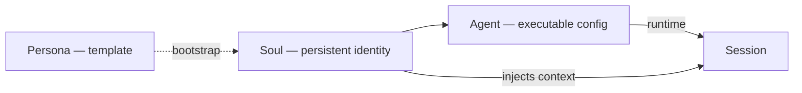
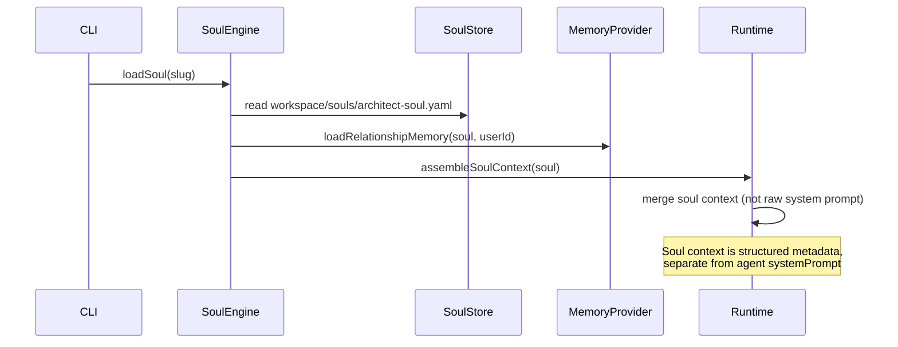

# Soul System

A **Soul** is the long-term identity of an agent. It is **not** a system prompt — it is durable state that survives sessions, restarts, upgrades, and provider changes.

## What a Soul Contains

| Dimension | Description | Example |
|-----------|-------------|---------|
| **Identity** | Display name, role, scope | `Architect Soul`, Senior Software Architect |
| **Personality** | Behavioral traits | thoughtful, structured |
| **Values** | Non-negotiable principles | simplicity, maintainability |
| **Preferences** | Interaction defaults | professional conversation |
| **Communication Style** | Tone, format, language | concise, structured rationale |
| **Long-Term Goals** | Aspirations tied to the soul | help build maintainable systems |
| **Behavioral Tendencies** | Recurring patterns | consider tradeoffs before recommending |
| **Relationship Memory** | Facts about the user relationship | prefers diagrams in architecture reviews |

## Soul vs Persona vs Agent



- **Persona** (`kind: Persona`): reusable template; optional seed for a new soul
- **Soul** (`kind: Soul`): persisted identity; evolves over time
- **Agent** (`kind: Agent`): binds soul + skills + model + tools for execution

## File Layout

```
workspace/souls/
  architect-soul.yaml    # Soul definition
  architect-soul/
    relationship/        # Relationship memory entries
      local-user.yaml
    journal/             # Optional reflective entries (append-only)
      2026-06-19.md
```

## Schema (Target)

```yaml
apiVersion: anvio.io/v1
kind: Soul
metadata:
  slug: architect-soul
  version: "1.0.0"
  createdAt: "2026-06-19T00:00:00Z"
  updatedAt: "2026-06-19T00:00:00Z"
spec:
  name: Architect Soul
  identity:
    role: Senior Software Architect
    description: Long-term architectural thinking partner
  values:
    - simplicity
    - maintainability
  personality:
    - thoughtful
    - structured
  preferences:
    conversation: professional
    diagrams: when helpful
  communicationStyle:
    tone: professional and thoughtful
    format: structured with clear rationale
  longTermGoals:
    - help build maintainable systems
    - improve architecture over time
  behavioralTendencies:
    - consider tradeoffs before recommending
    - prefer simplicity over cleverness
  relationshipMemory:
    provider: filesystem          # or memory provider ref
    path: architect-soul/relationship
  evolution:
    allowAutoUpdate: true         # soul can evolve from sessions
    requireApproval: false        # gate changes behind approval hook
```

## Architecture



## Soul Context Assembly

Soul context is injected as **structured metadata**, not concatenated into the system prompt:

1. Load soul YAML
2. Load relationship memory for `userId`
3. Build `SoulContext` object (core port)
4. Runtime merges into context assembly phase — distinct from `agent.spec.persona` system prompt

```typescript
// packages/core/src/ports/soul.port.ts (planned)
interface SoulContext {
  soulId: string;
  identity: Record<string, string>;
  values: string[];
  personality: string[];
  preferences: Record<string, string>;
  communicationStyle: Record<string, string>;
  longTermGoals: string[];
  behavioralTendencies: string[];
  relationshipFacts: MemoryEntry[];
}
```

## Persistence Rules

1. Souls live in `workspace/souls/` — git-versionable
2. Relationship memory uses the configured **MemoryProvider** (filesystem default)
3. Soul updates emit `anvio.soul.updated.v1` event
4. Session end may trigger soul evolution (configurable)

## Evolution & Safety

| Mode | Behavior |
|------|----------|
| `allowAutoUpdate: false` | Soul is read-only during runs |
| `requireApproval: true` | Proposed changes go to approval workflow |
| Hook `onSoulEvolved` | External scripts validate changes |

## CLI Examples

```bash
anvio soul list
anvio soul show architect-soul
anvio soul create --slug architect-soul --name "Architect Soul" --from-persona architect
anvio soul show architect-soul --context
```

## Extension Guide

1. Add custom soul dimensions via `spec.extensions` (arbitrary YAML)
2. Implement `SoulStore` port for non-filesystem backends (optional)
3. Register hook on `onSessionEnd` to propose soul updates

## Operational Runbook

| Scenario | Action |
|----------|--------|
| Backup souls | `git add workspace/souls && git commit` |
| Migrate workspace | Copy `workspace/souls/` to new machine |
| Reset relationship memory | Delete `workspace/souls/{slug}/relationship/` |
| Debug context | `anvio soul show architect-soul --context` dumps assembled context |

## Package Boundaries

- **Schema:** `packages/core/src/schemas/soul.schema.ts`
- **Port:** `packages/core/src/ports/soul.port.ts`
- **Engine:** `packages/souls/src/soul-engine.ts`
- **Store:** `packages/souls/src/filesystem-soul-store.ts`
