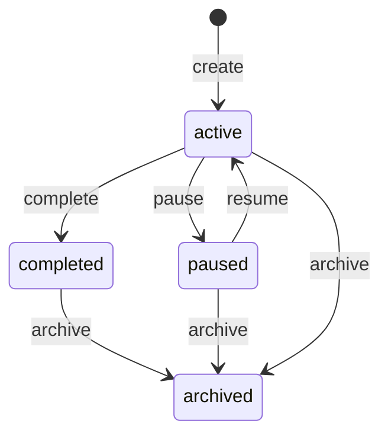
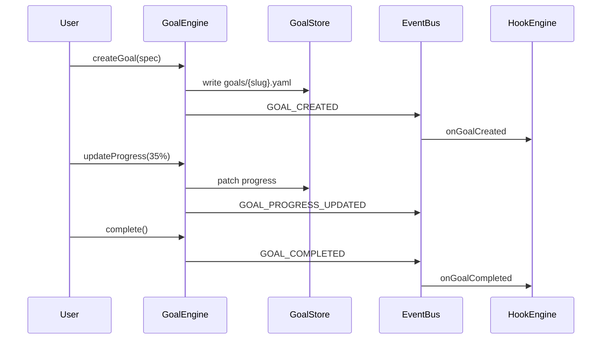

# Goal System

Goals exist **independently from conversations**. They represent long-horizon outcomes with lifecycle management, progress tracking, and prioritization.

## Principles

- File-first: one YAML file per goal under `workspace/goals/`
- Survives session restarts and provider changes
- Linkable to kanban tasks, automations, and agent assignments
- No database required in Level 1

## File Layout

```
workspace/goals/
  project-refactor.yaml
  learn-golang.yaml
  improve-architecture.yaml
  review-repository.yaml
```

## Schema

```yaml
apiVersion: anvio.io/v1
kind: Goal
metadata:
  slug: project-refactor
  createdAt: "2026-06-01T00:00:00Z"
  updatedAt: "2026-06-19T08:00:00Z"
spec:
  title: Finish software project refactor
  description: Migrate monolith modules to packages with tests
  status: active          # active | paused | completed | archived
  priority: high          # critical | high | medium | low
  progress:
    percent: 35
    milestones:
      - name: Extract core package
        completed: true
        completedAt: "2026-06-10"
      - name: Migrate agents package
        completed: false
  assignedAgents:
    - architect
    - software-engineer
  linkedTasks:
    - kanban/task-001
  automations:
    - weekly-review-refactor
  tags:
    - engineering
    - q2-2026
  dueDate: "2026-08-31"
```

## Lifecycle



## Architecture



## Operations

| Operation | CLI | Event |
|-----------|-----|-------|
| Create | `anvio goal create` | `GOAL_CREATED` |
| Progress | `anvio goal progress <slug> --percent 35` | `GOAL_PROGRESS_UPDATED` |
| Complete | `anvio goal complete <slug>` | `GOAL_COMPLETED` |
| Pause | `anvio goal pause <slug>` | `GOAL_PAUSED` |
| Resume | `anvio goal resume <slug>` | `GOAL_RESUMED` |
| Prioritize | `anvio goal prioritize --order ...` | `GOAL_REPRIORITIZED` |

## Prioritization

Goals are ordered by:

1. Explicit `priority` field (critical > high > medium > low)
2. `dueDate` ascending
3. `metadata.updatedAt` descending

Store order in `workspace/goals/_index.yaml` (optional index file):

```yaml
apiVersion: anvio.io/v1
kind: GoalIndex
spec:
  order:
    - project-refactor
    - learn-golang
    - review-repository
```

## Integration Points

| System | Integration |
|--------|-------------|
| **Kanban** | Tasks link via `linkedTasks` |
| **Automation** | Goal triggers fire automations |
| **Soul** | Soul long-term goals may sync bidirectionally |
| **Batch** | Batch jobs can target goal slugs |

## Extension Guide

1. Add custom fields under `spec.extensions`
2. Implement `GoalStore` port for SQLite/PostgreSQL (optional)
3. Register hooks on `onGoalCreated`, `onGoalCompleted`

## Operational Runbook

| Scenario | Action |
|----------|--------|
| Audit active goals | `anvio goal list --status active` |
| Export for report | `anvio goal export --format markdown` |
| Recover deleted goal | Restore from git history |

## Package Boundaries

- **Schema:** `packages/core/src/schemas/goal.schema.ts`
- **Port:** `packages/core/src/ports/goal.port.ts`
- **Engine:** `packages/goals/src/goal-engine.ts`
- **Store:** `packages/goals/src/filesystem-goal-store.ts`
