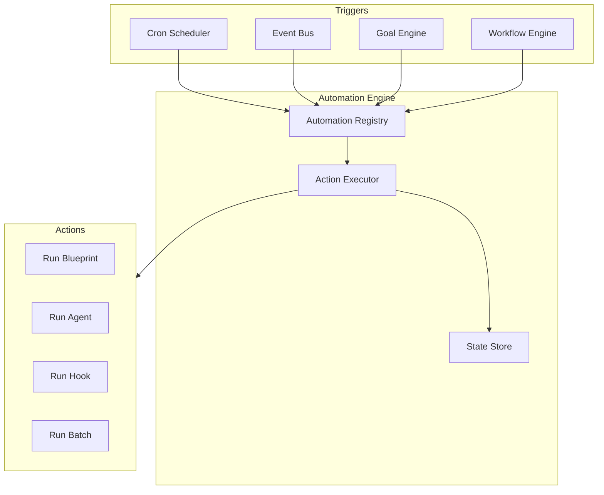
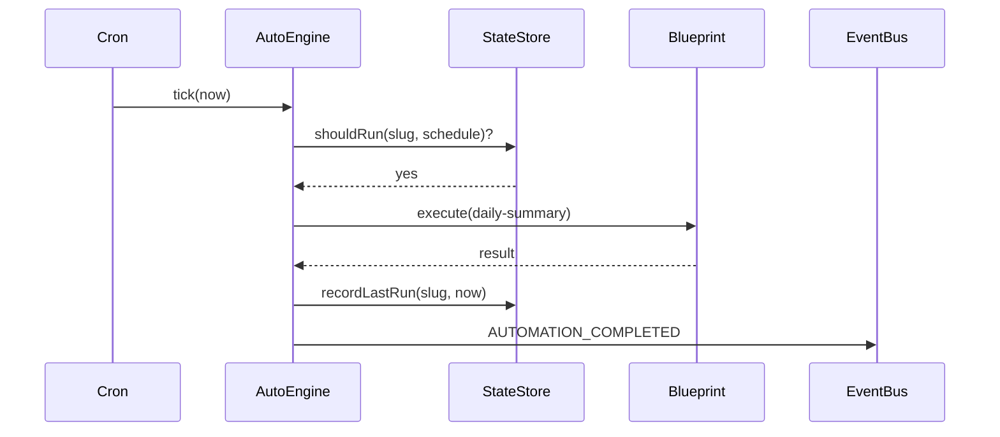

# Automation Engine

The Automation Engine executes recurring and event-driven workflows without manual intervention. All automations are **configuration-driven** and stored in the filesystem by default.

## Trigger Types

| Type | Example | Config Key |
|------|---------|------------|
| **Scheduled (Cron)** | Every day at 08:00 | `schedule: "0 8 * * *"` |
| **Event** | On every commit | `on: git.commit` |
| **Workflow** | After blueprint completes | `on: workflow.completed` |
| **Goal** | When goal reaches 100% | `on: goal.completed` |

## File Layout

```
workspace/automations/
  daily-summary.yaml
  weekly-review.yaml
  on-commit-review.yaml

workspace/automations/_state/
  daily-summary.last-run    # Persisted scheduler state
  cron.lock                 # Leader election (optional, multi-instance)
```

## Automation Schema

```yaml
apiVersion: anvio.io/v1
kind: Automation
metadata:
  slug: daily-summary
  enabled: true
spec:
  description: Summarize notifications every morning
  trigger:
    type: cron
    schedule: "0 8 * * *"
    timezone: Asia/Jakarta
  action:
    type: blueprint
    blueprint: daily-summary
    inputs:
      userId: local-user
  retry:
    maxAttempts: 3
    backoff: exponential
  onFailure:
    notify: true
    hook: workspace/hooks/on-automation-failed.sh
```

## Event Trigger Example

```yaml
apiVersion: anvio.io/v1
kind: Automation
metadata:
  slug: on-commit-review
spec:
  trigger:
    type: event
    event: git.commit
    filter:
      branch: main
  action:
    type: agent
    agent: code-reviewer
    input: "Review the latest commit"
```

## Goal Trigger Example

```yaml
spec:
  trigger:
    type: goal
    event: goal.completed
    goalSlug: project-refactor
  action:
    type: blueprint
    blueprint: release-preparation
```

## Architecture



## Sequence: Scheduled Run



## Cron Scheduler

Native cron scheduling with **restart-safe** persistence.

### Features

- Standard cron expressions (`0 8 * * *`, `0 9 * * MON`)
- Timezone-aware (`spec.trigger.timezone`)
- State persisted to `workspace/automations/_state/`
- Survives process restarts — missed runs optionally catch up (configurable)

### Cron Schema Extension

```yaml
trigger:
  type: cron
  schedule: "0 9 * * MON"
  timezone: UTC
  catchUp: false          # skip missed runs after long downtime
  maxCatchUp: 1           # max catch-up executions
```

### Implementation Notes

- **Level 1:** in-process `node-cron` or lightweight scheduler in `packages/automation`
- **Level 3:** optional distributed lock via Redis for multi-worker deployments
- Cron definitions live in automation YAML — no code changes to add schedules

### CLI

```bash
anvio cron list
anvio cron add daily-summary --schedule "0 8 * * *"
anvio cron remove daily-summary
anvio cron next-runs --limit 5
```

## Failure Handling

| Policy | Behavior |
|--------|----------|
| `retry.maxAttempts` | Retry with backoff |
| `onFailure.notify` | Send notification via channel hub |
| `onFailure.hook` | Execute local script |

## Extension Guide

1. Register custom trigger types via plugin manifest
2. Register custom action types (`type: webhook`, `type: mcp-tool`)
3. Add automations by dropping YAML in `workspace/automations/`

## Operational Runbook

| Scenario | Action |
|----------|--------|
| Disable automation | Set `metadata.enabled: false` |
| Debug missed run | Check `automations/_state/{slug}.last-run` |
| Force run | `anvio automation run daily-summary --force` |
| View logs | `anvio logs --automation daily-summary` |

## Package Boundaries

- **Schema:** `packages/core/src/schemas/automation.schema.ts`
- **Engine:** `packages/automation/src/automation-engine.ts`
- **Cron:** `packages/automation/src/cron-scheduler.ts`
- **State:** `packages/automation/src/filesystem-state-store.ts`
