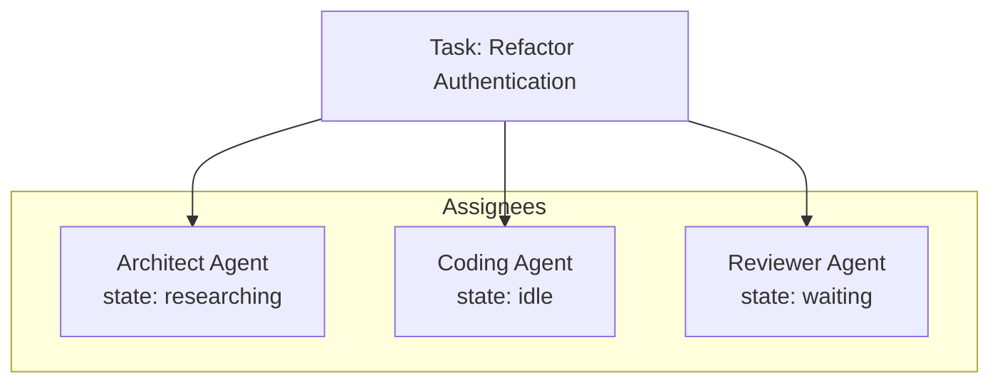
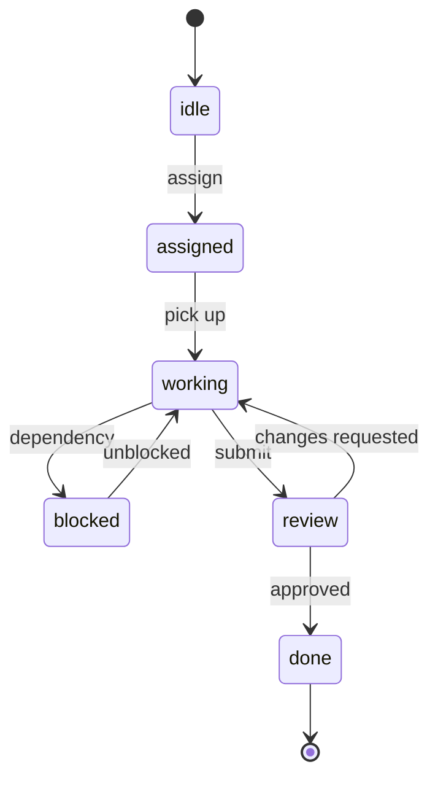
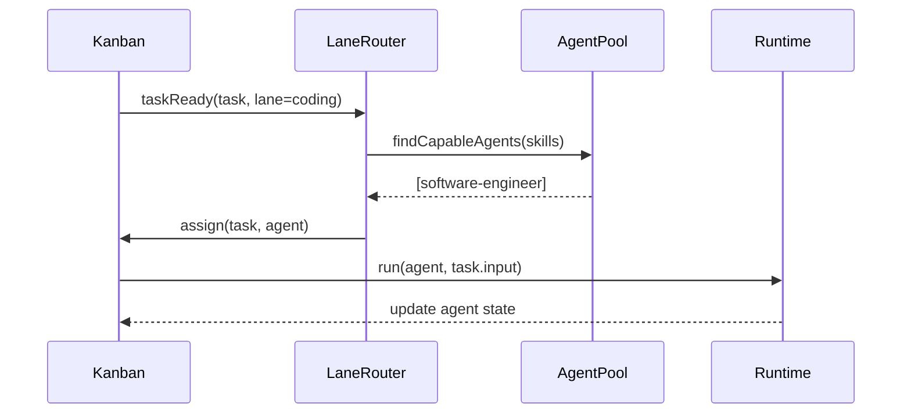
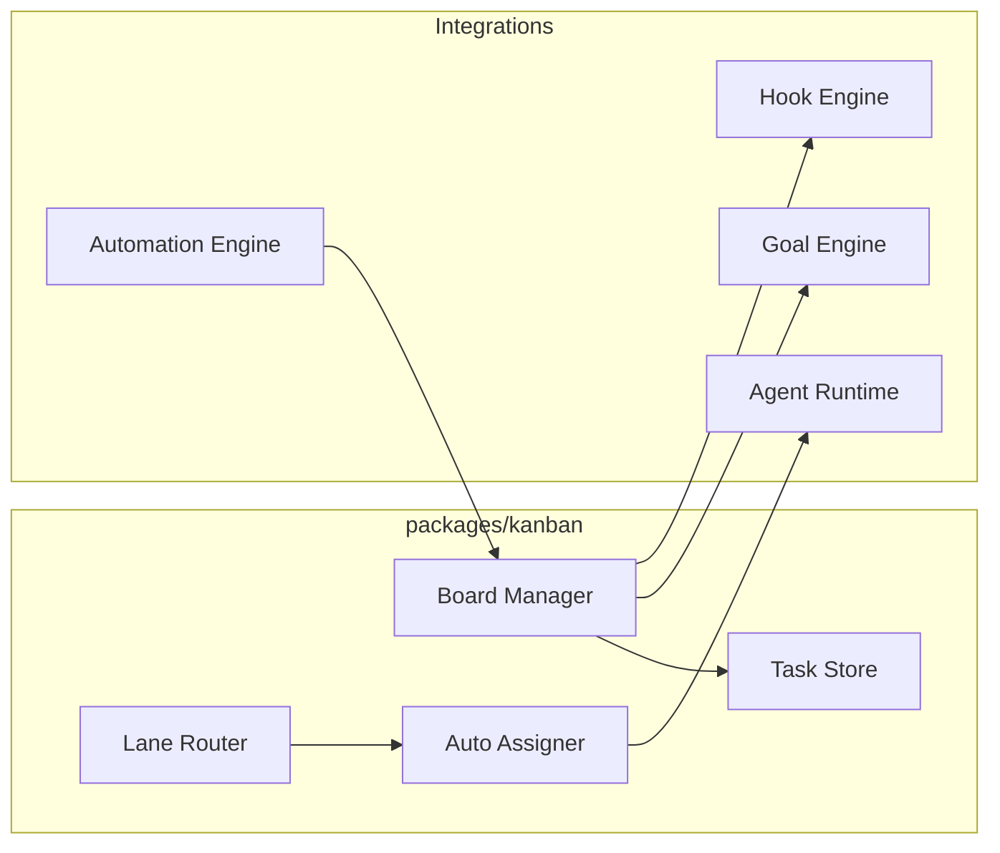

# Kanban System & Multi-Agent Board

Kanban-style task management with multi-agent assignment, per-agent work state, and specialized worker lanes.

## Kanban Columns

| Column | Purpose |
|--------|---------|
| **Backlog** | Unprioritized work |
| **Todo** | Ready to start |
| **Doing** | In progress |
| **Review** | Awaiting review |
| **Done** | Completed |

## File Layout

```
workspace/kanban/
  boards/
    default.yaml           # Board definition
  tasks/
    task-001.yaml          # Individual task files
    task-002.yaml
  lanes/
    research.yaml          # Worker lane definitions
    coding.yaml
    review.yaml
```

## Board Schema

```yaml
apiVersion: anvio.io/v1
kind: KanbanBoard
metadata:
  slug: default
spec:
  columns:
    - backlog
    - todo
    - doing
    - review
    - done
  defaultLane: coding
  wipLimits:
    doing: 3
    review: 2
```

## Task Schema

```yaml
apiVersion: anvio.io/v1
kind: KanbanTask
metadata:
  id: task-001
  createdAt: "2026-06-19T00:00:00Z"
spec:
  title: Refactor Authentication
  description: Migrate auth to plugin architecture
  column: doing
  priority: high
  assignees:
    - type: agent
      id: architect
      state:
        status: researching
        startedAt: "2026-06-19T08:00:00Z"
        sessionId: sess-abc123
    - type: agent
      id: software-engineer
      state:
        status: idle
    - type: human
      id: local-user
  linkedGoal: project-refactor
  requiredSkills:
    - architecture
    - coding
  lane: coding
  labels:
    - auth
    - refactor
```

## Multi-Agent Board

Each assigned agent maintains **independent work state**:



### Per-Agent State Machine



## Worker Lanes

Specialized lanes route tasks to agents by capability.

### Lane Definition

```yaml
apiVersion: anvio.io/v1
kind: WorkerLane
metadata:
  slug: coding
spec:
  description: Implementation and code changes
  requiredSkills:
    - coding
  preferredAgents:
    - software-engineer
  autoAssign: true
  concurrency: 2
```

### Built-in Lanes

| Lane | Skills | Typical Agents |
|------|--------|----------------|
| **Research** | research, planning | researcher, architect |
| **Coding** | coding, debugging | software-engineer |
| **Review** | code-review | code-reviewer |
| **Testing** | testing, qa | qa-agent |
| **Documentation** | documentation | technical-writer |

### Auto-Assignment Flow



## Architecture



## Events

| Event | When |
|-------|------|
| `TASK_CREATED` | New task in backlog |
| `TASK_ASSIGNED` | Agent or human assigned |
| `TASK_MOVED` | Column change |
| `TASK_COMPLETED` | Moved to done |
| `LANE_QUEUE_UPDATED` | Lane queue changed |

## CLI

```bash
anvio kanban board
anvio kanban task create --title "Refactor Auth" --lane coding
anvio kanban move task-001 --to doing
anvio kanban assign task-001 --agent architect
anvio kanban lanes
```

## Extension Guide

1. Add custom columns via board YAML
2. Define new lanes under `workspace/kanban/lanes/`
3. Hook `onTaskAssigned` for external notifications (Slack, Jira)

## Operational Runbook

| Scenario | Action |
|----------|--------|
| WIP limit exceeded | Tasks queue in Todo; check `wipLimits` |
| Stuck agent state | `anvio kanban reset-state task-001 --agent architect` |
| Board backup | Git commit `workspace/kanban/` |

## Package Boundaries

- **Schema:** `packages/core/src/schemas/kanban.schema.ts`
- **Engine:** `packages/kanban/src/kanban-engine.ts`
- **Lanes:** `packages/kanban/src/lane-router.ts`
- **Store:** `packages/kanban/src/filesystem-task-store.ts`
