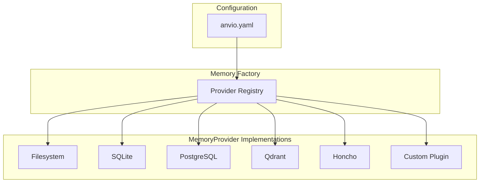
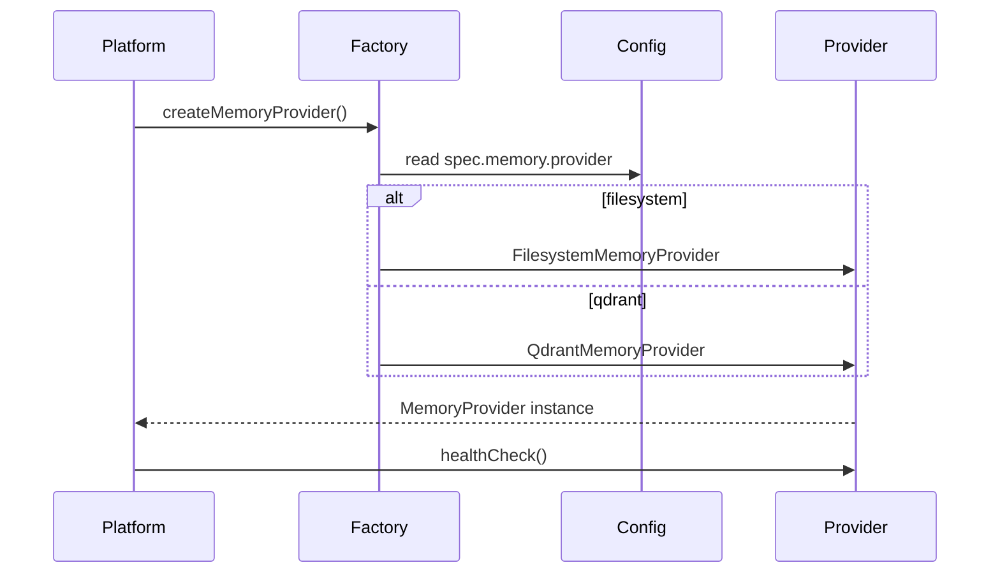

# Memory Providers

Pluggable memory architecture with **filesystem as the default**. All providers implement the same port and are interchangeable via `workspace/anvio.yaml`.

## Unified MemoryProvider Port

Extends existing short-term, long-term, and semantic ports into a single provider interface:

```typescript
// packages/core/src/ports/memory-provider.port.ts (planned)
interface MemoryProvider {
  readonly providerId: string;

  // Short-term (session context)
  getMessages(sessionId: string): Promise<ChatMessage[]>;
  setMessages(sessionId: string, messages: ChatMessage[], ttl?: number): Promise<void>;
  appendMessage(sessionId: string, message: ChatMessage): Promise<void>;
  clearSession(sessionId: string): Promise<void>;

  // Long-term (facts, preferences, soul relationship)
  store(entry: MemoryEntry): Promise<MemoryEntry>;
  getBySession(sessionId: string, limit?: number): Promise<MemoryEntry[]>;
  getByUser(userId: string, type?: MemoryEntryType, limit?: number): Promise<MemoryEntry[]>;

  // Semantic (optional — provider may no-op)
  storeSemantic?(entry: MemoryEntry, embedding?: number[]): Promise<void>;
  search?(query: string, options?: SearchOptions): Promise<MemoryEntry[]>;

  // Lifecycle
  healthCheck(): Promise<{ ok: boolean; details?: string }>;
  migrate?(target: MemoryProvider): Promise<void>;
}
```

## Provider Matrix

| Provider | Level | Storage | Semantic Search | Default |
|----------|-------|---------|-----------------|---------|
| **Filesystem** | 1 | JSON/YAML files | No | Yes |
| **SQLite** | 2 | Single `.db` file | Optional FTS | No |
| **PostgreSQL** | 3 | Server DB | pgvector optional | No |
| **Qdrant** | 3 | Vector DB | Yes | No |
| **Honcho** | 3 | Honcho API | Yes (via Honcho) | No |
| **Custom** | * | Plugin-defined | Plugin-defined | No |

## Configuration

```yaml
# workspace/anvio.yaml
spec:
  memory:
    provider: filesystem
    basePath: memory
    # Optional provider-specific config:
    sqlite:
      path: memory/anvio.db
    postgresql:
      connectionString: ${DATABASE_URL}
    qdrant:
      url: http://localhost:6333
      collection: anvio-memory
    honcho:
      apiKey: ${HONCHO_API_KEY}
      workspace: default
```

## Filesystem Layout (Default)

```
workspace/memory/
  sessions/
    {session-id}.json       # Short-term messages
  users/
    {user-id}.json          # Long-term facts & preferences
  souls/
    {soul-id}/{user-id}.json  # Relationship memory
  index/
    entries.jsonl           # Optional append-only audit log
```

## Architecture



## Provider Selection Sequence



## Interchangeability Rules

1. All providers implement `MemoryProvider` port
2. Switching providers: update `anvio.yaml`, restart — no code changes
3. Optional `migrate()` for data portability between providers
4. Semantic methods are optional — callers check availability

## Honcho Integration

Honcho provides session-aware memory with built-in user/session modeling:

```yaml
spec:
  memory:
    provider: honcho
    honcho:
      apiKey: ${HONCHO_API_KEY}
      baseUrl: https://api.honcho.dev
```

Maps Anvio concepts:

| Anvio | Honcho |
|-------|--------|
| `userId` | Honcho user |
| `sessionId` | Honcho session |
| `MemoryEntry` | Honcho message/metadata |

## Custom Provider Plugin

```yaml
# workspace/plugins/my-memory/plugin.yaml
name: my-memory
type: memory-provider
entry: ./index.js
config:
  endpoint: http://localhost:9999
```

## Extension Guide

1. Implement `MemoryProvider` in a new package
2. Register in `packages/memory/src/registry.ts`
3. Add config schema to `workspace.schema.ts`
4. Document migration path from filesystem

## Operational Runbook

| Scenario | Action |
|----------|--------|
| Backup memory | Copy `workspace/memory/` or git commit |
| Switch to SQLite | Change provider, run `anvio memory migrate --to sqlite` |
| Health check | `anvio providers memory --health` |
| Clear session | `anvio memory clear-session <id>` |

## Relationship to Existing Code

Current ports in `packages/core/src/ports/memory.port.ts` remain; `MemoryProvider` composes them. Existing `packages/memory` implementations become provider adapters:

- Filesystem → new default provider (extract from current JSON store)
- `postgres-long-term.ts` → PostgreSQL provider
- `redis-short-term.ts` → optional Redis session cache layer

## Package Boundaries

- **Port:** `packages/core/src/ports/memory-provider.port.ts`
- **Factory:** `packages/memory/src/provider-factory.ts`
- **Providers:** `packages/memory/src/providers/{filesystem,sqlite,postgresql,qdrant,honcho}/`
