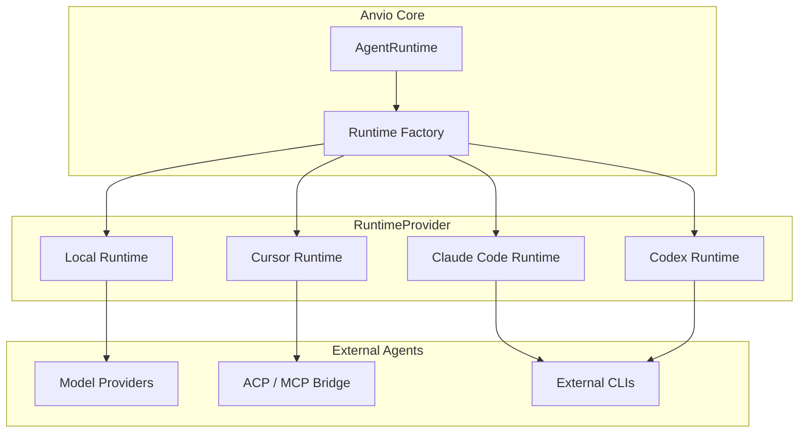
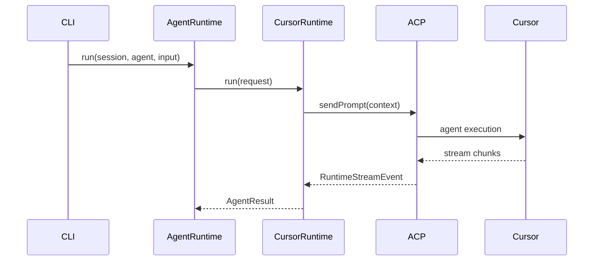

# Runtime Providers & Code Execution

Vendor-agnostic runtime layer that decouples Anvio from any single coding agent (Claude Code, Cursor, Codex, local models).

## RuntimeProvider Port

```typescript
// packages/core/src/ports/runtime-provider.port.ts (planned)
interface RuntimeProvider {
  readonly runtimeId: string;  // claude-code | cursor | codex | local

  capabilities(): RuntimeCapabilities;

  run(request: RuntimeRequest): Promise<RuntimeResult>;
  stream(request: RuntimeRequest): AsyncIterable<RuntimeStreamEvent>;

  // Optional: editor-specific features
  executeTool?(call: ToolCall): Promise<ToolResult>;
  getWorkspaceContext?(): Promise<WorkspaceContext>;
}

interface RuntimeCapabilities {
  supportsTools: boolean;
  supportsStreaming: boolean;
  supportsSubagents: boolean;
  supportsMcp: boolean;
  supportedLanguages: string[];
}
```

## Implementations

| Runtime | ID | Use Case |
|---------|-----|----------|
| **Claude Code Runtime** | `claude-code` | Anthropic CLI agent |
| **Cursor Runtime** | `cursor` | Cursor agent via MCP/ACP |
| **Codex Runtime** | `codex` | OpenAI Codex CLI |
| **Local Runtime** | `local` | Direct model provider (default Level 1) |

## Configuration

```yaml
# workspace/anvio.yaml
spec:
  runtime:
    default: local
    providers:
      local:
        enabled: true
      cursor:
        enabled: false
        acp:
          endpoint: http://localhost:8765
      claude-code:
        enabled: false
        binary: claude
      codex:
        enabled: false
        binary: codex
```

## Agent Runtime Binding

```yaml
# workspace/agents/architect.yaml
spec:
  runtime:
    provider: cursor        # Override default
    fallback: local
  model:
    provider: anthropic
    model: claude-sonnet-4-20250514
```

## Architecture



## Sequence: Agent Run via Cursor Runtime



## Code Execution Engine

Separate from agent runtime — executes code in controlled environments.

### Supported Runtimes

| Runtime | Sandbox | Default |
|---------|---------|---------|
| **Shell** | process limits | Yes |
| **Python** | subprocess + limits | Yes |
| **Node.js** | subprocess + limits | Yes |
| **Go** | subprocess + limits | Yes |
| **Docker** | container sandbox | Optional (Level 3) |

### Execution Port

```typescript
interface CodeExecutor {
  execute(request: CodeExecutionRequest): Promise<CodeExecutionResult>;
}

interface CodeExecutionRequest {
  runtime: 'shell' | 'python' | 'node' | 'go' | 'docker';
  code: string;
  cwd?: string;
  env?: Record<string, string>;
  timeoutMs: number;
  memoryLimitMb?: number;
  networkEnabled?: boolean;
}

interface CodeExecutionResult {
  exitCode: number;
  stdout: string;
  stderr: string;
  durationMs: number;
  auditId: string;
}
```

### Security Requirements

| Control | Implementation |
|---------|----------------|
| **Sandboxing** | Process isolation; Docker optional |
| **Limits** | CPU, memory, disk quotas |
| **Timeouts** | Hard kill after `timeoutMs` |
| **Auditing** | Every execution logged to `workspace/audit/executions/` |
| **Network** | Disabled by default; opt-in per tool |
| **Filesystem** | Scoped to workspace or worktree |

### Configuration

```yaml
spec:
  execution:
    defaultTimeoutMs: 30000
    maxMemoryMb: 512
    networkEnabled: false
    docker:
      enabled: false
      image: anvio/sandbox:latest
    allowedRuntimes:
      - shell
      - python
      - node
      - go
```

## Extension Guide

1. Implement `RuntimeProvider` for new editor/agent CLIs
2. Register via plugin manifest (`type: runtime-provider`)
3. Implement `CodeExecutor` sandbox for new languages

## Operational Runbook

| Scenario | Action |
|----------|--------|
| Switch runtime | Update agent YAML `spec.runtime.provider` |
| Debug ACP connection | `anvio runtime test cursor` |
| Audit executions | `anvio audit executions --last 24h` |
| Kill runaway process | `anvio execution kill <auditId>` |

## Package Boundaries

- **Runtime port:** `packages/core/src/ports/runtime-provider.port.ts`
- **Runtimes:** `packages/runtimes/src/{local,cursor,claude-code,codex}/`
- **Execution:** `packages/execution/src/code-executor.ts`
- **Sandbox:** `packages/execution/src/sandbox/`

## Design Constraint

**No editor-specific logic in core.** All Cursor/VS Code/Windsurf specifics live in `packages/runtimes` and `packages/acp`.
