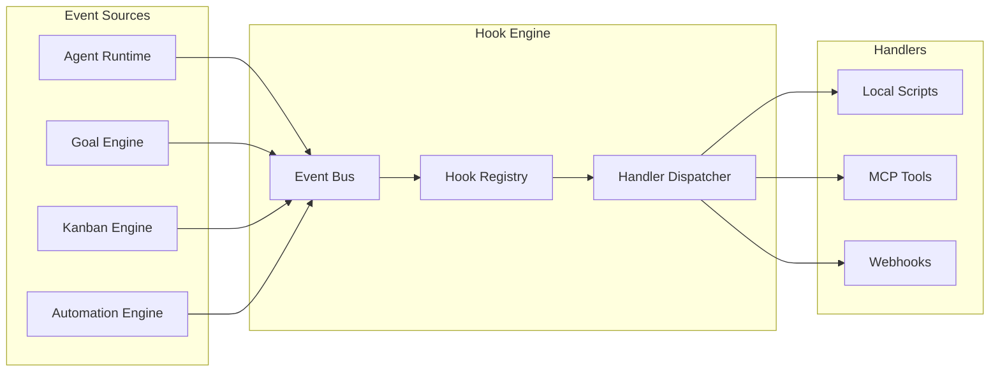
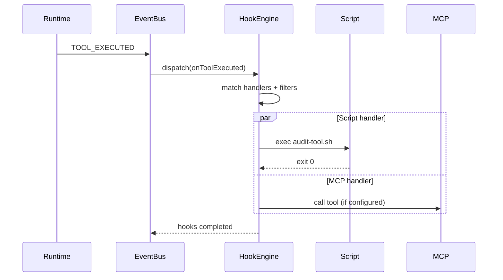

# Event Hooks

Event-driven hook system for extending Anvio behavior without modifying core code.

## Hook Events

| Hook | Trigger | Payload |
|------|---------|---------|
| `onSessionStart` | Session created | `{ sessionId, agentId, userId }` |
| `onSessionEnd` | Session closed | `{ sessionId, reason }` |
| `onGoalCreated` | Goal created | `{ goalSlug, spec }` |
| `onGoalCompleted` | Goal completed | `{ goalSlug }` |
| `onTaskAssigned` | Kanban task assigned | `{ taskId, assignee }` |
| `onTaskCompleted` | Task moved to done | `{ taskId }` |
| `onToolExecuted` | Tool invocation | `{ sessionId, toolName, status }` |
| `onWorkflowCompleted` | Blueprint/automation done | `{ workflowId, status }` |
| `onSoulEvolved` | Soul updated | `{ soulSlug, changes }` |
| `onAutomationFailed` | Automation error | `{ slug, error }` |

## Hook Types

| Type | Description | Example |
|------|-------------|---------|
| **Local Script** | Shell/Node script | `hooks/on-session-start.sh` |
| **MCP Integration** | Call MCP tool | `mcp://slack/post-message` |
| **Webhook** | HTTP POST | `https://api.example.com/hooks` |

## File Layout

```
workspace/hooks/
  hooks.yaml               # Hook registry
  on-session-start.sh
  on-goal-completed.js
  on-tool-executed/
    audit-log.sh
```

## Hook Registry Schema

```yaml
apiVersion: anvio.io/v1
kind: HookRegistry
spec:
  hooks:
    - event: onSessionStart
      handlers:
        - type: script
          path: hooks/on-session-start.sh
          timeoutMs: 5000
        - type: mcp
          server: slack
          tool: post_message
          args:
            channel: "#anvio"
            text: "Session started: {{sessionId}}"

    - event: onGoalCompleted
      handlers:
        - type: webhook
          url: https://hooks.example.com/goals
          method: POST
          headers:
            Authorization: Bearer ${WEBHOOK_TOKEN}
          body:
            goal: "{{goalSlug}}"
            completedAt: "{{timestamp}}"

    - event: onToolExecuted
      handlers:
        - type: script
          path: hooks/audit-tool.sh
          filter:
            toolName: filesystem.write
```

## Architecture



## Sequence: Tool Executed Hook



## Handler Contract

### Script Handlers

- Receive JSON payload via stdin
- Exit 0 on success, non-zero on failure
- Timeout enforced by `timeoutMs`

```bash
#!/bin/bash
# hooks/on-session-start.sh
payload=$(cat)
session_id=$(echo "$payload" | jq -r '.sessionId')
echo "[$(date)] Session started: $session_id" >> workspace/audit/sessions.log
```

### MCP Handlers

- Reference server and tool from `workspace/mcp/servers.yaml`
- Template variables in args: `{{sessionId}}`, `{{goalSlug}}`, etc.

### Webhook Handlers

- Retry with exponential backoff (configurable)
- Sign payloads optionally via HMAC

## Filtering

Handlers may include filters:

```yaml
filter:
  toolName: filesystem.write
  agentId: software-engineer
  column: done
```

## Extension Guide

1. Add hooks to `workspace/hooks/hooks.yaml`
2. Create handler scripts with executable permissions
3. Register custom events via plugin (extends `EventSubjects`)

## Operational Runbook

| Scenario | Action |
|----------|--------|
| Disable hook | Comment out in `hooks.yaml` |
| Debug handler | `anvio hooks test onSessionStart --dry-run` |
| View hook logs | `workspace/audit/hooks/` |
| Handler timeout | Increase `timeoutMs` or optimize script |

## Package Boundaries

- **Schema:** `packages/core/src/schemas/hook.schema.ts`
- **Engine:** `packages/hooks/src/hook-engine.ts`
- **Dispatcher:** `packages/hooks/src/handlers/{script,mcp,webhook}.ts`

## Relationship to Event Bus

Hooks subscribe to existing `EventSubjects` in `packages/events/src/types.ts`. New subjects will be added for goal, task, soul, and automation events.
