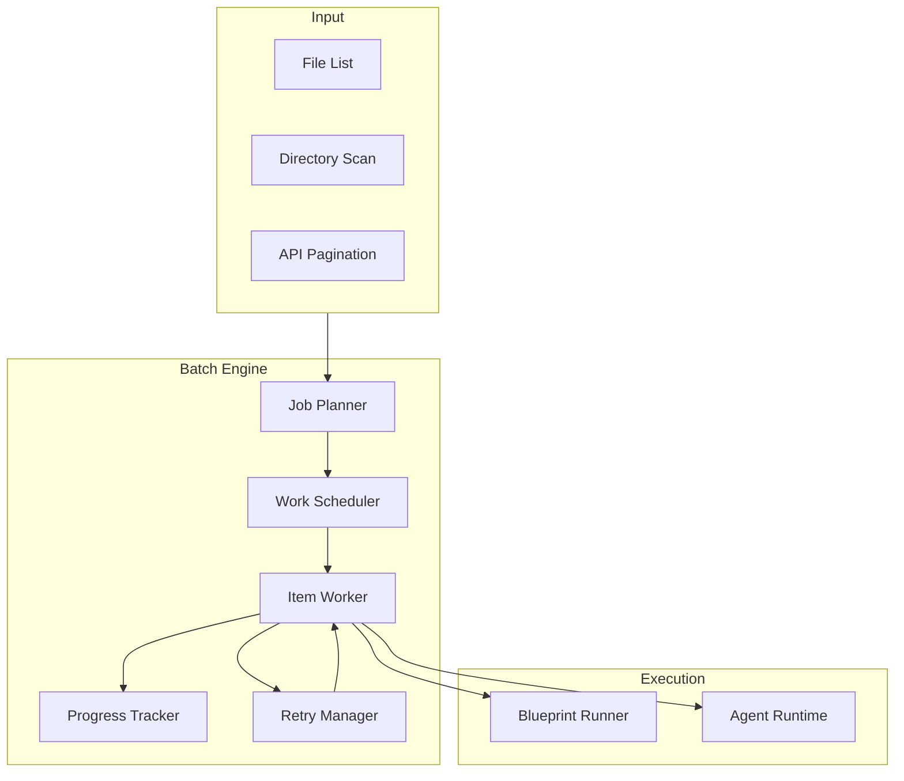
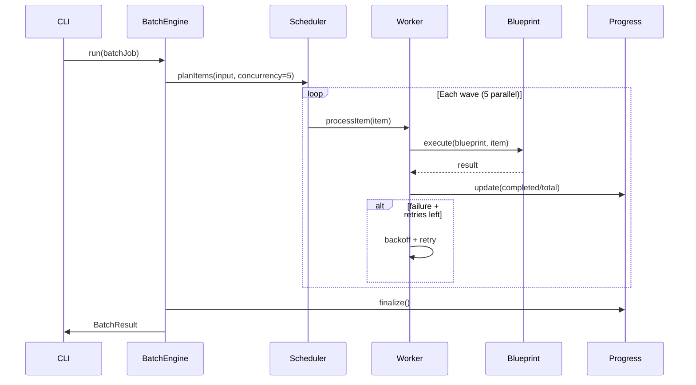

# Batch Processing

Execute large-scale operations with parallel execution, retry policies, and progress tracking.

## Use Cases

| Scenario | Input | Output |
|----------|-------|--------|
| Review 50 repositories | `repos.txt` | 50 review reports |
| Analyze 100 documents | `docs/` directory | Summary index |
| Generate reports for projects | Goal slugs | Markdown reports |

## Batch Job Schema

```yaml
apiVersion: anvio.io/v1
kind: BatchJob
metadata:
  id: batch-20260619-001
  createdAt: "2026-06-19T08:00:00Z"
spec:
  name: Review 50 repositories
  blueprint: repository-analysis
  input:
    type: file
    path: inputs/repos.txt
  concurrency: 5
  retry:
    maxAttempts: 3
    backoff: exponential
    retryOn:
      - timeout
      - rate_limit
  progress:
    store: filesystem
    path: workspace/batch/batch-20260619-001/
  onComplete:
    hook: hooks/on-batch-complete.sh
  outputs:
    directory: workspace/batch/batch-20260619-001/results/
```

## Architecture



## Sequence: Parallel Batch Run



## Progress Tracking

```
workspace/batch/batch-20260619-001/
  status.yaml              # Job-level status
  progress.json            # { completed: 35, total: 50, failed: 2 }
  items/
    repo-001.yaml          # Per-item status + result path
    repo-002.yaml
  results/
    repo-001/report.md
    repo-002/report.md
  errors/
    repo-015/error.log
```

### Status Schema

```yaml
# status.yaml
status: running          # pending | running | completed | failed | partial
startedAt: "2026-06-19T08:00:00Z"
completedAt: null
stats:
  total: 50
  completed: 35
  failed: 2
  skipped: 0
  inProgress: 5
```

## Retry Policies

| Policy | Behavior |
|--------|----------|
| `maxAttempts: 3` | Up to 3 tries per item |
| `backoff: exponential` | 1s, 2s, 4s, ... |
| `backoff: fixed` | Constant delay |
| `retryOn: [timeout, rate_limit]` | Selective retry |

## CLI

```bash
# Run batch from blueprint
anvio batch run repository-analysis --input repos.txt --concurrency 5

# Monitor progress
anvio batch status batch-20260619-001

# Resume failed items
anvio batch resume batch-20260619-001 --retry-failed

# Cancel running batch
anvio batch cancel batch-20260619-001
```

## Integration with Blueprints

Batch jobs typically invoke blueprints per item:

```yaml
spec:
  blueprint: repository-analysis
  input:
    type: file
    path: repos.txt
    itemTemplate:
      repository: "{{line}}"
```

Blueprint receives `{ repository: "org/repo" }` per item.

## Extension Guide

1. Add input types: `directory`, `json-array`, `api-pagination`
2. Custom retry classifiers via plugin
3. Hook `onBatchCompleted` for notifications

## Operational Runbook

| Scenario | Action |
|----------|--------|
| Stuck batch | `anvio batch cancel <id>` then `resume --retry-failed` |
| Rate limited | Reduce `concurrency`, increase backoff |
| Partial failure | Check `errors/` directory, fix, resume |
| Clean up | `anvio batch clean --older-than 30d` |

## Package Boundaries

- **Schema:** `packages/core/src/schemas/batch.schema.ts`
- **Engine:** `packages/batch/src/batch-engine.ts`
- **Scheduler:** `packages/batch/src/work-scheduler.ts`
- **Progress:** `packages/batch/src/filesystem-progress-store.ts`
