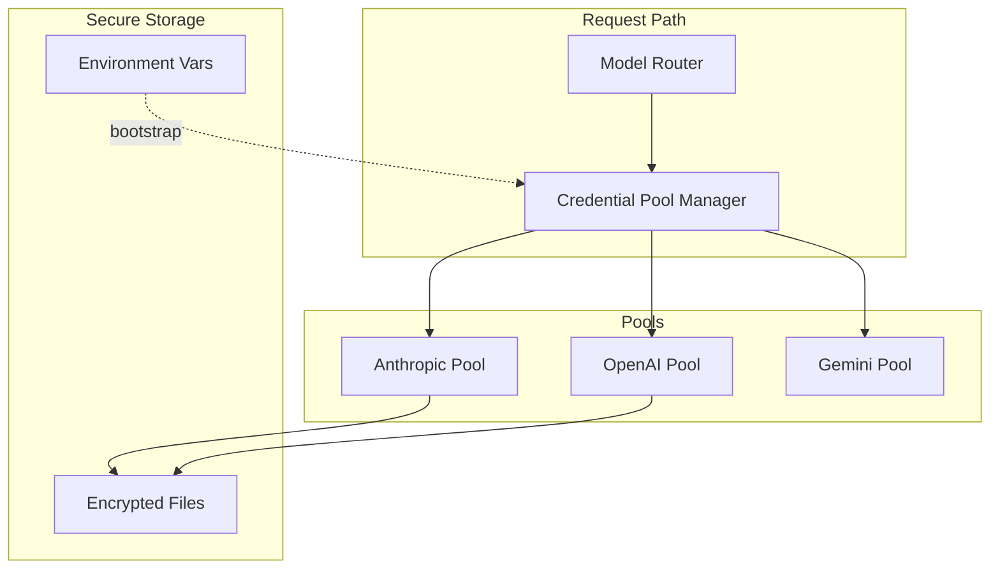
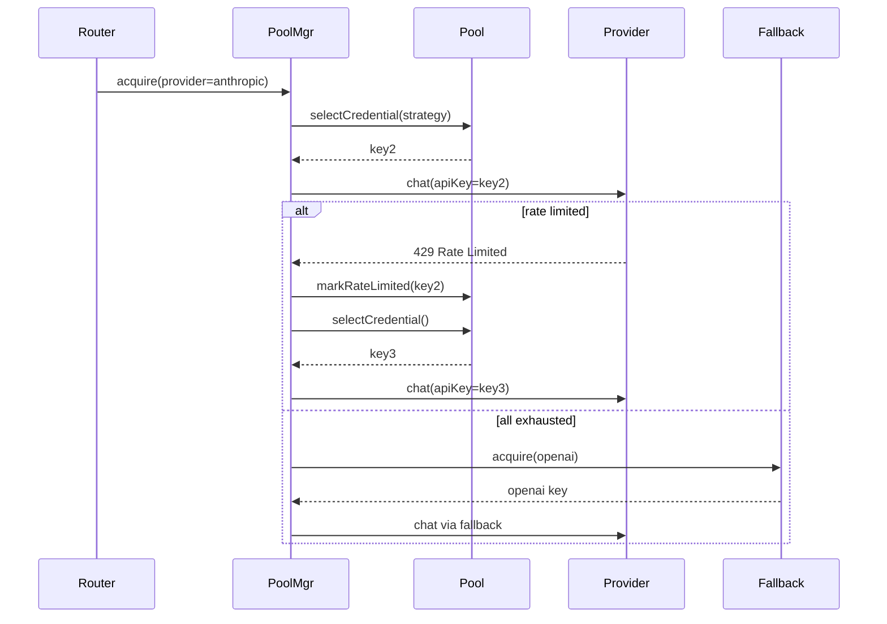

# Credential Pools

Secure, rotatable credential management with rate-limit handling, failover, and quota tracking.

## Principles

- Credentials never stored in agent YAML or git-tracked configs
- Filesystem mode supports **encrypted local storage**
- Pool-based rotation for high-throughput workloads
- Automatic failover on rate limits and auth errors

## File Layout

```
workspace/credentials/
  pools.yaml               # Pool definitions (no secrets)
  encrypted/
    anthropic.pool.enc     # Encrypted credential blobs
    openai.pool.enc
  audit/
    usage.jsonl            # Usage and rotation audit log
```

## Pool Schema

```yaml
apiVersion: anvio.io/v1
kind: CredentialPool
metadata:
  slug: anthropic
spec:
  provider: anthropic
  strategy: round_robin     # round_robin | least_used | random
  credentials:
    - id: key1
      encryptedRef: encrypted/anthropic.pool.enc#key1
      quota:
        requestsPerMinute: 60
        tokensPerDay: 1000000
      status: active        # active | rate_limited | disabled
    - id: key2
      encryptedRef: encrypted/anthropic.pool.enc#key2
      status: active
    - id: key3
      encryptedRef: encrypted/anthropic.pool.enc#key3
      status: active
  rotation:
    onRateLimit: rotate     # rotate | wait | fail
    cooldownSeconds: 60
  failover:
    enabled: true
    fallbackPool: openai
```

## Architecture



## Sequence: Credential Selection with Failover



## Encrypted Filesystem Storage (Level 1)

```bash
# Initialize encryption (uses local master key)
anvio credentials init --passphrase

# Add credential to pool
anvio credentials add anthropic --id key1 --value $ANTHROPIC_API_KEY

# Rotate (disable old, add new)
anvio credentials rotate anthropic --id key1 --new-value $NEW_KEY
```

Encryption details:

- Master key derived from passphrase + machine salt (or OS keychain when available)
- Individual credentials encrypted with AES-256-GCM
- `encrypted/*.enc` files safe to backup (useless without passphrase)

## Rate Limit Handling

| Event | Action |
|-------|--------|
| HTTP 429 | Mark credential `rate_limited`, rotate |
| Quota exceeded | Disable credential, alert via hook |
| All pool exhausted | Failover to fallback pool |
| Cooldown elapsed | Restore credential to `active` |

## Quota Tracking

```yaml
# Per-credential usage tracked in memory + periodic flush
quota:
  requestsPerMinute: 60
  tokensPerDay: 1000000
  currentUsage:
    requestsThisMinute: 12
    tokensToday: 450000
```

Usage logged to `workspace/credentials/audit/usage.jsonl`:

```json
{"ts":"2026-06-19T08:00:00Z","pool":"anthropic","credId":"key2","tokens":1523,"status":"ok"}
```

## Fallback Chains

Integrates with provider routing (see [36-provider-routing.md](./36-provider-routing.md)):

```yaml
# workspace/providers/routing.yaml
routing:
  coding:
    primary:
      provider: anthropic
      pool: anthropic
    fallback:
      - provider: openai
        pool: openai
      - provider: gemini
        pool: gemini
      - provider: openai
        model: qwen-via-openrouter
        pool: openrouter
```

## CLI

```bash
anvio credentials list
anvio credentials add <pool> --id <id>
anvio credentials rotate <pool> --id <id>
anvio credentials status <pool>
anvio credentials test <pool>
```

## Extension Guide

1. Implement `CredentialStore` port for HashiCorp Vault (Level 4)
2. Custom selection strategies via plugin
3. Hook `onCredentialRotated` for team notifications

## Operational Runbook

| Scenario | Action |
|----------|--------|
| Key compromised | `anvio credentials disable anthropic --id key2` + rotate |
| All keys rate limited | Check fallback chain; reduce concurrency |
| Backup credentials | Backup `encrypted/` + secure passphrase separately |
| Migrate machine | Copy `credentials/` + re-enter passphrase |

## Security Requirements

- Never log credential values
- Audit all acquisitions and rotations
- Support `--dry-run` for testing without real API calls
- Integrate with [12-security.md](./12-security.md) approval workflow for credential changes

## Package Boundaries

- **Schema:** `packages/core/src/schemas/credential.schema.ts`
- **Port:** `packages/core/src/ports/credential.port.ts`
- **Manager:** `packages/credentials/src/pool-manager.ts`
- **Crypto:** `packages/credentials/src/encrypted-store.ts`
