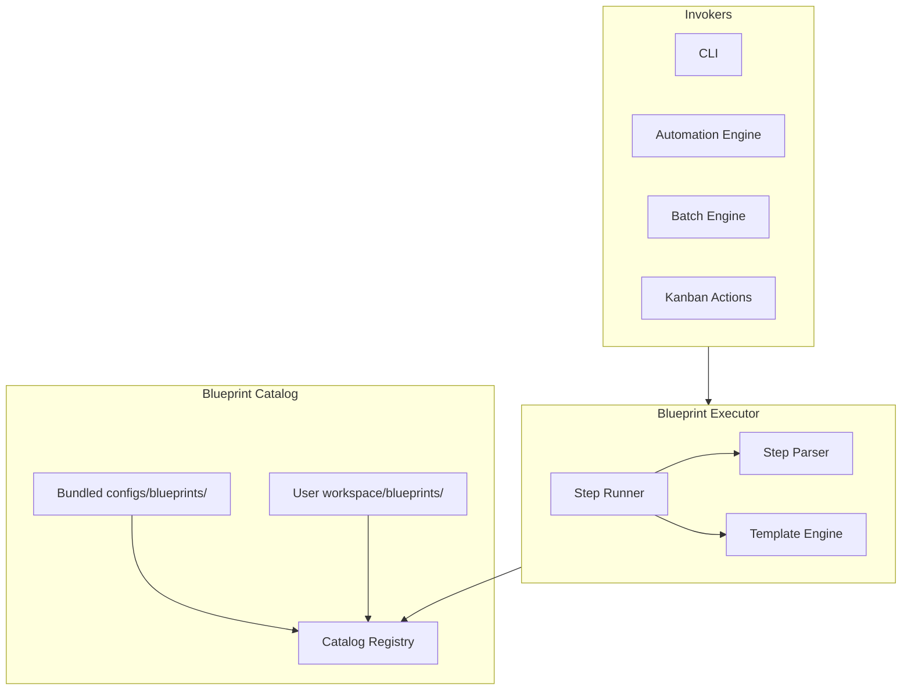
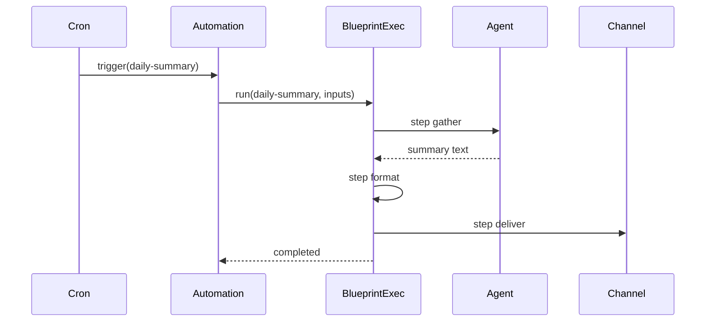

# Blueprint Catalog

Reusable workflow templates — installable, composable, and shareable without modifying runtime code.

## Principles

- Blueprints are YAML-defined workflow templates
- Stored in `workspace/blueprints/` (user) and shipped in `configs/blueprints/` (bundled)
- Invoked by automations, batch jobs, CLI, and kanban task actions
- Composable: blueprints can call other blueprints

## Bundled Catalog

| Blueprint | Description | Trigger Example |
|-----------|-------------|-----------------|
| `daily-summary` | Summarize notifications and activity | Cron 08:00 daily |
| `weekly-review` | Review project progress and goals | Cron Monday 09:00 |
| `github-triage` | Triage open issues and PRs | Event: schedule |
| `repository-analysis` | Analyze repo structure and health | Batch input |
| `documentation-generator` | Generate/update docs from codebase | Manual / goal |
| `release-preparation` | Checklist for release readiness | Goal completed |
| `security-audit` | Run security checks on codebase | Cron weekly |
| `research-report` | Deep research on a topic | Manual |

## File Layout

```
configs/blueprints/              # Bundled (read-only)
  daily-summary.yaml
  weekly-review.yaml
  ...

workspace/blueprints/            # User-installed
  my-custom-review.yaml
  _installed/                    # Install manifest
    github-triage.yaml
```

## Blueprint Schema

```yaml
apiVersion: anvio.io/v1
kind: Blueprint
metadata:
  slug: daily-summary
  version: "1.0.0"
  catalog: bundled              # bundled | community | team | private
spec:
  description: Summarize notifications and recent activity
  inputs:
    userId:
      type: string
      required: true
      default: local-user
    channel:
      type: string
      default: cli
  steps:
    - id: gather
      type: agent
      agent: assistant
      input: |
        Summarize all notifications and activity for user {{userId}}
        from the last 24 hours. Be concise.

    - id: format
      type: transform
      input: "{{steps.gather.output}}"
      template: |
        # Daily Summary — {{date}}
        {{steps.gather.output}}

    - id: deliver
      type: channel
      channel: "{{channel}}"
      message: "{{steps.format.output}}"

  outputs:
    summary:
      from: steps.format.output
```

## Step Types

| Type | Description |
|------|-------------|
| `agent` | Run an agent with templated input |
| `blueprint` | Invoke nested blueprint |
| `parallel` | Run steps concurrently |
| `conditional` | Branch on expression |
| `transform` | Template/format data |
| `channel` | Send via channel hub |
| `hook` | Execute hook handler |
| `batch` | Fan-out over input list |
| `mcp` | Call MCP tool |

## Example: Repository Analysis

```yaml
apiVersion: anvio.io/v1
kind: Blueprint
metadata:
  slug: repository-analysis
spec:
  inputs:
    repository:
      type: string
      required: true
  steps:
    - id: clone
      type: mcp
      server: github
      tool: clone_repository
      args:
        repo: "{{repository}}"

    - id: analyze
      type: agent
      agent: architect
      input: |
        Analyze repository {{repository}} for:
        - Architecture quality
        - Test coverage gaps
        - Security concerns
        - Documentation completeness

    - id: report
      type: transform
      template: |
        # Repository Analysis: {{repository}}
        {{steps.analyze.output}}
      output: file
      path: "reports/{{repository | slugify}}.md"
```

## Architecture



## Installation

```bash
# List available blueprints
anvio blueprint catalog

# Install from bundled catalog
anvio blueprint install daily-summary

# Install from URL (future: marketplace)
anvio blueprint install https://example.com/blueprints/custom-review.yaml

# Run directly
anvio blueprint run daily-summary --input userId=local-user
```

## Install Manifest

```yaml
# workspace/blueprints/_installed/manifest.yaml
apiVersion: anvio.io/v1
kind: BlueprintInstallManifest
spec:
  installed:
    - slug: daily-summary
      source: bundled
      version: "1.0.0"
      installedAt: "2026-06-19"
    - slug: github-triage
      source: bundled
      version: "1.0.0"
```

## Sequence: Automation Invokes Blueprint



## Extension Guide

1. Create blueprint YAML in `workspace/blueprints/`
2. Add custom step types via plugin (`type: my-step`)
3. Publish to team catalog via git submodule or private registry (future)

## Operational Runbook

| Scenario | Action |
|----------|--------|
| Update bundled blueprint | `anvio blueprint upgrade daily-summary` |
| Debug step failure | `anvio blueprint run daily-summary --step gather --verbose` |
| Validate blueprint | `anvio blueprint validate my-blueprint.yaml` |

## Package Boundaries

- **Schema:** `packages/core/src/schemas/blueprint.schema.ts`
- **Executor:** `packages/blueprints/src/blueprint-executor.ts`
- **Catalog:** `packages/blueprints/src/catalog-registry.ts`
- **Templates:** `packages/blueprints/src/template-engine.ts`
