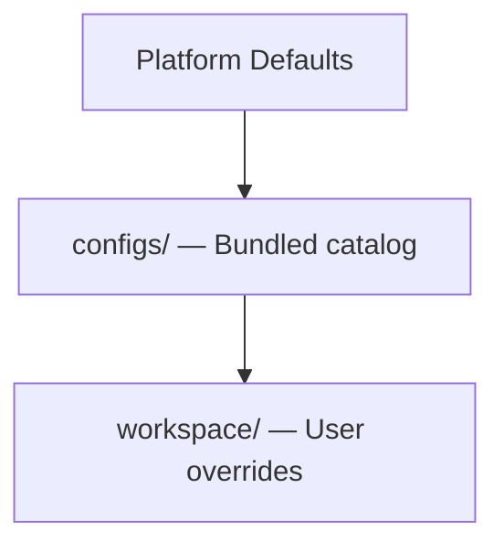

# Workspace Architecture

Everything in Anvio lives in a **portable workspace** — backup, git-version, move, and run on another machine without database migration.

## Directory Layout

```
workspace/
├── anvio.yaml              # Workspace configuration (required)
├── agents/                 # Agent definitions
├── souls/                  # Persistent agent identities
├── personas/               # Persona templates (legacy/bootstrap)
├── skills/                 # Installed skills
├── goals/                  # Persistent goals
├── memory/                 # Memory provider data (filesystem default)
├── sessions/               # Session store (filesystem default)
├── kanban/                 # Kanban boards and tasks
├── automations/            # Automation definitions + scheduler state
├── blueprints/             # User-installed workflow templates
├── hooks/                  # Event hook handlers
├── credentials/            # Encrypted credential pools
├── mcp/                    # MCP server configurations
├── tools/                  # Custom tool definitions
├── providers/              # Routing and provider overrides
├── batch/                  # Batch job state and results
├── audit/                  # Execution and hook audit logs
└── plugins/                # Workspace-local plugins
```

## Portability Guarantees

| Operation | Supported | Notes |
|-----------|-----------|-------|
| **Backup** | Yes | Copy or git clone entire `workspace/` |
| **Git version** | Yes | All configs are human-readable YAML/JSON |
| **Move machine** | Yes | No DB migration in Level 1 |
| **Run elsewhere** | Yes | Same `anvio.yaml`, same behavior |

## Configuration Hierarchy



Resolution order (last wins):

1. `packages/platform` defaults
2. `configs/` bundled agents, skills, personas, blueprints
3. `workspace/` user definitions

## anvio.yaml Extensions (Target)

```yaml
apiVersion: anvio.io/v1
kind: Workspace
metadata:
  name: default
  version: "2.0.0"
spec:
  auth:
    enabled: false
  storage:
    provider: filesystem
    basePath: .
  memory:
    provider: filesystem
    basePath: memory
  events:
    provider: local
  runtime:
    default: local
  execution:
    defaultTimeoutMs: 30000
    networkEnabled: false
  credentials:
    encryption: enabled
  defaultAgent: architect
  defaultUserId: local-user
  defaultSoul: cela
```

## Path Resolution

All paths in workspace configs are **relative to workspace root**:

```yaml
spec:
  memory:
    basePath: memory          # → workspace/memory/
  storage:
    basePath: .               # → workspace/
```

Environment variable interpolation: `${VAR_NAME}` resolved at load time.

## Multi-Workspace Support (Future)

```bash
anvio --workspace ~/projects/work workspace/
anvio --workspace ~/personal workspace/
```

Each workspace is fully isolated.

## Git Workflow

Recommended `.gitignore` for workspace:

```gitignore
# Secrets
credentials/encrypted/
.env

# Runtime state
sessions/
automations/_state/
batch/
audit/
memory/sessions/

# Keep structure
!credentials/.gitkeep
!sessions/.gitkeep
```

Safe to commit:

- `agents/`, `souls/`, `goals/`, `skills/`
- `kanban/`, `automations/*.yaml`, `blueprints/`
- `hooks/`, `providers/routing.yaml`
- `anvio.yaml`

## Migration Between Levels

| From | To | Action |
|------|-----|--------|
| Level 1 (filesystem) | Level 2 (SQLite) | `anvio migrate --memory sqlite` |
| Level 1 | Level 3 (PostgreSQL) | `anvio migrate --all postgresql` |
| Any | Any | Provider `migrate()` port method |

No workspace restructure required — only config change + optional data migration.

## Extension Guide

1. Add new top-level directories via plugin manifest
2. Register loaders in `packages/workspace/src/workspace-loader.ts`
3. Document new paths in this file

## Operational Runbook

| Scenario | Action |
|----------|--------|
| Fresh workspace | `anvio init` creates scaffold |
| Validate workspace | `anvio workspace validate` |
| Export workspace | `tar czf anvio-workspace.tar.gz workspace/` |
| Import workspace | Extract + `anvio workspace validate` |

## Package Boundaries

- **Loader:** `packages/workspace/src/workspace-loader.ts`
- **Schema:** `packages/core/src/schemas/workspace.schema.ts`
- **Init CLI:** `apps/cli/src/commands/workspace-init.ts`
