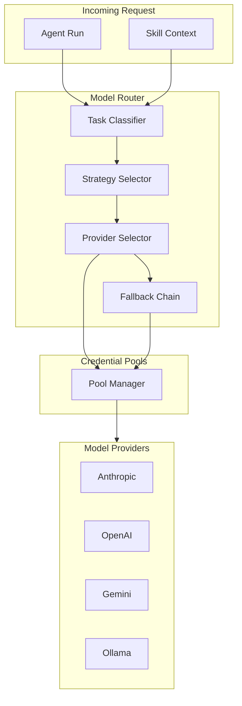
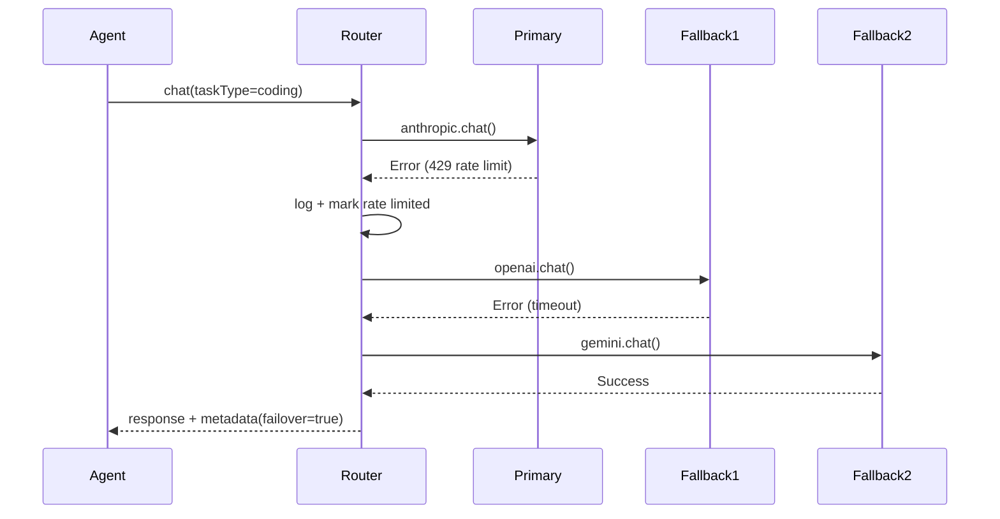

# Provider Routing & Fallback

Advanced model and runtime routing with strategy-based selection and automatic failover.

## Routing Strategies

| Strategy | Optimizes For | Selection Criteria |
|----------|---------------|-------------------|
| `cheapest` | Cost | Lowest $/token |
| `fastest` | Latency | Historical p95 latency |
| `highest_quality` | Quality | Capability tier + benchmark scores |
| `coding_optimized` | Code tasks | Models tuned for code |
| `research_optimized` | Research tasks | Long context + reasoning |

## Configuration

```yaml
# workspace/providers/routing.yaml
apiVersion: anvio.io/v1
kind: ProviderRouting
spec:
  defaultStrategy: highest_quality

  routes:
    coding:
      strategy: coding_optimized
      primary:
        provider: anthropic
        model: claude-sonnet-4-20250514
        pool: anthropic
      fallback:
        - provider: openai
          model: gpt-4o
          pool: openai
        - provider: gemini
          model: gemini-2.0-pro
          pool: gemini

    review:
      strategy: highest_quality
      primary:
        provider: cursor
        runtime: cursor
      fallback:
        - provider: anthropic
          model: claude-sonnet-4-20250514

    chat:
      strategy: cheapest
      primary:
        provider: openrouter
        model: qwen/qwen-2.5-72b-instruct
        pool: openrouter

    research:
      strategy: research_optimized
      primary:
        provider: anthropic
        model: claude-opus-4-20250514
      fallback:
        - provider: openai
          model: o3
```

## Architecture



## Sequence: Failover Chain



## Task Classification

Routes selected by:

1. Explicit agent config: `spec.model.routing: coding`
2. Skill context: skills tagged `routing: research`
3. Runtime inference: keyword/heuristic classifier (optional)
4. Default route: `defaultStrategy`

## Agent Override

```yaml
# workspace/agents/architect.yaml
spec:
  model:
    routing: coding          # Uses routes.coding
    override:
      provider: anthropic    # Force provider (skip routing)
      model: claude-opus-4-20250514
```

## Fallback Rules

| Condition | Action |
|-----------|--------|
| Rate limit (429) | Next in fallback chain |
| Auth error (401/403) | Rotate credential, retry once, then fallback |
| Timeout | Next in fallback chain |
| All exhausted | Return error with audit trail |

## Metrics & Observability

Router emits events:

- `PROVIDER_SELECTED` — which provider chosen and why
- `PROVIDER_FAILOVER` — fallback triggered
- `PROVIDER_EXHAUSTED` — all options failed

Logged to `workspace/audit/routing.jsonl`.

## CLI

```bash
anvio routing show
anvio routing test coding --input "Implement auth middleware"
anvio routing stats --last 24h
```

## Extension Guide

1. Add custom strategies via plugin
2. Implement `TaskClassifier` for domain-specific routing
3. Integrate cost tracking from provider responses

## Relationship to Existing Code

Extends `packages/models` and `docs/09-model-router.md`. Current `ModelProvider` port remains; router sits above it.

## Package Boundaries

- **Schema:** `packages/core/src/schemas/routing.schema.ts`
- **Router:** `packages/models/src/model-router.ts`
- **Classifier:** `packages/models/src/task-classifier.ts`
