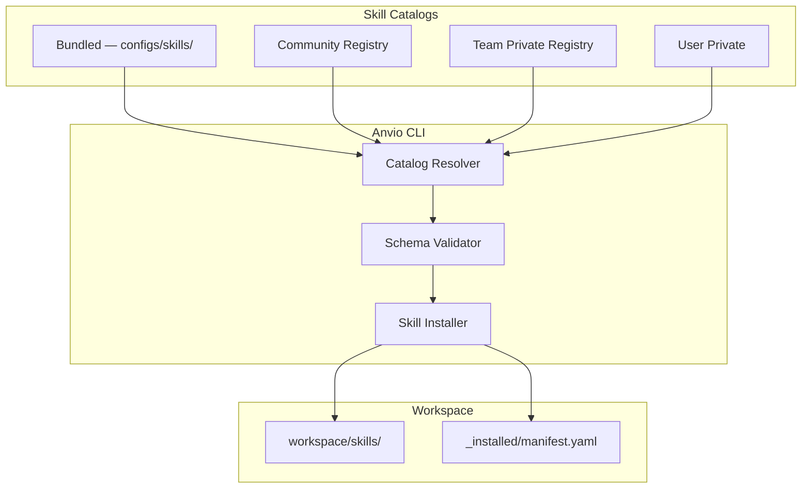

# Skills Catalog & Marketplace Architecture

Bundled skills ship with Anvio; optional skills install without runtime code changes; marketplace architecture supports future community, team, and private catalogs.

## Bundled Skills Catalog

Shipped in `configs/skills/` — available immediately after install:

| Skill | Category | Description |
|-------|----------|-------------|
| `coding` | Engineering | Write and modify code |
| `architecture` | Engineering | System design and tradeoffs |
| `debugging` | Engineering | Diagnose and fix issues |
| `code-review` | Engineering | Review PRs and code quality |
| `research` | Knowledge | Deep research and synthesis |
| `planning` | Productivity | Break down work and plan |
| `documentation` | Knowledge | Write and maintain docs |
| `finance` | Domain | Financial analysis |
| `coach` | Personal | Coaching and growth |
| `assistant` | General | General assistance |
| `project-manager` | Productivity | Project tracking and coordination |

## Optional Skills Catalog

Installable via CLI — no core code changes:

| Skill | Domain |
|-------|--------|
| `aws` | Cloud |
| `gcp` | Cloud |
| `kubernetes` | Infrastructure |
| `flutter` | Mobile |
| `golang` | Language |
| `postgresql` | Database |
| `terraform` | Infrastructure |
| `github` | Integration |
| `jira` | Integration |

## File Layout

```
configs/skills/                 # Bundled (platform)
  coding.yaml
  architecture.yaml
  ...

workspace/skills/               # User-installed
  aws.yaml
  golang.yaml
  _installed/
    manifest.yaml

catalogs/                       # Future: remote catalogs
  community/
  team/
  private/
```

## Skill Schema (Existing + Extensions)

```yaml
apiVersion: anvio.io/v1
kind: Skill
metadata:
  slug: architecture
  version: "1.0.0"
  catalog: bundled           # bundled | community | team | private
spec:
  description: System design and architectural analysis
  category: engineering
  instructions: |
    When performing architecture work...
  permissions:
    - filesystem.read
    - mcp.github
  tools:
    - filesystem
    - diagram
  routing: coding              # Hint for provider routing
  tags:
    - design
    - tradeoffs
```

## Installation

```bash
# List bundled skills
anvio skill catalog --source bundled

# Install optional skill
anvio skill install aws

# Install from team catalog (future)
anvio skill install @myteam/security-audit

# Install from URL
anvio skill install https://skills.example.com/golang.yaml
```

## Marketplace Architecture (Future)



### Catalog Types

| Type | Source | Trust | Access |
|------|--------|-------|--------|
| **Bundled** | Platform release | Signed, verified | Offline |
| **Community** | Public registry | Community review + signatures | Online |
| **Team** | Private git/registry | Org-controlled | Authenticated |
| **Private** | Local/URL | User responsibility | Any |

### Plugin Manifest for Skills

```yaml
# skill plugin.yaml
name: aws-skill
type: skill
version: 1.0.0
catalog: community
author: community/aws-contributors
signature: sha256:abc123...
files:
  - skill.yaml
  - prompts/
dependencies:
  mcp:
    - aws-server
```

## Skill Resolution

When agent runs, skills resolved in order:

1. `workspace/skills/{slug}.yaml` (user override)
2. `configs/skills/{slug}.yaml` (bundled)
3. Remote catalog (if installed via marketplace)

## Extension Guide

1. Create skill YAML following schema
2. Drop in `workspace/skills/` or publish to catalog
3. Attach to agent: `spec.skills: [architecture, aws]`

## Operational Runbook

| Scenario | Action |
|----------|--------|
| Update skill | `anvio skill upgrade architecture` |
| Validate skill | `anvio skill validate my-skill.yaml` |
| Remove skill | `anvio skill remove aws` |

## Package Boundaries

- **Schema:** `packages/core/src/schemas/skill.schema.ts` (existing)
- **Catalog:** `packages/skills/src/catalog-resolver.ts`
- **Installer:** `packages/skills/src/skill-installer.ts`

See also [05-skills.md](./05-skills.md) for current skill documentation.
