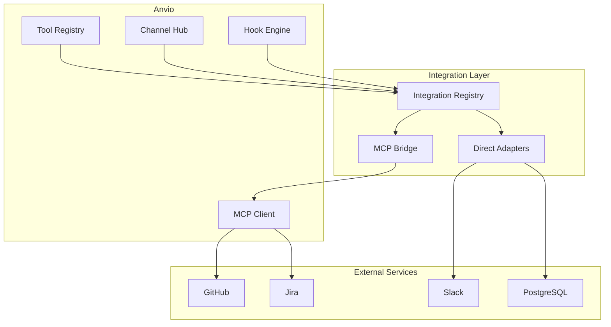

# Integration Architecture

Vendor-agnostic integration framework for external services. **MCP-first** — use MCP servers whenever possible; fall back to direct adapters only when MCP is unavailable.

## Supported Integrations

| Integration | Primary | Fallback |
|-------------|---------|----------|
| **GitHub** | MCP (`github`) | REST adapter |
| **GitLab** | MCP | REST adapter |
| **Jira** | MCP (`atlassian`) | REST adapter |
| **Notion** | MCP | REST adapter |
| **PostgreSQL** | MCP | Direct driver |
| **Slack** | MCP | Bot API adapter |
| **Telegram** | Channel adapter | — |
| **Discord** | Channel adapter | — |
| **Email** | MCP / SMTP hook | — |

## Architecture



## Configuration

```yaml
# workspace/mcp/servers.yaml
apiVersion: anvio.io/v1
kind: McpConfig
spec:
  servers:
    github:
      command: npx
      args: ["-y", "@modelcontextprotocol/server-github"]
      env:
        GITHUB_TOKEN: ${GITHUB_TOKEN}
      enabled: true

    atlassian:
      command: npx
      args: ["-y", "@atlassian/mcp-server"]
      env:
        ATLASSIAN_TOKEN: ${ATLASSIAN_TOKEN}
      enabled: false

    postgres:
      command: npx
      args: ["-y", "@modelcontextprotocol/server-postgres"]
      env:
        DATABASE_URL: ${DATABASE_URL}
      enabled: false
```

```yaml
# workspace/integrations/registry.yaml (planned)
apiVersion: anvio.io/v1
kind: IntegrationRegistry
spec:
  integrations:
    github:
      type: mcp
      server: github
      tools:
        - create_issue
        - create_pull_request
        - search_code

    email:
      type: smtp
      config:
        host: smtp.example.com
        port: 587
        from: anvio@example.com
      credentials: credentials/pools.yaml#smtp
```

## Integration Port

```typescript
interface Integration {
  readonly integrationId: string;
  readonly capabilities: IntegrationCapability[];

  connect(): Promise<void>;
  disconnect(): Promise<void>;
  healthCheck(): Promise<{ ok: boolean }>;

  // Unified tool surface
  invoke(action: string, params: Record<string, unknown>): Promise<unknown>;
}
```

## MCP-First Policy

1. Check if MCP server exists for the service
2. Configure in `workspace/mcp/servers.yaml`
3. Expose tools via MCP bridge to agent runtime
4. Direct adapter only when: no MCP server, MCP lacks required capability, or offline requirement

## Channel vs Integration

| Layer | Purpose | Examples |
|-------|---------|----------|
| **Channel** | User communication ingress/egress | Telegram, Discord, CLI, Web |
| **Integration** | Backend service connectivity | GitHub, Jira, PostgreSQL |

Channels use integrations internally (e.g., Slack channel + Slack MCP).

## Blueprint & Automation Integration

Blueprints invoke integrations via step types:

```yaml
steps:
  - id: triage
    type: mcp
    server: github
    tool: list_issues
    args:
      repo: "{{repository}}"
      state: open
```

## Extension Guide

1. Add MCP server to `workspace/mcp/servers.yaml`
2. For custom services: implement `Integration` port as plugin
3. Register tools in `workspace/tools/`

## Operational Runbook

| Scenario | Action |
|----------|--------|
| Test MCP connection | `anvio mcp test github` |
| List available tools | `anvio mcp tools github` |
| Rotate integration token | Update env + `anvio credentials rotate` |
| Disable integration | Set `enabled: false` in servers.yaml |

## Package Boundaries

- **Registry:** `packages/integrations/src/integration-registry.ts`
- **MCP Bridge:** `packages/integrations/src/mcp-bridge.ts` (wraps existing MCP client)
- **Adapters:** `packages/integrations/src/adapters/{smtp,rest}/`

See also [07-mcp.md](./07-mcp.md) and [10-channels.md](./10-channels.md).
