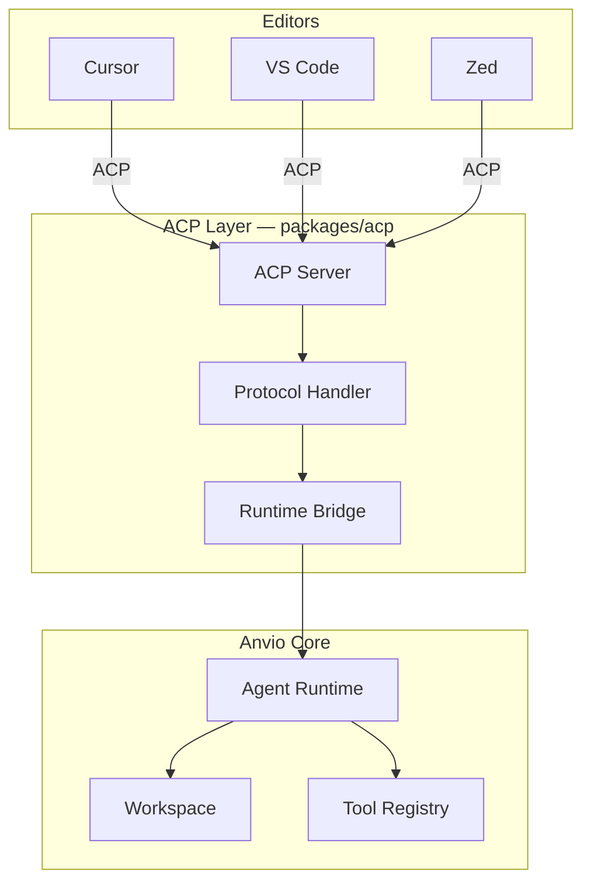
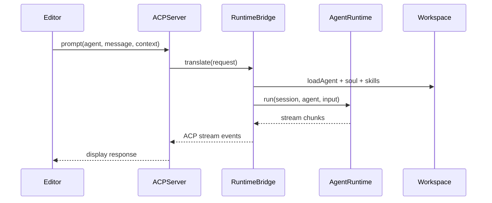

# Editor Integration (ACP)

Agent Client Protocol (ACP) integration for editors — VS Code, Cursor, Windsurf, Zed, JetBrains — without editor-specific logic in core runtime.

## Principles

- Editors interact via **ACP APIs or MCP**
- Core runtime remains editor-agnostic
- Editor adapters live in `packages/acp` and `packages/runtimes`
- Progressive enhancement: local runtime works without any editor

## Supported Editors (Target)

| Editor | Protocol | Package |
|--------|----------|---------|
| **Cursor** | ACP + MCP | `packages/runtimes/cursor` |
| **VS Code** | ACP extension | `packages/acp/vscode` |
| **Windsurf** | ACP | `packages/acp/windsurf` |
| **Zed** | ACP | `packages/acp/zed` |
| **JetBrains** | ACP plugin | `packages/acp/jetbrains` |

## Architecture



## ACP Server

```yaml
# workspace/anvio.yaml
spec:
  acp:
    enabled: true
    port: 8765
    host: 127.0.0.1
    editors:
      cursor:
        enabled: true
      vscode:
        enabled: false
```

## Sequence: Editor Request via ACP



## MCP as Alternative Path

Editors with native MCP support can connect directly:

```yaml
# Editor MCP config points to Anvio MCP server
{
  "mcpServers": {
    "anvio": {
      "command": "anvio",
      "args": ["mcp", "serve"]
    }
  }
}
```

Anvio exposes workspace tools, agents, and goals via MCP — editor uses Anvio as MCP server.

## Bidirectional Modes

| Mode | Direction | Use Case |
|------|-----------|----------|
| **Anvio → Editor** | Anvio uses editor as runtime | `runtime.provider: cursor` |
| **Editor → Anvio** | Editor uses Anvio as backend | `anvio mcp serve` |

## Configuration per Agent

```yaml
# workspace/agents/software-engineer.yaml
spec:
  runtime:
    provider: cursor
    acp:
      workspaceFolder: ${EDITOR_WORKSPACE}
      permissions:
        - filesystem
        - terminal
```

## Extension Guide

1. Implement ACP handler for new editor in `packages/acp/{editor}/`
2. No changes to `packages/core` or `packages/agents`
3. Register in `packages/runtimes` factory

## CLI

```bash
anvio acp serve                    # Start ACP server
anvio acp status                   # Connected editors
anvio runtime test cursor          # Test Cursor runtime connection
```

## Operational Runbook

| Scenario | Action |
|----------|--------|
| Editor not connecting | Check `anvio acp status`, firewall on port 8765 |
| Wrong workspace | Set `EDITOR_WORKSPACE` env var |
| Fallback to local | Agent `spec.runtime.fallback: local` |

## Design Constraint

**Zero editor imports in `packages/core`, `packages/agents`, `packages/platform`.**

All editor-specific code isolated to `packages/acp` and `packages/runtimes`.

## Package Boundaries

- **ACP Server:** `packages/acp/src/acp-server.ts`
- **Protocol:** `packages/acp/src/protocol/`
- **Editor adapters:** `packages/acp/src/editors/{cursor,vscode,zed}/`
- **Runtime bridge:** `packages/runtimes/src/cursor/cursor-runtime.ts`
