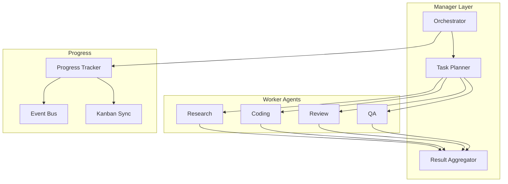
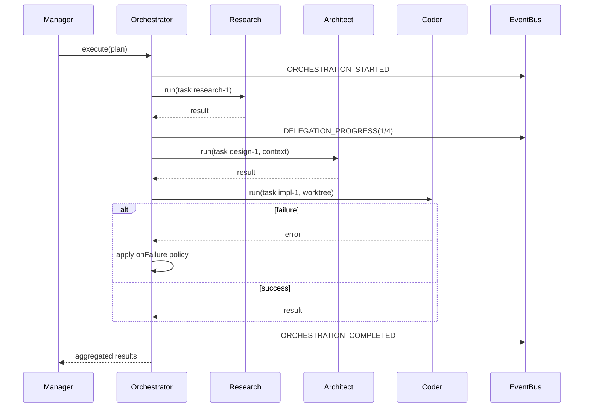

# Subagent Delegation

Native multi-agent delegation with task assignment, result aggregation, failure handling, and progress tracking.

## Delegation Model

```
Manager Agent
├── Research Agent    → gather context
├── Coding Agent      → implement changes
├── Review Agent      → code review
└── QA Agent          → test validation
```

## Orchestration Modes

Extends existing `SupervisorOrchestrator` in `packages/agents/src/orchestrator.ts`:

| Mode | Behavior | Use Case |
|------|----------|----------|
| `sequential` | Run tasks in order | Pipeline workflows |
| `parallel` | Concurrent execution | Independent subtasks |
| `fan-out` | Parallel + no synthesis | Bulk processing |
| `fan-in` | Parallel + manager synthesis | Research → decision |
| `hierarchical` | Nested orchestration plans | Complex projects |

## Enhanced Orchestration Plan

```yaml
# Runtime plan (generated or configured)
managerAgentId: project-manager
mode: hierarchical
tasks:
  - agentId: researcher
    input: "Research auth patterns for our stack"
    id: research-1
    onFailure: continue        # continue | abort | retry

  - agentId: architect
    input: "Design auth plugin based on: {{tasks.research-1.output}}"
    id: design-1
    dependsOn: [research-1]

  - agentId: software-engineer
    input: "Implement: {{tasks.design-1.output}}"
    id: impl-1
    dependsOn: [design-1]
    worktree: true             # isolated git worktree

  - agentId: code-reviewer
    input: "Review changes in worktree {{tasks.impl-1.worktree}}"
    id: review-1
    dependsOn: [impl-1]

  - agentId: qa-agent
    input: "Test auth flows"
    id: qa-1
    dependsOn: [review-1]
```

## Architecture



## Sequence: Hierarchical Delegation



## Failure Handling

| Policy | Behavior |
|--------|----------|
| `abort` | Stop all remaining tasks (default) |
| `continue` | Skip failed task, proceed with dependents blocked |
| `retry` | Retry up to `maxAttempts` with backoff |

```typescript
interface DelegationTask {
  agentId: string;
  input: string;
  id?: string;
  dependsOn?: string[];
  onFailure?: 'abort' | 'continue' | 'retry';
  maxAttempts?: number;
  worktree?: boolean;
}
```

## Progress Tracking

Orchestrator publishes granular events:

| Event | Data |
|-------|------|
| `ORCHESTRATION_STARTED` | plan summary |
| `DELEGATION_TASK_STARTED` | taskId, agentId |
| `DELEGATION_TASK_COMPLETED` | taskId, result summary |
| `DELEGATION_TASK_FAILED` | taskId, error |
| `ORCHESTRATION_COMPLETED` | status, result count |

Progress visible via:

```bash
anvio orchestrate status <managerSessionId>
anvio logs --orchestration <managerSessionId>
```

## Result Aggregation

| Mode | Aggregation |
|------|-------------|
| `fan-in` | Manager synthesizes all sub-results |
| `parallel` | Array of results returned |
| `hierarchical` | Nested result tree |

```typescript
interface OrchestrationResult {
  managerSessionId: string;
  results: Array<{
    taskId: string;
    agentId: string;
    sessionId: string;
    result: AgentResult;
    status: 'completed' | 'failed' | 'skipped';
  }>;
  status: 'completed' | 'failed' | 'partial';
  synthesized?: string;       // fan-in output
}
```

## Agent Configuration

```yaml
# workspace/agents/project-manager.yaml
spec:
  orchestration:
    pattern: hierarchical
    delegates:
      - researcher
      - architect
      - software-engineer
      - code-reviewer
      - qa-agent
    defaults:
      onFailure: abort
      maxAttempts: 2
```

## Kanban Integration

Delegation tasks sync to kanban:

- Each subtask → kanban task with agent assignee
- Column transitions driven by delegation status
- Multi-agent board shows per-agent state

## Extension Guide

1. Add custom aggregation strategies via plugin
2. Implement `TaskPlanner` for automatic plan generation from goals
3. Hook `onOrchestrationCompleted` for notifications

## Operational Runbook

| Scenario | Action |
|----------|--------|
| Stuck delegation | `anvio orchestrate cancel <sessionId>` |
| Partial failure | Review `results` array, re-run failed tasks |
| Debug plan | `anvio orchestrate dry-run --plan plan.yaml` |

## Package Boundaries

- **Orchestrator:** `packages/agents/src/orchestrator.ts` (extend existing)
- **Planner:** `packages/agents/src/task-planner.ts`
- **Progress:** `packages/agents/src/delegation-progress.ts`

See also [03-runtime.md](./03-runtime.md) for runtime orchestration patterns.
