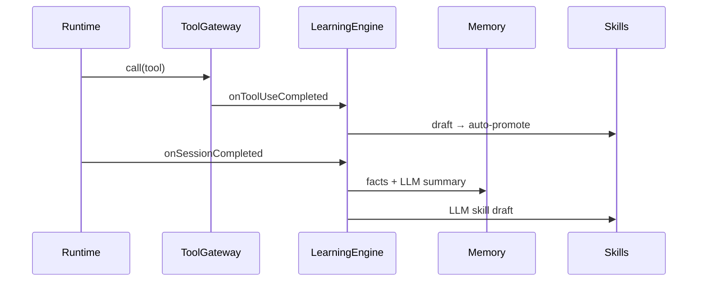

# Learning Loop (Phase H → L6)

Hermes-style **self-improving** layer — opt-in via soul evolution settings.

## Components

| Component | Package | Description |
|-----------|---------|-------------|
| Memory nudge | `@anvio/learning` | Extract preference facts from sessions (regex) |
| Session summary | `@anvio/learning` | LLM summary when model available; rule-based fallback |
| Skill evolution | `@anvio/learning` | LLM-analyzed drafts in `workspace/skills/_drafts/` |
| Runtime tool learning | `@anvio/learning` | `onToolUseCompleted` after successful tool calls (L6) |
| Honcho sync | `@anvio/memory` | Filesystem delegate + optional Honcho API sync |

## Enable

Soul must allow evolution (default: `allowAutoUpdate: true`):

```yaml
spec:
  evolution:
    allowAutoUpdate: true
    requireApproval: false   # false = auto-promote runtime skills; true = manual promote
```

Learning runs on `AGENT_RUN_COMPLETED` (worker, detached, `anvio chat`, inline `anvio run`).

Runtime tool learning runs on each successful `ToolGateway.call()`.

## LLM summarizer

Requires a configured model provider (e.g. `ANTHROPIC_API_KEY`). Platform passes Anthropic or first non-mock provider to `LearningEngine`.

LLM returns JSON with `shouldCreate: false` to skip low-value skills.

## CLI

```bash
anvio learning drafts
anvio learning promote <draft-slug>
```

## Flow



## Related

- [55-phase-l6-learning-priorities.md](./55-phase-l6-learning-priorities.md)
- [37-skills-catalog.md](./37-skills-catalog.md)
- [29-memory-providers.md](./29-memory-providers.md)
