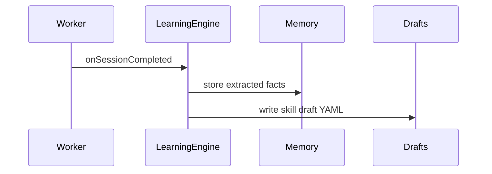

# Learning Loop (Phase H)

Hermes-style **self-improving** layer — opt-in via soul evolution settings.

## Components

| Component | Package | Description |
|-----------|---------|-------------|
| Memory nudge | `@anvio/learning` | Extract preference facts from sessions |
| Skill evolution | `@anvio/learning` | Propose draft skills in `workspace/skills/_drafts/` |
| Honcho sync | `@anvio/memory` | Filesystem delegate + optional Honcho API sync |

## Enable

Soul must allow evolution (default: `allowAutoUpdate: true`):

```yaml
spec:
  evolution:
    allowAutoUpdate: true
    requireApproval: false   # set true to gate skill promotion
```

Learning runs automatically on `AGENT_RUN_COMPLETED`.

## CLI

```bash
anvio learning drafts
anvio learning promote <draft-slug>
```

## Flow



## Related

- [37-skills-catalog.md](./37-skills-catalog.md)
- [29-memory-providers.md](./29-memory-providers.md)
