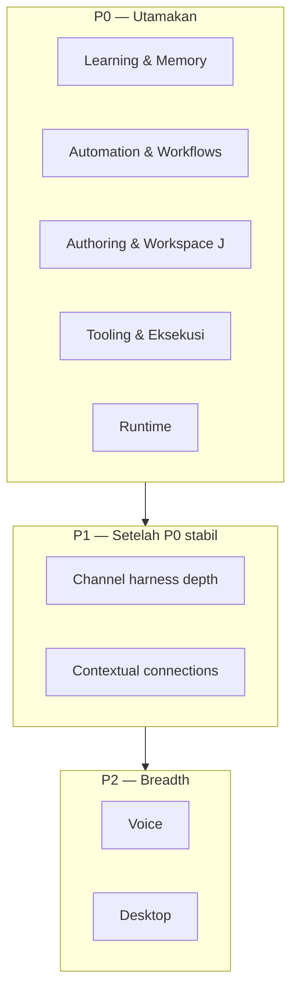

# Phase K — Priority Pillars (2026)

**Status:** Active  
**Supersedes:** Generic P0–P3 ordering in [51-gap-hermes-slaude.md](./51-gap-hermes-slaude.md) for near-term delivery.

User directive: prioritize **Learning & memory**, **Automation & workflows**, **Authoring & workspace (Phase J)**, **Tooling & eksekusi**, and **Runtime** before channel breadth, voice, and desktop.

---

## Priority stack

---

## 1. Learning & Memory

| ID | Deliverable | Status |
|----|-------------|--------|
| L1 | Skill evolution drafts → promote | ✅ |
| L2 | Memory nudge on session end | ✅ |
| L3 | Session summarizer + summary storage | ✅ Phase K |
| L4 | Cross-session recall index (filesystem) | ✅ Phase K |
| L5 | Skill self-improve from tool use | ✅ Phase K |
| L6 | Honcho full dialectic | ✅ Phase K+ |
| L7 | FTS5 / sqlite recall layer | ✅ Phase K+ |

**CLI:** `anvio learning drafts`, `anvio learning promote`

---

## 2. Automation & Workflows

| ID | Deliverable | Status |
|----|-------------|--------|
| W1 | Cron automations | ✅ |
| W2 | Blueprint catalog | ✅ |
| W3 | Standalone workflow DAG | ✅ |
| W4 | Workflow → skill pattern (docs + example) | ✅ Phase K |
| W5 | PLAN → EXECUTE → REVIEW planner | ✅ Phase K |
| W6 | Batch / parallel jobs | ✅ |

**Config:** `configs/planner/plan-execute-review.yaml`  
**CLI:** `anvio automation`, `anvio blueprint`, `anvio batch`

---

## 3. Authoring & Workspace (Phase J)

| ID | Deliverable | Status |
|----|-------------|--------|
| A1 | Skills `.md` | ✅ |
| A2 | SOUL `.md` | ✅ |
| A3 | Agents `.md` | ✅ |
| A4 | Workflows `.md` | ✅ |
| A5 | Personas `.md` loader | ✅ Phase K |
| A6 | Blueprints / automations YAML | ✅ by design |
| A7 | hermes-tech skill import script | ✅ Phase K |

**Convention:** [49-workspace-artifacts.md](./49-workspace-artifacts.md)

---

## 4. Tooling & Eksekusi

| ID | Deliverable | Status |
|----|-------------|--------|
| T1 | `web_fetch` | ✅ |
| T2 | `file_read` / `file_write` | ✅ Phase K |
| T3 | `execute_code` via CodeExecutor | ✅ Phase K |
| T4 | Browser sandbox (Playwright) | ✅ Phase K+ |
| T5 | Image / TTS providers | 🔜 |

**Config:** `workspace/tools/gateway.yaml`

---

## 5. Runtime

| ID | Deliverable | Status |
|----|-------------|--------|
| R1 | Local runtime | ✅ |
| R2 | Docker runtime (first-class) | ✅ Phase K |
| R3 | SSH connectivity | 🟡 |
| R4 | Daytona / Modal | 🟡 stub |
| R7 | ACP / Cursor delegate | ✅ Phase K+ |

**CLI:** `anvio runtime list`, `anvio exec`, `anvio acp serve`

---

## Phase P1 — Harness & Connections

See [53-phase-p1-priorities.md](./53-phase-p1-priorities.md).

| ID | Deliverable | Status |
|----|-------------|--------|
| C3 | Harness enabled + regression | ✅ Phase P1 |
| S4 | OAuth login-host | ✅ Phase P1 |
| S5 | Connection isolation | ✅ Phase P1 |

**CLI:** `anvio connect list|put|revoke|login-host`

---

## Phase P2 — Voice & channels (no desktop)

See [54-phase-p2-priorities.md](./54-phase-p2-priorities.md). Desktop (DT) optional / deferred.

| ID | Deliverable | Status |
|----|-------------|--------|
| C1 | Mattermost adapter | ✅ Phase P2 |
| V2 | Telegram voice notes | ✅ Phase P2 |
| V3 | Discord audio attachments | ✅ Phase P2 |

---

## Success criteria (Phase K)

1. Session end produces **summary + recall hits** in next chat turn
2. `anvio tools call file_read` works without MCP
3. `execute_code` runs through audited sandbox (not `new Function`)
4. Personas load from `personas/*.md`
5. Planner YAML runs PLAN→EXECUTE→REVIEW via automation/blueprint path
6. Docker runtime passes integration test when `docker info` available

---

## Related

- [43-learning-loop.md](./43-learning-loop.md)
- [44-tool-gateway.md](./44-tool-gateway.md)
- [45-workflow-engine.md](./45-workflow-engine.md)
- [49-workspace-artifacts.md](./49-workspace-artifacts.md)
- [51-gap-hermes-slaude.md](./51-gap-hermes-slaude.md)
