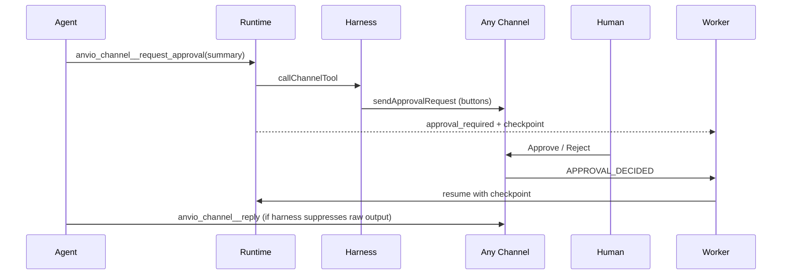

# Phase P5 — Multi-channel approval loop (2026)

**Status:** ✅ v1.10.0  
**Scope:** End-to-end harness approval (Reporting + Approvers) on **all channels**, not Slack-only.

---

## vs slaude (Slack-only)

| Capability | slaude | Anvio P5 |
|------------|--------|----------|
| Approval UI | Slack Block Kit | Per-channel adapters (Slack, Telegram, WhatsApp, Discord, Mattermost, …) |
| Approver IDs | Slack `U…` | Channel-prefixed: `slack:U…`, `telegram:123`, `whatsapp:1555…` |
| Agent tool | `mcp__slaude_slack__request_approval` | `anvio_channel__request_approval` |
| Runtime pause | SDK blocks | `awaiting_approval` + checkpoint + resume |
| Timeout | SOUL `approvalTimeoutSeconds` | ✅ enforced in `ApprovalGate` |

---

## Flow



---

## SOUL.md (multi-channel)

```markdown
## Reporting
- Manager: telegram:1001

## Approvers
- slack:U_MANAGER: deploy production ; catchall
- telegram:1001: anything ; catchall
- whatsapp:15551234567: database migration

## Approval timeout
- seconds: 1800
```

Use `anvio soul validate-policy workspace/souls/<slug>/SOUL.md` after edits.

---

## CLI

```bash
anvio approve <sessionId> <requestId>          # manual approve (any channel)
anvio approve <sessionId> <requestId> --reject
anvio harness simulate                         # policy tests without live creds
```

---

## Enable

```yaml
# workspace/harness/defaults.yaml
spec:
  enabled: true
  soulSlug: architect-soul
  suppressRawOutput: true
```

When enabled, runtime tool port merges built-in gateway + `anvio_channel__*` tools.

See [41-channel-harness.md](./41-channel-harness.md).
