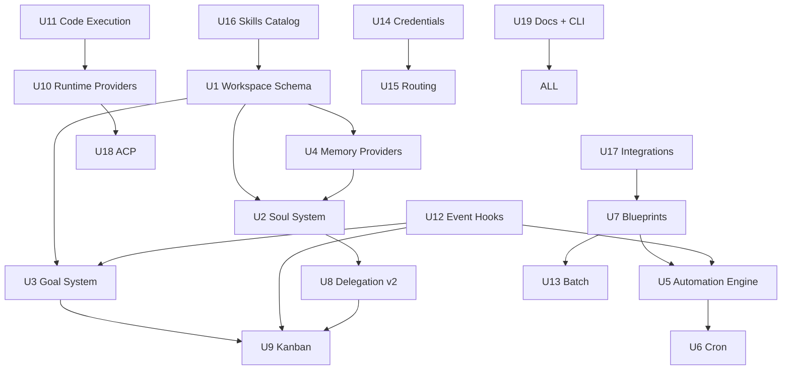
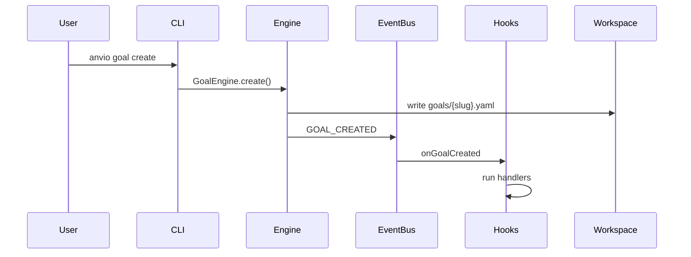

# Implementation Plan: Advanced Agent OS Features

**Created:** 2026-06-19  
**Type:** feat  
**Depth:** Deep  
**Origin:** User requirements — Advanced Agent OS mandatory features

---

## Summary

Implement a first-class Advanced Agent OS layer on Anvio's existing local-first foundation: Soul System, persistent Goals, pluggable Memory Providers, Automation Engine with native cron, Blueprint Catalog, enhanced Subagent Delegation, Kanban with Worker Lanes, Runtime Providers, Code Execution, Event Hooks, Batch Processing, Credential Pools, Provider Routing, Skills Catalog, Integration Framework, and ACP Editor Integration — all filesystem-default with optional database enhancement.

---

## Problem Frame

Anvio Level 1 provides agents, personas, memory, and basic orchestration. Users need **long-lived agent identity**, **persistent goals**, **automation**, **multi-agent task coordination**, and **vendor-agnostic execution** — without breaking the portable workspace model or requiring databases.

---

## Requirements Traceability

| Requirement | Implementation Units |
|-------------|---------------------|
| Soul System | U1, U2 |
| Persistent Goals | U3 |
| Memory Providers | U4 |
| Automation + Cron | U5, U6 |
| Blueprint Catalog | U7 |
| Subagent Delegation v2 | U8 |
| Kanban + Worker Lanes | U9 |
| Runtime Providers | U10 |
| Code Execution | U11 |
| Event Hooks | U12 |
| Batch Processing | U13 |
| Credential Pools | U14 |
| Provider Routing + Fallback | U15 |
| Skills Catalog | U16 |
| Integration Framework | U17 |
| ACP Editor Integration | U18 |
| Workspace Architecture | U1, U19 |
| Documentation | U19 |

---

## Key Technical Decisions

### KTD-1: Soul supersedes Persona for identity; Persona becomes bootstrap template

Personas remain for backward compatibility. Agents reference `spec.soul` (new) with optional `spec.persona` fallback during migration.

### KTD-2: Unified MemoryProvider port composes existing ports

Do not break `ShortTermMemoryPort` / `LongTermMemoryPort`. New `MemoryProvider` wraps them; filesystem provider is extracted from current JSON store.

### KTD-3: Automation state in filesystem

Cron scheduler persists to `workspace/automations/_state/`. No Redis required for Level 1.

### KTD-4: Blueprint executor as DAG interpreter

Reuse workflow concepts from `docs/11-workflows.md`. Blueprint steps are a superset of workflow nodes.

### KTD-5: Editor isolation

All ACP/Cursor/VS Code code in `packages/acp` and `packages/runtimes`. Zero editor imports in core.

### KTD-6: MCP-first integrations

Direct REST adapters only when MCP unavailable. Registry in `workspace/mcp/servers.yaml`.

---

## High-Level Technical Design

### Component Dependency Graph

### Cross-Cutting Event Flow

---

## Scope Boundaries

### In Scope

All 24 feature areas from the requirements document, implemented with filesystem defaults.

### Deferred to Follow-Up Work

- Community skill marketplace hosting (architecture only in U16)
- HashiCorp Vault credential backend
- Kubernetes-native cron leader election
- Full JetBrains ACP plugin (stub in U18)

### Outside Product Identity

- Mandatory cloud SaaS
- Enterprise multi-tenant auth (existing optional auth unchanged)

---

## Phased Delivery

| Phase | Units | Target |
|-------|-------|--------|
| **A — Foundation** | U1–U4, U19 | Workspace + Soul + Goals + Memory |
| **B — Automation** | U5–U7, U12 | Cron + Automation + Blueprints + Hooks |
| **C — Coordination** | U8–U9, U13 | Delegation + Kanban + Batch |
| **D — Execution** | U10–U11, U18 | Runtimes + Code Exec + ACP |
| **E — Platform** | U14–U17 | Credentials + Routing + Skills + Integrations |

---

## Implementation Units

### U1. Workspace Schema & Directory Scaffold

**Goal:** Extend workspace schema and CLI init for Advanced OS directories.

**Dependencies:** None

**Files:**
- `packages/core/src/schemas/workspace.schema.ts`
- `packages/workspace/src/workspace-loader.ts`
- `apps/cli/src/commands/workspace-init.ts`
- `workspace/anvio.yaml` (example updates)

**Approach:** Add schema fields for runtime, execution, credentials, acp. `anvio init` scaffolds all directories from `docs/35-workspace-architecture.md`.

**Test scenarios:**
- Happy path: `anvio init` creates full directory tree
- Edge case: init on existing workspace merges without overwrite
- Validation: invalid `anvio.yaml` rejected with clear error

**Verification:** Workspace validates; all directories exist per spec.

---

### U2. Soul System

**Goal:** First-class Soul with filesystem persistence and context assembly.

**Dependencies:** U1, U4

**Files:**
- `packages/core/src/schemas/soul.schema.ts`
- `packages/core/src/ports/soul.port.ts`
- `packages/souls/src/soul-engine.ts`
- `packages/souls/src/filesystem-soul-store.ts`
- `packages/core/src/schemas/agent.schema.ts` (add `spec.soul`)
- `tests/integration/soul.integration.spec.ts`

**Approach:** SoulEngine loads YAML, assembles SoulContext, injects in runtime context assembly (separate from systemPrompt). CLI: `anvio soul list|show|create|edit`.

**Test scenarios:**
- Happy path: create soul, bind to agent, run session with soul context
- Edge case: soul without relationship memory falls back gracefully
- Integration: soul survives restart (reload from filesystem)
- Error: invalid soul YAML rejected at load

**Verification:** Soul persists across CLI restart; agent run includes soul context.

---

### U3. Goal System

**Goal:** Persistent goals with full lifecycle management.

**Dependencies:** U1

**Files:**
- `packages/core/src/schemas/goal.schema.ts`
- `packages/core/src/ports/goal.port.ts`
- `packages/goals/src/goal-engine.ts`
- `packages/goals/src/filesystem-goal-store.ts`
- `packages/events/src/types.ts` (goal events)
- `tests/integration/goal.integration.spec.ts`

**Approach:** One YAML per goal. GoalEngine handles CRUD + lifecycle. Emit events for hooks/automation.

**Test scenarios:**
- Happy path: create → progress → complete
- Edge case: pause/resume preserves progress
- Edge case: prioritization order in `_index.yaml`
- Integration: goal events reach event bus

**Verification:** All lifecycle transitions persist to filesystem.

---

### U4. Memory Provider Refactor

**Goal:** Unified MemoryProvider with filesystem default and plugin registry.

**Dependencies:** U1

**Files:**
- `packages/core/src/ports/memory-provider.port.ts`
- `packages/memory/src/provider-factory.ts`
- `packages/memory/src/providers/filesystem/`
- `packages/memory/src/providers/sqlite/` (stub)
- `packages/memory/src/providers/postgresql/` (adapt existing)
- `packages/memory/src/providers/qdrant/` (stub)
- `packages/memory/src/providers/honcho/` (stub)
- `tests/integration/memory-provider.integration.spec.ts`

**Approach:** Extract filesystem provider from current JSON store. Factory selects by config. Stubs for SQLite/Qdrant/Honcho with `healthCheck()` returning not-configured.

**Test scenarios:**
- Happy path: filesystem provider round-trip store/search
- Edge case: switch provider in config without code change
- Edge case: semantic methods no-op on filesystem provider
- Integration: soul relationship memory uses MemoryProvider

**Verification:** Default mode unchanged; provider switchable via YAML.

---

### U5. Automation Engine

**Goal:** Event and goal-triggered automations with action execution.

**Dependencies:** U1, U7, U12

**Files:**
- `packages/core/src/schemas/automation.schema.ts`
- `packages/automation/src/automation-engine.ts`
- `packages/automation/src/action-executor.ts`
- `packages/automation/src/filesystem-state-store.ts`
- `tests/integration/automation.integration.spec.ts`

**Approach:** Load automations from `workspace/automations/`. Match triggers from event bus. Execute blueprint/agent/hook actions.

**Test scenarios:**
- Happy path: event trigger fires agent action
- Edge case: disabled automation skipped
- Error path: action failure triggers retry policy
- Integration: goal.completed trigger runs blueprint

**Verification:** Automations survive restart; state persisted.

---

### U6. Cron Scheduler

**Goal:** Native cron with restart-safe persistence.

**Dependencies:** U5

**Files:**
- `packages/automation/src/cron-scheduler.ts`
- `packages/automation/src/cron-parser.ts`
- `tests/unit/cron-scheduler.spec.ts`

**Approach:** In-process scheduler reads cron triggers from automation YAML. Persist last-run to `_state/`. Support timezones.

**Test scenarios:**
- Happy path: `0 8 * * *` fires at 08:00
- Edge path: `0 9 * * MON` fires Monday only
- Edge case: restart after missed run respects catchUp config
- Edge case: invalid cron expression rejected at load

**Verification:** Cron fires on schedule; state file updated.

---

### U7. Blueprint Catalog

**Goal:** Bundled blueprints and YAML DAG executor.

**Dependencies:** U1

**Files:**
- `packages/core/src/schemas/blueprint.schema.ts`
- `packages/blueprints/src/blueprint-executor.ts`
- `packages/blueprints/src/catalog-registry.ts`
- `packages/blueprints/src/template-engine.ts`
- `configs/blueprints/daily-summary.yaml` (+ 7 bundled)
- `tests/integration/blueprint.integration.spec.ts`

**Approach:** Step executor supports agent, transform, channel, hook, mcp, parallel, conditional. Template engine for `{{variable}}` substitution.

**Test scenarios:**
- Happy path: daily-summary blueprint end-to-end
- Edge case: nested blueprint invocation
- Error path: step failure halts or continues per config
- Happy path: `anvio blueprint install daily-summary`

**Verification:** All 8 bundled blueprints validate and execute in dry-run.

---

### U8. Subagent Delegation v2

**Goal:** Enhanced orchestrator with dependencies, failure policies, progress.

**Dependencies:** U2, U4

**Files:**
- `packages/agents/src/orchestrator.ts` (extend)
- `packages/agents/src/task-planner.ts`
- `packages/agents/src/delegation-progress.ts`
- `packages/events/src/types.ts` (delegation events)
- `tests/integration/delegation.integration.spec.ts`

**Approach:** Add dependsOn, onFailure, retry to task model. Publish DELEGATION_* events. Hierarchical mode for nested plans.

**Test scenarios:**
- Happy path: sequential pipeline with dependencies
- Edge case: parallel fan-out all complete
- Error path: onFailure abort stops remaining tasks
- Error path: onFailure continue skips dependents
- Integration: fan-in manager synthesizes results

**Verification:** OrchestrationResult includes per-task status.

---

### U9. Kanban & Worker Lanes

**Goal:** File-based kanban with multi-agent assignment and lane routing.

**Dependencies:** U3, U8

**Files:**
- `packages/core/src/schemas/kanban.schema.ts`
- `packages/kanban/src/kanban-engine.ts`
- `packages/kanban/src/lane-router.ts`
- `packages/kanban/src/filesystem-task-store.ts`
- `tests/integration/kanban.integration.spec.ts`

**Approach:** Task files with column, assignees (agent/human), per-agent state. LaneRouter matches skills to agents.

**Test scenarios:**
- Happy path: create task, move through columns to done
- Happy path: auto-assign to lane-capable agent
- Edge case: WIP limit blocks move to doing
- Integration: delegation updates kanban agent state

**Verification:** Multi-agent board shows independent agent states.

---

### U10. Runtime Providers

**Goal:** Pluggable runtime layer with local default.

**Dependencies:** U1

**Files:**
- `packages/core/src/ports/runtime-provider.port.ts`
- `packages/runtimes/src/runtime-factory.ts`
- `packages/runtimes/src/local/local-runtime.ts`
- `packages/runtimes/src/cursor/cursor-runtime.ts` (stub)
- `packages/runtimes/src/claude-code/claude-code-runtime.ts` (stub)
- `packages/runtimes/src/codex/codex-runtime.ts` (stub)
- `tests/integration/runtime-provider.integration.spec.ts`

**Approach:** Local runtime wraps existing AgentRuntime. External runtimes invoke CLI/ACP. Factory by agent config.

**Test scenarios:**
- Happy path: local runtime unchanged behavior
- Edge case: unconfigured runtime falls back to local
- Edge case: runtime capabilities reported correctly

**Verification:** Agent runs with local runtime; cursor stub returns not-configured.

---

### U11. Code Execution Engine

**Goal:** Sandboxed shell/python/node/go execution with auditing.

**Dependencies:** U10

**Files:**
- `packages/core/src/ports/code-execution.port.ts`
- `packages/execution/src/code-executor.ts`
- `packages/execution/src/sandbox/process-sandbox.ts`
- `packages/execution/src/audit-log.ts`
- `tests/integration/code-execution.integration.spec.ts`

**Approach:** Subprocess sandbox with timeout, memory limits. Audit every execution to `workspace/audit/executions/`. Docker sandbox stub.

**Test scenarios:**
- Happy path: python script executes and returns stdout
- Edge case: timeout kills runaway process
- Edge case: network disabled by default
- Error path: execution failure logged with auditId

**Verification:** Executions audited; timeouts enforced.

---

### U12. Event Hooks

**Goal:** Configurable hooks for all lifecycle events.

**Dependencies:** U1

**Files:**
- `packages/core/src/schemas/hook.schema.ts`
- `packages/hooks/src/hook-engine.ts`
- `packages/hooks/src/handlers/script.ts`
- `packages/hooks/src/handlers/webhook.ts`
- `packages/hooks/src/handlers/mcp.ts`
- `tests/integration/hooks.integration.spec.ts`

**Approach:** HookEngine subscribes to event bus. Dispatches script/mcp/webhook handlers with filtering and timeouts.

**Test scenarios:**
- Happy path: onSessionStart script receives JSON stdin
- Edge case: handler timeout kills script
- Edge case: filter matches only specific toolName
- Error path: handler failure logged, does not crash runtime

**Verification:** Hooks fire on configured events.

---

### U13. Batch Processing

**Goal:** Parallel batch execution with retry and progress.

**Dependencies:** U7

**Files:**
- `packages/core/src/schemas/batch.schema.ts`
- `packages/batch/src/batch-engine.ts`
- `packages/batch/src/work-scheduler.ts`
- `packages/batch/src/filesystem-progress-store.ts`
- `tests/integration/batch.integration.spec.ts`

**Approach:** Work scheduler with concurrency limit. Per-item retry. Progress in `workspace/batch/{id}/`.

**Test scenarios:**
- Happy path: 10 items with concurrency 3 completes
- Edge case: retry recovers transient failure
- Edge case: resume retries only failed items
- Integration: batch invokes blueprint per item

**Verification:** Progress trackable via CLI; partial failure recoverable.

---

### U14. Credential Pools

**Goal:** Encrypted credential storage with rotation and failover.

**Dependencies:** U1

**Files:**
- `packages/core/src/schemas/credential.schema.ts`
- `packages/core/src/ports/credential.port.ts`
- `packages/credentials/src/pool-manager.ts`
- `packages/credentials/src/encrypted-store.ts`
- `tests/integration/credentials.integration.spec.ts`

**Approach:** AES-256-GCM encrypted files. Pool manager with round-robin selection. Rate limit marking and cooldown.

**Test scenarios:**
- Happy path: add credential, acquire, use
- Edge case: rate limit rotates to next credential
- Edge case: all exhausted triggers fallback pool
- Security: credentials never appear in logs

**Verification:** Encrypted storage round-trip; rotation works.

---

### U15. Provider Routing & Fallback

**Goal:** Strategy-based routing with automatic failover chains.

**Dependencies:** U14, U10

**Files:**
- `packages/core/src/schemas/routing.schema.ts`
- `packages/models/src/model-router.ts`
- `packages/models/src/task-classifier.ts`
- `packages/models/src/fallback-chain.ts`
- `tests/integration/routing.integration.spec.ts`

**Approach:** Router reads `workspace/providers/routing.yaml`. Classifies task, selects route, walks fallback chain on failure.

**Test scenarios:**
- Happy path: coding route selects anthropic
- Edge case: primary 429 triggers fallback
- Edge case: agent override bypasses routing
- Integration: credential pool integrated in selection

**Verification:** Failover chain exercised in integration test.

---

### U16. Skills Catalog

**Goal:** Bundled + installable skills with marketplace architecture stub.

**Dependencies:** U1

**Files:**
- `packages/skills/src/catalog-resolver.ts`
- `packages/skills/src/skill-installer.ts`
- `configs/skills/` (11 bundled skills)
- `apps/cli/src/commands/skill.ts`
- `tests/integration/skills-catalog.integration.spec.ts`

**Approach:** Catalog resolver checks workspace → bundled → remote. Installer writes manifest. CLI install/list/upgrade.

**Test scenarios:**
- Happy path: bundled skill resolved for agent
- Happy path: install optional skill to workspace
- Edge case: workspace override wins over bundled

**Verification:** All 11 bundled skills validate; install works offline.

---

### U17. Integration Framework

**Goal:** MCP-first integration registry.

**Dependencies:** U7

**Files:**
- `packages/integrations/src/integration-registry.ts`
- `packages/integrations/src/mcp-bridge.ts`
- `workspace/mcp/servers.yaml` (example)
- `tests/integration/integrations.integration.spec.ts`

**Approach:** Registry maps integration IDs to MCP servers or direct adapters. Blueprint mcp steps use bridge.

**Test scenarios:**
- Happy path: MCP server registered and tools listed
- Edge case: disabled integration skipped
- Integration: blueprint mcp step calls tool

**Verification:** `anvio mcp test` validates configured servers.

---

### U18. ACP Editor Integration

**Goal:** ACP server and Cursor runtime stub.

**Dependencies:** U10

**Files:**
- `packages/acp/src/acp-server.ts`
- `packages/acp/src/protocol/`
- `packages/runtimes/src/cursor/cursor-runtime.ts`
- `apps/cli/src/commands/acp.ts`
- `tests/integration/acp.integration.spec.ts`

**Approach:** ACP server exposes Anvio workspace to editors. Cursor runtime connects via ACP. Other editors documented, stubbed.

**Test scenarios:**
- Happy path: ACP server starts on configured port
- Edge case: editor disconnect handled gracefully
- Integration: prompt via ACP triggers agent run

**Verification:** `anvio acp serve` starts; health endpoint responds.

---

### U19. Documentation & CLI Surface

**Goal:** Complete documentation suite and CLI commands.

**Dependencies:** All units (docs written; CLI incremental)

**Files:**
- `docs/24-advanced-agent-os-overview.md` through `docs/40-subagent-delegation.md`
- `docs/02-architecture.md` (update)
- `docs/23-roadmap.md` (update)
- `apps/cli/src/main.ts` (command registration)

**Approach:** Documentation complete (this plan). CLI commands added per feature as units land.

**Test expectation:** none — documentation and CLI registration

**Verification:** All docs linked from overview; roadmap reflects new phases.

---

## Risks & Mitigation

| Risk | Impact | Mitigation |
|------|--------|------------|
| Scope creep across 19 units | Delay | Strict phased delivery; stubs for optional providers |
| Soul/Persona confusion | UX | Clear migration guide; persona as bootstrap only |
| Cron drift on long downtime | Missed automations | catchUp config; audit log |
| Credential encryption UX | Adoption friction | Optional; env vars still work Level 1 |
| ACP protocol changes | Editor breakage | Version pin; adapter isolation |

---

## Test Strategy

- Unit tests for cron parser, template engine, pool selection
- Integration tests per unit in `tests/integration/`
- Existing `anvio.integration.spec.ts` extended for backward compatibility
- No behavioral regression in Level 1 filesystem mode

---

## Documentation Index

| Doc | Path |
|-----|------|
| Overview | `docs/24-advanced-agent-os-overview.md` |
| Soul System | `docs/25-soul-system.md` |
| Goal System | `docs/26-goal-system.md` |
| Automation Engine | `docs/27-automation-engine.md` |
| Kanban & Lanes | `docs/28-kanban-system.md` |
| Memory Providers | `docs/29-memory-providers.md` |
| Runtime Providers | `docs/30-runtime-providers.md` |
| Event Hooks | `docs/31-event-hooks.md` |
| Batch Processing | `docs/32-batch-processing.md` |
| Credential Pools | `docs/33-credential-pools.md` |
| Blueprint Catalog | `docs/34-blueprint-catalog.md` |
| Workspace Architecture | `docs/35-workspace-architecture.md` |
| Provider Routing | `docs/36-provider-routing.md` |
| Skills Catalog | `docs/37-skills-catalog.md` |
| Integrations | `docs/38-integration-architecture.md` |
| Editor Integration | `docs/39-editor-integration.md` |
| Subagent Delegation | `docs/40-subagent-delegation.md` |

---

## Suggested First PR

**Phase A only:** U1 + U2 + U3 + U4 + U19 — delivers Soul, Goals, Memory refactor, workspace scaffold. Smallest vertical slice proving the Advanced OS foundation without automation complexity.
