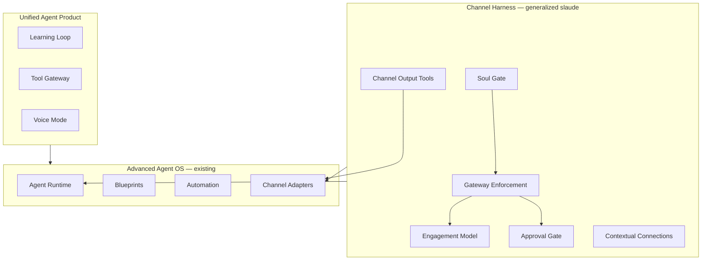
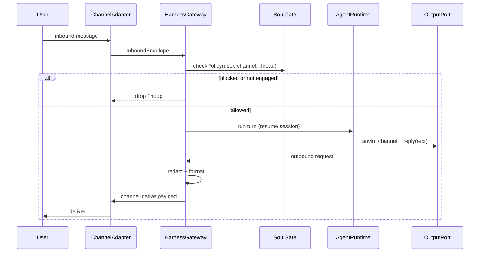

# Implementation Plan: Unified Agent Product (Hermes + Channel Harness)

**Created:** 2026-06-19  
**Type:** feat  
**Depth:** Deep  
**Origin:** User request — combine [Hermes Agent](https://hermes-agent.nousresearch.com/docs) capabilities with [slaude](https://github.com/barockok/slaude)-style harness, **generalized across all channels** (not Slack-only)

**Depends on:** [2026-06-19-001-feat-advanced-agent-os-plan.md](./2026-06-19-001-feat-advanced-agent-os-plan.md) (Phases A–F ✅)

---

## Summary

Evolve Anvio from an **Agent OS foundation** into a **full agent product** by merging:

1. **Hermes-like product depth** — learning loop, built-in tool gateway, voice, expanded channels, serverless runtimes, skills evolution, batch/RL hooks.
2. **slaude-like channel harness** — but **channel-agnostic**: deterministic gateway, soul policy enforcement, structured output tools, engagement model, approval gates, and contextual connections work identically on CLI, Web, Telegram, Discord, Slack, WhatsApp, and future adapters.

All features remain **local-first, file-first, configuration-driven**. No mandatory SaaS.

---

## Problem Frame

Advanced Agent OS (v1.2) delivers souls, goals, blueprints, automation, MCP, and multi-channel adapters — but:

| Gap | Reference |
|-----|-----------|
| Adapters are thin transports; no **harness** (output discipline, engagement, trust boundary) | slaude |
| Soul is YAML-only; no **policy extraction + gateway enforcement** | slaude SOUL.md + SoulData |
| Skills are install-only; no **self-improving loop** | Hermes learning loop |
| Tools require external MCP; no **bundled tool gateway** | Hermes Tool Gateway |
| Approval is session-level; not **scope-based approver matching** | slaude approval gate |
| Connections are global MCP; no **per-user contextual broker** | slaude_connect |
| Workflows are blueprints-only; no **standalone DAG engine** | Hermes + docs/11-workflows |
| Runtimes are local/docker; missing **SSH / serverless backends** | Hermes terminal backends |

---

## Vision: Two Layers



**Rule:** Runtime and agents never import Slack/Telegram/Discord specifics. The **Channel Harness** sits between `AgentRuntime` and `ChannelAdapter`, exactly as slaude sits between Claude SDK and Slack — but with a **HarnessPort** per channel family.

---

## Requirements Traceability

| Requirement | Units |
|-------------|-------|
| Channel Harness (generalized slaude) | U20, U21, U22 |
| Soul Gate (SOUL.md + policy JSON + trust boundary) | U23 |
| Scope-based approval gate | U24 |
| Engagement model (mention/reply/DM rules) | U25 |
| Channel output discipline (structured send/edit/react/upload) | U26 |
| Format pipeline (markdown → channel-native) | U27 |
| Contextual Connections broker | U28 |
| Learning loop (skill + memory evolution) | U29, U30 |
| Tool Gateway (web, browser, media) | U31 |
| Workflow engine (standalone DAG) | U32 |
| Expanded channels (Teams, Signal, Matrix, Email) | U33 |
| Serverless / remote runtimes (SSH, Daytona, Modal) | U34 |
| Voice mode | U35 |
| Simulation gateway (channel-free testing) | U36 |
| Knowledge base + ingest pipeline | U37 |
| Desktop shell (optional) | U38 |
| Documentation + CLI | U39 |

---

## Key Technical Decisions

### KTD-7: Harness is channel-agnostic; adapters stay dumb transports

`ChannelAdapter` continues to send bytes/buttons. **HarnessGateway** owns policy, engagement, approval authorization, and routes agent output through **HarnessOutputPort** (MCP tools `anvio_channel__*` or internal port — never raw assistant text to external channels when harness mode is enabled).

### KTD-8: Soul Gate separates parsing from enforcement (slaude trust boundary)

- **Parsing:** optional LLM projection of `SOUL.md` → `SoulPolicy` JSON, cached by content hash under `workspace/souls/_cache/`.
- **Verification:** every external id (Slack `U…`, Discord snowflake, Telegram chat id) must appear verbatim in source SOUL/Soul YAML before policy applies.
- **Enforcement:** 100% deterministic in gateway code — never delegated to the model.

### KTD-9: SOUL.md and Soul YAML coexist

- `kind: Soul` YAML remains canonical for Advanced OS.
- `SOUL.md` is an **alternate authoring surface**; `anvio soul import SOUL.md` produces/updates soul YAML.
- Agents bind `spec.soul`; harness reads compiled `SoulPolicy`.

### KTD-10: Engagement rules are configurable per channel profile

Default profiles in `workspace/harness/channel-profiles.yaml`:

| Profile | Engage trigger | Disengage | DM policy |
|---------|----------------|-----------|-----------|
| `slack-like` | @bot mention | @other mention | manager-only unless public channel |
| `telegram-like` | /start or @bot | /stop | same soul policy |
| `discord-like` | @bot or thread owner | — | thread-scoped |
| `web-like` | always engaged | tab close | authenticated user |
| `cli-like` | always engaged | — | local user |

### KTD-11: Learning loop is opt-in per soul

`soul.spec.evolution.allowAutoUpdate: true` gates autonomous skill/memory writes. All mutations emit audit events and optional approval hooks.

### KTD-12: Tool Gateway is MCP-compatible internally

Built-in tools register as `anvio_tools__*` MCP surface so runtime, blueprints, and harness share one tool path. External MCP servers remain in `workspace/mcp/servers.yaml`.

### KTD-13: Contextual Connections are user-scoped, thread-scoped

Connection broker stores encrypted credentials keyed by `(channel, userId, service)` with TTL. Borrow requires owner approval delivered on **same channel** (generalized from slaude DM approval).

---

## High-Level Technical Design

### Channel Harness Stack



### Package Boundaries (new)

```
packages/
  harness/           # U20–U28, U36 — gateway, engagement, approval, simulation
  soul-gate/         # U23 — SOUL.md import, SoulPolicy, cache (or extend souls/)
  learning/          # U29–U30 — skill evolution, memory nudges
  tools/             # U31 — built-in tool gateway
  workflows/         # U32 — standalone DAG (Phase 3 engine)
  voice/             # U35 — STT/TTS adapters
  knowledge/         # U37 — raw/wiki ingest, manifest sync
```

Extend existing:

```
packages/channels/   # U33 — new adapters; format helpers per channel
packages/runtimes/   # U34 — SSH, Daytona, Modal providers
packages/skills/     # U29 — evolution writer
packages/memory/     # U30 — Honcho real provider, FTS summarization
```

### Workspace Layout (additions)

```
workspace/
  harness/
    channel-profiles.yaml
    defaults.yaml
  souls/
    architect-soul.yaml
    architect-soul/SOUL.md          # optional alternate source
    _cache/soul.<sha>.json          # compiled SoulPolicy
  connections/                      # encrypted contextual connections
    _state/
  knowledge/
    <kb-slug>/
      raw/
      wiki/
  tools/
    gateway.yaml                    # enabled built-in tools
  workflows/                        # U32 DAG definitions
  slaude-compat/                    # optional: import slaude.json manifest
```

---

## Phased Delivery

| Phase | Units | Target | Theme |
|-------|-------|--------|-------|
| **G — Channel Harness** | U20–U28, U36 | Q3 2026 | Generalized slaude |
| **H — Learning & Tools** | U29–U31, U37 | Q4 2026 | Hermes depth |
| **I — Scale & Reach** | U32–U35, U38 | Q1 2027 | Workflows, channels, voice, desktop |
| **J — Docs & Polish** | U39 | Q1 2027 | Product-ready |

---

## Implementation Units

### U20. Harness Core & Gateway

**Goal:** Introduce `HarnessGateway` between adapters and runtime.

**Files:**
- `packages/core/src/ports/harness.port.ts`
- `packages/core/src/schemas/harness.schema.ts`
- `packages/harness/src/gateway.ts`
- `packages/harness/src/inbound-envelope.ts`
- `packages/platform/src/index.ts` (wire harness)
- `apps/worker/src/main.ts` (route inbound through harness)

**Approach:** Feature flag `workspace/harness/defaults.yaml` → `enabled: true`. When disabled, current thin-adapter behavior unchanged.

**Verification:** Integration test — inbound dropped when blocked; allowed message reaches runtime.

---

### U21. Harness Output Port (generalized `anvio_channel__*`)

**Goal:** Agent output flows only through structured output API when harness enabled.

**Tools / methods:**
- `reply`, `edit`, `upload`, `react`, `unreact`, `setStatus`, `requestApproval`

**Files:**
- `packages/harness/src/output-port.ts`
- `packages/harness/src/mcp-channel-server.ts` (in-process MCP for runtime providers)
- `packages/runtimes/src/local/local-runtime.ts` (register harness tools)

**Approach:** Mirror slaude's "no raw assistant text to channel" rule. CLI/Web use same port (CLI renders plain text; Web renders components).

**Verification:** Runtime test — direct text does not reach adapter; `reply` does.

---

### U22. Channel Profiles & Engagement Model

**Goal:** Configurable engage/disengage per channel type.

**Files:**
- `packages/harness/src/engagement.ts`
- `packages/harness/src/channel-profiles.ts`
- `workspace/harness/channel-profiles.yaml` (default bundled)

**Approach:** `EngagementState` persisted per `(channel, threadId)` in `workspace/sessions/` metadata.

**Verification:** Simulation tests — mention engages; wrong user dropped in restricted mode.

---

### U23. Soul Gate (SOUL.md + SoulPolicy)

**Goal:** slaude-style soul parsing with trust boundary, channel-agnostic.

**Files:**
- `packages/soul-gate/src/policy-schema.ts`
- `packages/soul-gate/src/extractor.ts` (LLM + regex fallback)
- `packages/soul-gate/src/verifier.ts` (id must exist in source text)
- `packages/soul-gate/src/cache.ts`
- `packages/souls/src/soul-engine.ts` (consume SoulPolicy)
- `apps/cli/src/main.ts` — `anvio soul import|validate-policy`

**SoulPolicy fields (channel-agnostic ids):**
```yaml
identity: { name, role, voice }
manager: { userId, handle }          # canonical user id per channel namespace
backupManager: { userId, handle }
allowedZones: [{ channel, ids[] }]   # public zones — any member
trustedZones: [{ channel, ids[] }]   # team zones — full transparency
blockedUsers: [{ channel, userId }]
approvers: [{ userId, scope, catchall }]
redactPatterns: [string]
approvalTimeoutSeconds: number
mandate: string
values: [string]
```

**Verification:** Extracted fake user id rejected; valid SOUL.md produces cached policy.

---

### U24. Scope-Based Approval Gate

**Goal:** `requestApproval(summary)` → channel-native Approve/Deny; clicker must match approver scope.

**Files:**
- `packages/harness/src/approval-gate.ts`
- `packages/harness/src/approver-matcher.ts` (keyword overlap on summary)
- Extend `packages/channels/src/*.ts` — unified `ApprovalAction` callback

**Approach:** Agent never passes approver ids — only summary text. Gateway resolves approvers from SoulPolicy.

**Verification:** Unauthorized click rejected; scope match allows approval.

---

### U25. Session Resume & Idle TTL

**Goal:** slaude-style thread persistence generalized.

**Files:**
- `packages/harness/src/session-bridge.ts` (extend existing channel session bridge)
- `packages/workspace/src/session-store.ts` — store runtime resume handle per thread

**Config:** `harness.defaults.yaml` → `idleMinutes: 15`, `resume: true`

**Verification:** After idle, next message resumes same session id and context.

---

### U26. Attachments (inbound + outbound)

**Goal:** User files → session workspace; agent uploads via output port.

**Files:**
- `packages/harness/src/attachments.ts`
- Channel adapters — download/upload per platform API

**Verification:** Slack/Telegram/Discord file round-trip integration tests.

---

### U27. Format Pipeline (markdown → channel-native)

**Goal:** One markdown authoring format; adapters receive optimized payloads.

**Files:**
- `packages/harness/src/format/markdown.ts`
- `packages/harness/src/format/slack-mrkdwn.ts`
- `packages/harness/src/format/telegram-html.ts`
- `packages/harness/src/format/discord-markdown.ts`
- `packages/harness/src/format/plain.ts` (CLI, WhatsApp)

**Verification:** Table/code/link conversion snapshot tests per format.

---

### U28. Contextual Connections Broker

**Goal:** Per-user service connections (Jira, GitHub OAuth, etc.), thread-scoped, encrypted.

**Files:**
- `packages/harness/src/connect/broker.ts`
- `packages/harness/src/connect/store.ts` (AES-256-GCM, TTL)
- `packages/harness/src/connect/login-host.ts` (optional web-CDP flow)
- `packages/core/src/schemas/connection.schema.ts`
- Blueprint step type: `connection` (optional)

**Config:** `workspace/harness/defaults.yaml` → `connectBroker.enabled`, encryption key env.

**Verification:** User A connection not usable by User B without approval.

---

### U29. Learning Loop — Skill Evolution

**Goal:** Hermes-like autonomous skill create/improve from sessions (opt-in).

**Files:**
- `packages/learning/src/skill-evolution.ts`
- `packages/skills/src/evolution-writer.ts`
- Hook: `onSessionEnd` → propose skill patch
- `workspace/skills/_drafts/` staging area

**Approach:** Proposed skills require `soul.spec.evolution.requireApproval` or auto-merge when allowed.

**Verification:** Session produces draft skill; install after approval.

---

### U30. Learning Loop — Memory Nudges & Honcho

**Goal:** Periodic summarization, cross-session recall, Honcho provider implementation.

**Files:**
- `packages/learning/src/memory-nudge.ts`
- `packages/memory/src/providers/honcho/` (replace stub)
- Optional FTS layer in sqlite memory provider

**Verification:** Nudge writes fact; Honcho provider stores/retrieves when configured.

---

### U31. Tool Gateway

**Goal:** Bundled tools without external MCP setup.

**Built-in tools (initial set):**
| Tool | Description |
|------|-------------|
| `web_search` | Search API (env-configured provider) |
| `web_fetch` | URL → markdown extract |
| `browser` | Optional Playwright sandbox |
| `image_generate` | Provider-pluggable |
| `text_to_speech` | Provider-pluggable |
| `execute_code` | Programmatic multi-step (Hermes-style) |

**Files:**
- `packages/tools/src/gateway.ts`
- `packages/tools/src/builtins/*.ts`
- `workspace/tools/gateway.yaml`

**Verification:** Agent invokes `anvio_tools__web_fetch` without external MCP.

---

### U32. Workflow Engine (standalone DAG)

**Goal:** Implement `docs/11-workflows.md` — `packages/workflows` as first-class engine; blueprints delegate to workflows for complex DAGs.

**Files:**
- `packages/workflows/src/dag-executor.ts`
- `packages/core/src/schemas/workflow.schema.ts`
- CLI: `anvio workflow validate|run|list`

**Verification:** Parallel + conditional DAG; blueprint step `workflow` invokes engine.

---

### U33. Expanded Channels

**Goal:** Add adapters using same harness stack.

| Channel | Priority |
|---------|----------|
| Microsoft Teams | P1 |
| Matrix | P2 |
| Email (IMAP/SMTP) | P2 |
| Signal | P3 |
| Google Chat | P3 |

**Files:** `packages/channels/src/{teams,matrix,email,signal,google-chat}.ts`

**Verification:** Harness engagement + approval work on at least Teams + Matrix.

---

### U34. Remote Runtime Backends

**Goal:** Hermes-like execution targets beyond local/docker.

| Backend | Package |
|---------|---------|
| SSH | `packages/runtimes/src/ssh/` |
| Daytona | `packages/runtimes/src/daytona/` |
| Modal | `packages/runtimes/src/modal/` |

**Verification:** `anvio runtime test ssh` executes echo remotely (mock ok in CI).

---

### U35. Voice Mode

**Goal:** Real-time STT/TTS on CLI + Telegram + Discord.

**Files:**
- `packages/voice/src/pipeline.ts`
- Adapters: whisper API, OpenAI TTS, or local models

**Verification:** CLI voice turn completes; optional Telegram voice note test.

---

### U36. Simulation Gateway

**Goal:** slaude-style testing without real Slack/Telegram credentials.

**Files:**
- `packages/harness/src/simulation/transport.ts`
- `apps/cli/src/main.ts` — `anvio harness simulate --scenario approval-flow`

**Verification:** Scenario tests cover engagement, approval, connect grant.

---

### U37. Knowledge Base & Ingest

**Goal:** slaude-style `raw/` → `wiki/` synthesis + manifest sync.

**Files:**
- `packages/knowledge/src/kb-store.ts`
- `packages/knowledge/src/ingest.ts`
- CLI: `anvio kb ingest <slug>`, `anvio kb sync`
- Optional import from `slaude.json` / `anvio-manifest.json`

**Verification:** Ingest produces wiki; sync updates lockfile.

---

### U38. Desktop Shell (optional)

**Goal:** Electron/Tauri wrapper — installer, tray, OAuth setup wizard (Hermes Desktop parity lite).

**Files:** `apps/desktop/` (new app)

**Deferred sub-features:** auto-update, portal OAuth — use env/CLI first.

---

### U39. Documentation & CLI Surface

**Docs:**
- `docs/41-channel-harness.md`
- `docs/42-soul-gate.md`
- `docs/43-learning-loop.md`
- `docs/44-tool-gateway.md`
- `docs/45-contextual-connections.md`
- Update `docs/23-roadmap.md`, `README.md`

**CLI additions:**
```bash
anvio harness status|simulate
anvio soul import SOUL.md|validate-policy
anvio connect list|revoke
anvio kb ingest|sync
anvio workflow list|run|validate
anvio tools list|test
```

---

## Feature Parity Matrix (target end state)

| Capability | Hermes | slaude | Anvio (after Phase G–J) |
|------------|--------|--------|-------------------------|
| Multi-channel | 20+ | Slack only | 7+ → 12+ with harness |
| Channel harness | partial | Slack deep | **All channels** |
| Soul / SOUL | SOUL.md | SOUL.md + gate | YAML + SOUL.md + gate |
| Learning loop | ✅ | — | ✅ opt-in |
| Built-in tools | 60+ | via MCP | gateway + MCP |
| MCP | ✅ | ✅ | ✅ |
| Cron automations | ✅ | — | ✅ |
| Blueprints/workflows | partial | — | ✅ both |
| Approval gate | basic | scope-based | scope-based all channels |
| Per-user connections | — | ✅ | ✅ generalized |
| Voice | ✅ | — | ✅ |
| Serverless runtimes | ✅ | — | ✅ |
| Desktop app | ✅ | — | optional |
| Local-first | partial | headless | **primary** |

---

## Risk Register

| Risk | Mitigation |
|------|------------|
| Harness breaks thin-adapter mode | Feature flag default off until stable; regression tests |
| LLM soul extraction hallucinates ids | Verifier rejects ids not in source; regex fallback |
| Tool gateway scope creep | Pluggable providers; minimal v1 set |
| Channel format drift | Snapshot tests per adapter |
| Learning loop writes bad skills | Draft + approval; audit log |
| Voice latency | Optional; streaming TTS |

---

## Success Criteria

1. **Harness mode** on Slack, Telegram, Discord, and Web behaves with same soul policy semantics.
2. `SOUL.md` import produces enforceable `SoulPolicy` with trust boundary tests passing.
3. Agent cannot bypass harness output port when harness enabled.
4. Learning loop creates/improves at least one skill from session (with approval).
5. Tool gateway serves web_fetch without external MCP.
6. Workflow engine runs DAG independent of blueprints.
7. Simulation gateway covers approval + engagement without API tokens.

---

## Non-Goals (this initiative)

- Hosting community marketplace (architecture only; reuse U16 skills catalog)
- Nous Portal exclusive OAuth (support generic OAuth env config)
- Replacing Advanced Agent OS primitives (extend, don't rewrite)
- Multi-tenant enterprise auth (unchanged optional auth)

---

## References

- [Hermes Agent Documentation](https://hermes-agent.nousresearch.com/docs)
- [slaude — Slack-native Claude Agent SDK harness](https://github.com/barockok/slaude)
- [Anvio Advanced Agent OS Plan](./2026-06-19-001-feat-advanced-agent-os-plan.md)
- [Channels Architecture](../10-channels.md)
- [Soul System](../25-soul-system.md)
- [Workflows (Phase 3)](../11-workflows.md)
